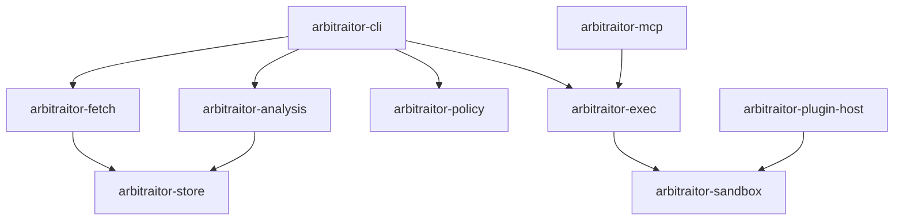
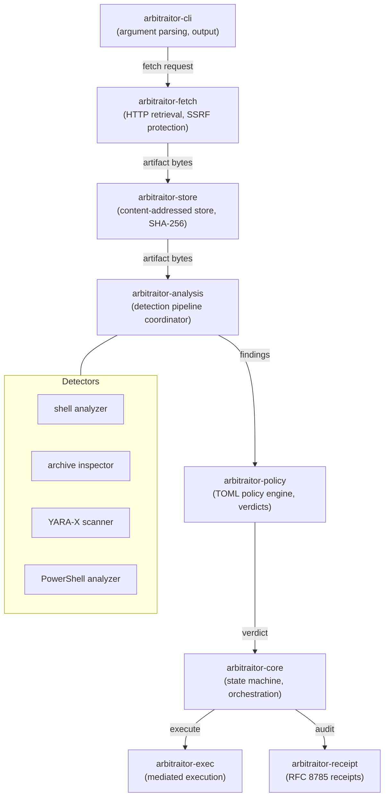

# Architecture Overview

Arbitraitor is organized as a Rust monorepo with focused crates that own specific responsibilities.

## High-level component interaction



## High-level pipeline



## Core subsystems

### Arbitraitor-fetch

HTTP retrieval with security controls. Owns:

- Transport policy (TLS verification, redirect limits, timeout)
- SSRF protection (private IP blocking, DNS rebinding defense)
- Transport metadata recording (final URL, certificate chain)
- Response buffering before release

**Must not**: Perform policy evaluation, make release decisions.

### Arbitraitor-store

Content-addressed storage (CAS). Owns:

- Immutable artifact storage by SHA-256 digest
- Quarantine zone for manual review
- Retention policy and garbage collection
- Integrity verification

**Must not**: Authorize release. Only the core state machine does that.

### Arbitraitor-analysis

Detection pipeline coordinator. Owns:

- Orchestrating parallel detector execution
- Aggregating findings across detectors
- Payload graph discovery (archives, scripts within scripts)
- Recursive inspection limits

Detectors it coordinates:

| Detector | Analyzes |
|----------|----------|
| `arbitraitor-shell` | Shell scripts (bash, dash) |
| `arbitraitor-archive` | Archives (tar, zip, gz, bz2, xz, 7z) |
| `arbitraitor-yarax` | YARA-X rule matches |
| `arbitraitor-powershell` | PowerShell scripts (AST analysis) |
| `arbitraitor-av` | ClamAV, Microsoft Defender adapters |

### Arbitraitor-policy

TOML policy engine. Owns:

- Rule evaluation against findings
- Verdict computation
- Policy document parsing and validation
- Monotonic project policy enforcement

### Arbitraitor-core

State machine. Owns:

- Pipeline orchestration (the diagram above)
- Approval flow coordination
- Receipt generation coordination
- Configuration loading and validation

### Arbitraitor-exec

Execution broker. Owns:

- Clean environment construction
- Sandbox control application
- Process execution and monitoring
- Output capture and limiting

**Must not**: Make trust decisions. Only executes what the core approves.

### Arbitraitor-receipt

Receipt generation. Owns:

- RFC 8785 JCS canonical JSON
- Receipt signing
- Receipt schema versioning

## Security boundaries

```
┌─────────────────────────────────────────────────────────┐
│                     UNTRUSTED INPUT                      │
│  (network, user-provided files, plugin output)            │
└──────────────────┬────────────────────────────────────────┘
                   │
                   ▼
┌─────────────────────────────────────────────────────────┐
│                 BOUNDARY: FETCH                          │
│  arbitraitor-fetch — retrieves and records metadata     │
│  SSRF protection enforced here                          │
└──────────────────┬────────────────────────────────────────┘
                   │ validated bytes
                   ▼
┌─────────────────────────────────────────────────────────┐
│                BOUNDARY: STORE (CAS)                    │
│  arbitraitor-store — immutable SHA-256 storage          │
│  No release decision made here                          │
└──────────────────┬────────────────────────────────────────┘
                   │ artifact handle (digest only)
                   ▼
┌─────────────────────────────────────────────────────────┐
│              BOUNDARY: ANALYSIS                         │
│  arbitraitor-analysis — detection pipeline              │
│  Produces findings, never releases bytes                 │
└──────────────────┬────────────────────────────────────────┘
                   │ findings
                   ▼
┌─────────────────────────────────────────────────────────┐
│              BOUNDARY: POLICY                           │
│  arbitraitor-policy — verdict computation               │
│  Produces verdict, never touches bytes                   │
└──────────────────┬────────────────────────────────────────┘
                   │ verdict
                   ▼
┌─────────────────────────────────────────────────────────┐
│              BOUNDARY: APPROVAL                          │
│  arbitraitor-core — human approval or policy capability  │
│  Plan-bound: artifact + context + policy bound          │
└──────────────────┬────────────────────────────────────────┘
                   │ approval token
                   ▼
┌─────────────────────────────────────────────────────────┐
│              BOUNDARY: EXECUTE                          │
│  arbitraitor-exec — mediated execution                   │
│  Uses exact CAS bytes, not re-fetched content            │
└──────────────────┬────────────────────────────────────────┘
                   │
                   ▼
┌─────────────────────────────────────────────────────────┐
│                    RECEIPT                              │
│  arbitraitor-receipt — signed audit trail               │
└─────────────────────────────────────────────────────────┘
```

## Data flow

1. **Retrieval**: Fetch records transport metadata and produces a CAS handle (digest)
2. **Storage**: CAS stores bytes, returns handle to core
3. **Analysis**: Analysis receives handle, produces findings keyed by digest
4. **Policy**: Policy evaluates findings, produces verdict
5. **Approval**: Core requests approval if verdict requires it
6. **Execution**: Exec receives handle + approval, reads exact bytes from CAS
7. **Receipt**: Receipt captures the full record with signatures

The artifact bytes are **never** passed by value across a boundary. Only handles (digests) flow between components after retrieval.

## Crate responsibilities

See [Crates](./crates.md) for the full workspace layout and dependency graph.
