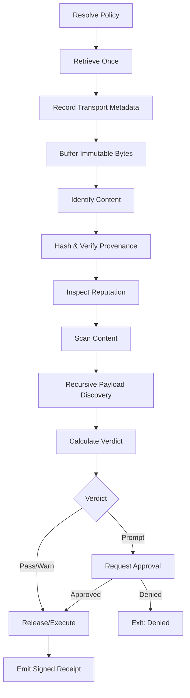

# Pipeline

The Arbitraitor pipeline transforms an untrusted URL into an inspected artifact with a signed verdict and optional mediated execution.

## Pipeline flow



## Pipeline stages

```
┌─────────────────────────────────────────────────────────────────────┐
│ STAGE 1: RETRIEVE                                                    │
│                                                                      │
│ Input:  URL                                                           │
│ Output: CAS handle (immutable digest) + transport metadata          │
│                                                                      │
│ - Resolve URL (handle redirects, SSRF check)                         │
│ - Verify TLS certificate chain                                       │
│ - Record final URL after redirects                                   │
│ - Buffer response body in CAS                                        │
│ - Compute SHA-256 digest                                             │
│ - Store transport metadata (IP, TLS cert, timing)                    │
└─────────────────────────────────────────────────────────────────────┘
                              │
                              ▼
┌─────────────────────────────────────────────────────────────────────┐
│ STAGE 2: IDENTIFY                                                     │
│                                                                      │
│ Input:  CAS handle                                                   │
│ Output: Content type, magic bytes signature                           │
│                                                                      │
│ - Read magic bytes from CAS                                          │
│ - Match against known content types                                  │
│ - Detect shell scripts, archives, binaries, documents                │
│ - Classify as text or binary                                         │
└─────────────────────────────────────────────────────────────────────┘
                              │
                              ▼
┌─────────────────────────────────────────────────────────────────────┐
│ STAGE 3: PROVENANCE                                                   │
│                                                                      │
│ Input:  CAS handle, content type                                     │
│ Output: Provenance attestations (signatures, attestations)           │
│                                                                      │
│ - Check for minisign/cosign signatures                               │
│ - Verify TUF metadata if configured                                 │
│ - Check digest pins (TOFU mode)                                     │
│ - Record all provenance sources in receipt                           │
└─────────────────────────────────────────────────────────────────────┘
                              │
                              ▼
┌─────────────────────────────────────────────────────────────────────┐
│ STAGE 4: ANALYZE                                                      │
│                                                                      │
│ Input:  CAS handle, content type                                     │
│ Output: Findings from all applicable detectors                        │
│                                                                      │
│ - Run enabled detectors in parallel                                  │
│ - Shell: parse AST, extract URLs/commands/hazards                   │
│ - Archive: recursively extract and inspect members                   │
│ - YARA-X: match rules against content                               │
│ - PowerShell: AST analysis for suspicious patterns                  │
│ - AV: signature scan with configured vendors                        │
│ - Intel: match indicators against feeds                             │
│ - Aggregate all findings by severity and category                    │
└─────────────────────────────────────────────────────────────────────┘
                              │
                              ▼
┌─────────────────────────────────────────────────────────────────────┐
│ STAGE 5: EVALUATE                                                     │
│                                                                      │
│ Input:  Findings, content type, provenance                           │
│ Output: Verdict (pass/warn/incomplete/block)                         │
│                                                                      │
│ - Apply policy rules to findings                                    │
│ - Check thresholds by severity                                      │
│ - Factor in provenance (signatures may lower effective severity)    │
│ - Check approval requirements                                        │
│ - Produce structured verdict with reasoning                          │
└─────────────────────────────────────────────────────────────────────┘
                              │
                              ▼
┌─────────────────────────────────────────────────────────────────────┐
│ STAGE 6: APPROVE (if required)                                       │
│                                                                      │
│ Input:  Verdict, execution plan                                      │
│ Output: Approval capability or denial                                │
│                                                                      │
│ - If verdict is pass: auto-approve                                   │
│ - If verdict is warn and auto-approve enabled: approve              │
│ - If verdict requires human review:                                  │
│     - Present plan digest for interactive approval                  │
│     - Or validate pre-issued policy capability                       │
│ - If verdict is block or incomplete: deny                           │
└─────────────────────────────────────────────────────────────────────┘
                              │
                              ▼
┌─────────────────────────────────────────────────────────────────────┐
│ STAGE 7: EXECUTE (if approved)                                       │
│                                                                      │
│ Input:  CAS handle, approval capability                             │
│ Output: Execution output, exit code                                   │
│                                                                      │
│ - Verify digest matches approved plan                                │
│ - Construct clean execution environment                              │
│ - Apply sandbox controls per assurance level                         │
│ - Execute exact CAS bytes (not re-fetched)                          │
│ - Capture stdout/stderr with limits                                 │
│ - Enforce timeout                                                    │
│ - Record actual controls in effect                                   │
└─────────────────────────────────────────────────────────────────────┘
                              │
                              ▼
┌─────────────────────────────────────────────────────────────────────┐
│ STAGE 8: RECEIPT                                                      │
│                                                                      │
│ Input:  All pipeline metadata and outputs                            │
│ Output: Signed JSON receipt                                           │
│                                                                      │
│ - Canonicalize using RFC 8785 JCS                                   │
│ - Sign with configured signing key                                   │
│ - Include full findings, verdicts, transport metadata               │
│ - Include capability matrix if contained execution                   │
│ - Emit receipt to configured output                                  │
└─────────────────────────────────────────────────────────────────────┘
```

## Verdict computation

The verdict is computed by evaluating policy rules against findings:

```toml
# Example policy
[policy.thresholds]
critical = "block"
high = "prompt"
medium = "warn"
low = "pass"

# Provenance can override
[policy.overrides]
# A valid signature from a trusted key lowers severity
"minisign:trusted-key-123" = { critical = "warn", high = "pass" }
```

If provenance attests the artifact, the override applies. Otherwise, thresholds control the verdict.

## Receipt generation

Every pipeline run produces a receipt regardless of verdict. Receipts are:

- **Canonical**: RFC 8785 JCS canonical JSON (deterministic byte output)
- **Signed**: HMAC or minisign signature over the canonical form
- **Complete**: Includes all metadata, findings, and execution context

```json
{
  "schema_version": 2,
  "request": {
    "arbitraitor_version": "0.1.0"
  },
  "artifact": {
    "sha256": "7c1a...",
    "size": 4096,
    "artifact_type": "shell-script"
  },
  "retrieval": {
    "requested_url": "https://example.com/install.sh",
    "final_url": "https://example.com/install.sh",
    "status_code": 200,
    "content_type": "application/x-shellscript",
    "byte_count": 4096,
    "tls_version": "TLSv1.3"
  },
  "provenance": {},
  "payload_graph": null,
  "detectors": [],
  "findings": [
    {
      "id": "network:curl",
      "category": "suspicious_script_behavior",
      "severity": "high",
      "confidence": "high",
      "title": "Downloads content via curl"
    }
  ],
  "policy": {},
  "verdict": {
    "verdict": "warn",
    "deciding_rule": null,
    "policy_trace": []
  },
  "release": null,
  "timestamps": {
    "created": "2026-06-23T12:00:00Z",
    "modified": "2026-06-23T12:00:00Z"
  }
}
```

## Recursive inspection

Archives and composite files are recursively inspected:

```
install.tar.gz
  ├── install.sh      -> analyzed by shell detector
  │     └── curl https://payload.com malware -> detected as recursive hazard
  ├── config.yml      -> analyzed for credentials/hazards
  └── bin/
        └── tool      -> binary analysis if native mode enabled
```

Recursion depth and total extracted size are bounded to prevent zip bombs and similar attacks.

## Error handling

| Error | Result |
|-------|--------|
| Network failure during fetch | Verdict: `incomplete`, blocked |
| TLS verification failure | Verdict: `block` (hardcoded policy) |
| Content too large | Verdict: `incomplete`, truncated |
| Detector panic | Catch, log, verdict: `incomplete` |
| Timeout exceeded | Kill, verdict: `incomplete` |
| CAS read failure | Verdict: `incomplete`, block re-execution |

## Sigstore Bundle policy enforcement

Sigstore Bundle consumption is policy-enforced per spec §14.2.1.
After `cosign verify-blob` succeeds cryptographically, the bundle is validated
against a `SigstoreBundlePolicy` that enforces:

- **Media type**: the `mediaType` field must be one of the accepted version
  strings (`application/vnd.dev.sigstore.bundle+json;version=0.1`, `0.2`, `0.3`).
  Unknown or missing media types are rejected.
- **Verification material form**: the bundle must contain a
  `verificationMaterial` field with one of three accepted forms:
  `x509CertificateChain` (form 1), `publicKey` (form 2), or `x509Certificate`
  (form 3, required for v0.3 keyless). All three forms are accepted by default.
- **Signature payload**: the bundle must contain either a `messageSignature` or
  a `dsseEnvelope`. Bundles missing both are rejected.
- **Transparency-log evidence**: controlled by `TlogPolicy`:

  | Policy | Requirement |
  |--------|-------------|
  | `RequireInclusionProof` (default) | Each tlog entry must carry an `inclusionProof` (Merkle proof) |
  | `RequireInclusionPromise` | Each tlog entry must carry an `inclusionPromise` (signed by Rekor) |
  | `RequireBoth` | Each tlog entry must carry both proof and promise |
  | `Optional` | Tlog entries not required; bundle may rely on RFC 3161 timestamps alone |

- **RFC 3161 timestamps**: accepted as signing-time evidence when Rekor is
  unreachable (air-gapped hosts, SSRF-restricted networks).
- **Online vs offline mode**: offline verification is the default. Online Rekor
  search is opt-in and never produces a stronger verdict than offline
  inclusion-proof verification.

Identity/issuer binding is **not** inferred from the Bundle — it is supplied by
local policy via `--identity` and `--issuer`.

A Bundle without an inclusion proof and without an RFC 3161 timestamp is
recorded as `unverified` and must not be treated as a valid signature.
