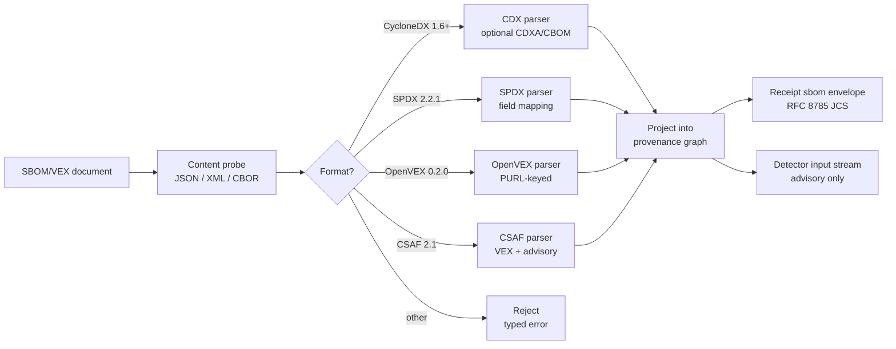

# SBOM and VEX ingestion

Arbitraitor consumes SBOM and VEX documents from upstream producers but never produces, signs, or republishes them. The ingestion surface lives at the policy and provenance boundary (spec §19.5, §19.7) and is read-only.

> **Stability: Unstable.** Verified against commit `7cb6906`. Field expectations may change between minor versions until the CISA 2025 minimum elements stabilize across the four supported formats.

## Supported formats

| Format | Version | Profile | Notes |
|---|---|---|---|
| CycloneDX | 1.6+ | Application, CBOM, CDXA | Extensions parsed when tagged |
| SPDX | 2.2.1 | Full only (SPDX Lite rejected) | ISO/IEC 5962:2021 |
| OpenVEX | 0.2.0 | VEX-only | Status semantics tracked under ADR-0029 (forward reference) |
| CSAF | 2.0 and 2.1 | VEX + security advisory | CSAF 2.0 = ISO/IEC 20153:2025; CSAF 2.1 = OASIS CSD02 (Feb 2026, not yet ISO). Signed CSAF accepted when publisher signature verifies |

Documents claiming two formats (e.g., SPDX-tagged CycloneDX) are rejected. Unknown formats are rejected with a typed error and no SBOM metadata is recorded in the receipt.

## CISA 2025 minimum elements

The August 2025 CISA *SBOM Minimum Elements* revision adds four fields and renames two from the 2024 baseline. Every SBOM profile here requires or accepts the 2025 shape.

| Field | Status in 2025 | CycloneDX 1.6+ path | SPDX 2.2.1 path |
|---|---|---|---|
| Software Producer | Renamed from Supplier Name | `components[].supplier` or `metadata.supplier` | `packages[].supplier` (or `originator`) |
| Component Name | Unchanged | `components[].name` | `packages[].name` |
| Version of Component | Unchanged | `components[].version` | `packages[].versionInfo` |
| Other Unique Identifiers | Unchanged | `components[].purl` (preferred), `components[].cpe` | `packages[].externalRefs[]` (purl or cpe22Type) |
| Dependency Relationship | Unchanged | `dependencies[]` keyed by bom-ref | `relationships[]` (dependsOn, buildDependsOn) |
| Author of SBOM Data | Unchanged | `metadata.authors[]` | `creationInfo.creators[]` |
| Timestamp | Unchanged | `metadata.timestamp` | `creationInfo.created` |
| Coverage | Renamed from Depth | `dependencies[]` graph breadth; `metadata.lifecycles[].phase` | `packages[].annotations[]` (`spdx.org:coverage`) |
| **Component Hash** | **New** | `components[].hashes[]` | `packages[].checksums[]` |
| **License (declared)** | **New** | `components[].licenses[]` (license name or expression) | `packages[].licenseDeclared` |
| **License (concluded)** | **New** | (single-mode license in CycloneDX) | `packages[].licenseConcluded` |
| **Tool Name** | **New** | `metadata.tools[]` (name + version) | `creationInfo.creators[]` filtered by SPDX `Tool:` prefix |
| **Generation Context** | **New** | `metadata.lifecycles[]` (build/source/deployed) | Non-standard for SPDX; mapped via `packages[].annotations[]` (`spdx.org:generationContext`) — Arbitraitor convention |

## SBOM-for-AI clusters (May 2026)

When a CycloneDX SBOM declares the CDXA extension or an SPDX document uses the AI extension (`Annotations` with the `spdx.org:AI` namespace), the seven SBOM-for-AI clusters are surfaced into the receipt under `sbom.ai_clusters`:

| Cluster | CycloneDX CDXA | SPDX AI extension |
|---|---|---|
| Metadata | `metadata.*` (document version, lifecycle, IDs) | `creationInfo.*`, `SPDXID` |
| System Level Properties | `components[].properties[]` (`system:type`, `system:name`) | `packages[].annotations[]` (`spdx.org:AI` system) |
| Models | `components[].modelCard.task`, `components[].modelParameters`, `components[].evaluationData` | `packages[].annotations[]` (model) |
| Dataset Properties | `components[].modelCard.trainingData[]`, `components[].modelCard.dataset` | `packages[].annotations[]` (data) |
| Infrastructure | `components[].properties[]` (`infrastructure:accelerator`, `infrastructure:memory`) | `packages[].annotations[]` (infrastructure) |
| Security Properties | `components[].properties[]` (`security:modelSigning`, `security:adversarialRobustness`) | `packages[].annotations[]` (security) |
| KPI | `components[].properties[]` (`metric:*`), `components[].evaluationData` | `packages[].annotations[]` (kpi) |

AI clusters are advisory signals (invariant 22) and never authorize release.

## VEX status surface

OpenVEX 0.2.0 and CSAF 2.1 VEX statements project into a shared status surface keyed by PURL:

| Status | Meaning |
|---|---|
| `not_affected` | Not impacted by the listed vulnerability under any supported configuration |
| `fixed` | A fix exists; document the fixed version |
| `affected` | Known impacted; document the impact statement |
| `under_investigation` | Producer is analyzing; not yet actionable |
| `false_positive` | Reported but not actually a vulnerability |
| `resolved` | Tracked and closed |
| `exploitable` | Known impacted and an exploit exists |
| `in_triage` | Internal triage in progress |

VEX status feeds the receipt `sbom.vex` envelope and downstream CVE matchers. VEX never overrides a malware finding (invariant 21).

## Ingestion flow

## Failure handling

| Failure | Result | Receipt state |
|---|---|---|
| Unknown format | Reject | No SBOM metadata |
| Required field absent | Reject | Partial parse under `sbom.partial` |
| Extension tagged but malformed | Accept parent, drop extension | `sbom.extensions_dropped` |
| AI clusters without CDXA / SPDX AI tag | Drop clusters, accept rest | `sbom.ai_clusters` empty with `drop_reason` |
| Signed CSAF, signature invalid | Accept content, flag provenance | `csaf.signature: invalid` |

## EU CRA alignment

EU CRA Annex I Part II takes effect for products placed on the EU market from 11 December 2027. CycloneDX 1.6+ and SPDX 2.2.1 are the formats cited in implementing guidance. The CycloneDX and SPDX profiles above accept CRA-shaped documents unmodified. ADR-0026 covers the informational compliance mapping; this page covers the SBOM-shape contract.

## See also

<!-- markdownlint-disable-next-line MD057 -->
- [ADR 0030: SBOM/VEX ingestion profiles](../adr/0030-sbom-vex-ingestion-profiles.md)
<!-- markdownlint-disable-next-line MD057 -->
- [ADR 0025: OpenSSF Scorecard, deps.dev, and GUAC as optional integrations](../adr/0025-ossf-scorecard-depsdev-guac-integration.md)
<!-- markdownlint-disable-next-line MD057 -->
- [ADR 0026: EU CRA / NIST SSDF informational compliance mapping](../adr/0026-eu-cra-nist-ssdf-compliance-mapping.md)
- [Security Model](./security.md#sbom-and-vex-ingestion)
