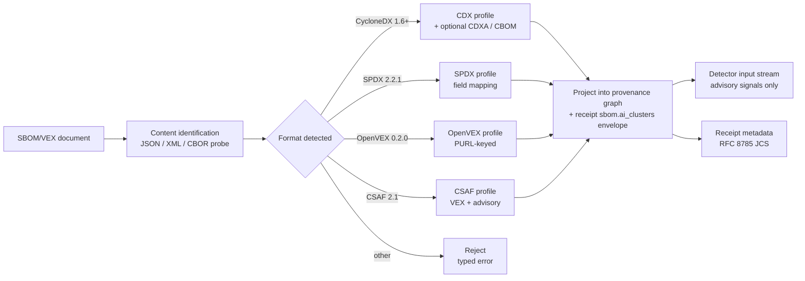

# ADR 0030: SBOM/VEX ingestion profiles

**Status:** Accepted
**Date:** 2026-07-20
**Issue:** #467

## Context

Spec §19.5 mentions SBOM and VEX ingestion in a single sentence. The CISA
*SBOM Minimum Elements* guidance was updated in August 2025, and CISA + G7
published *SBOM for AI: Minimum Elements* in May 2026. Neither revision is
enumerated in the spec, and no per-format ingestion profile exists.

### CISA 2025 SBOM minimum elements

The August 2025 revision adds four data fields and renames two existing
ones, against the original 2024 NTIS minimum-elements list:

| 2024 field | 2025 status |
|---|---|
| Supplier Name | Renamed to **Software Producer** |
| Component Name | Unchanged |
| Version of Component | Unchanged |
| Other Unique Identifiers (PURL, CPE) | Unchanged |
| Dependency Relationship | Unchanged |
| Author of SBOM Data | Unchanged |
| Timestamp | Unchanged |
| Depth | Renamed to **Coverage** |
| — | **New: Component Hash** |
| — | **New: License** (declared and concluded, SPDX-License-Expression) |
| — | **New: Tool Name** (generator identity and version) |
| — | **New: Generation Context** (build-time, source, deployed, other) |

These shape every SBOM an upstream producer can publish, and shape the
profile Arbitraitor expects when ingesting one.

### May 2026 SBOM-for-AI (CISA + G7)

The May 2026 SBOM-for-AI guidance introduces five AI-specific clusters on
top of the 2025 minimum elements:

| Cluster | Examples |
|---|---|
| System-Level Properties | System name, system version, system type, deployment context |
| Data Properties | Dataset name, dataset version, data modality, dataset license, sensitive-data indicators |
| Model Properties | Model name, model version, model architecture, parameter count, fine-tuning data references, evaluation metrics |
| Infrastructure | Compute substrate (accelerator type, count, memory), serving stack, hosting provider |
| Security Properties | Model signing (e.g., Signet, Sigstore for models), access-control posture, adversarial-robustness evidence, prompt-injection mitigations |

These clusters map to CycloneDX ML-BOM (CDXA), SPDX 2.2.1 with the AI
extension, and to OpenSSF AI/ML Profile work; CSAF 2.1 carries security
advisory context for the same components.

### EU CRA SBOM-shape mandate

EU CRA Reg 2024/2847 Annex I Part II requires a machine-readable SBOM of
top-level dependencies for products with digital elements placed on the
EU market. The 2025 minimum-element shape is the de facto target the
European Commission has cited in implementing guidance. The mandate is
informational for Arbitraitor's scope: it shapes what enterprise users
will receive from upstream producers and need to ingest.

### Adjacent standards

- **CSAF 2.1** (OASIS, ISO/IEC 20153, published May 2025) carries VEX and
  security advisory content keyed by PURL/CPE; the same identifiers SBOMs
  use.
- **OpenVEX 0.2.0** (OpenSSF VEX WG, experimental) is a minimal VEX
  format that links an advisory to a product/version and a status. ADR-0029
  is reserved for OpenVEX ingestion specifics once that work opens.
- **SPDX 2.2.1** (Linux Foundation) is the ISO/IEC 5962:2024 standard. Its
  field model differs from CycloneDX; a per-field mapping is required.
- **CycloneDX 1.6+** (OWASP) supports the application profile, the
  Cryptographic Bill of Materials (CBOM), and the ML/AI Bill of Materials
  (CDXA).

### Why this is an ADR and not a spec edit

The spec (`docs/spec.md`, gitignored) is a design draft. The ingestion
profile is a binding contract: once accepted, the field expectations for
each format shape detector output, receipt metadata, and plugin
contracts. Changing the profile later requires a superseding ADR. The
shape is also expensive to reverse because it crosses SBOM parsing,
receipt schema, and downstream GUAC consumers (ADR-0025).

## Decision

Arbitraitor **ingests** SBOM and VEX documents but does **not generate**
them. The ingestion surface is read-only and lives at the policy /
provenance boundary (spec §19.5). Four formats are supported as first-class
profiles; everything else is rejected with a typed error.

### Read-only ingestion

Arbitraitor never produces, mutates, signs, or republishes an SBOM or VEX
artifact. Generation is delegated to dedicated tooling (cargo-cyclonedx,
syft, spdx-tools, cdxgen, openvexgen, csaf-tooling). Rationale:

1. Generation requires build-system integration that varies per ecosystem.
   Cargo, npm, pnpm, uv, and PyPI each need a different generator and
   signing flow. ADR-0026 already names `cargo-cyclonedx` as the
   Arbitraitor self-release generator. Adding ingestion is enough for the
   current spec.
2. VEX generation is the producer's responsibility. CSAF 2.1 producers
   (vendors and CSIRTs) sign their own documents; re-signing or
   translating OpenVEX to CSAF introduces a separate trust boundary.
3. Receipts already encode the canonical identity (CAS digest, spec §3.10)
   and the signed in-toto envelope (ADR-0023). Adding a separately signed
   SBOM profile duplicates that authority.

### Per-format profiles

Each format profile declares the minimum fields Arbitraitor requires to
project a document into the provenance graph and the detector input
stream. Documents missing required fields are rejected with a typed
error and the partial parse is recorded in the receipt.

#### CycloneDX 1.6+ (CDX)

Required: `bomFormat = "CycloneDX"`, `specVersion >= "1.6"`,
`metadata.timestamp`, `metadata.tools`, `metadata.component` (when
present), `serialNumber`, `components[].bom-ref`, `components[].type`,
`components[].name`, `components[].version`, `components[].purl`,
`components[].hashes[]`, `components[].licenses[]` (declared), and
`dependencies[]` (per component, supports the 2025 Coverage field).

Profile-aware extensions accepted when present:

| Extension | Fields surfaced to detectors |
|---|---|
| Application profile (CDX-A) | `externalReferences[]` of type `release-notes`, `vcs`, `issue-tracker`, `documentation` |
| Cryptographic Bill of Materials (CBOM) | `components[].cryptoProperties` (algorithm, certificate, key, curve, usage) |
| ML/AI Bill of Materials (CDXA) | `components[].modelCard` (task, inputs, outputs), `components[].trainingData`, `components[].modelParameters`, `components[].evaluationData` |

The CBOM extension is parsed because crypto-property assertions are
material to the receipt's cryptographic provenance claims. The CDXA
extension is parsed only when the SBOM is tagged with the ML/AI profile
and is treated as an advisory signal (not authoritative), consistent
with invariant 22 (advisory data never authorizes release).

#### SPDX 2.2.1

Required: `spdxVersion = "SPDX-2.2.1"`, `SPDXID` on the document and every
package, `creationInfo.created`, `creationInfo.creators[]`,
`creationInfo.licenseListVersion`, `name`, `dataLicense`, `packages[]` and
`relationships[]`.

Field mapping to the CISA 2025 minimum elements:

| CISA 2025 field | SPDX 2.2.1 path |
|---|---|
| Software Producer | `packages[].supplier` (or `originator` when `supplier` absent) |
| Component Name | `packages[].name` |
| Version of Component | `packages[].versionInfo` |
| Other Unique Identifiers | `packages[].externalRefs[]` of type `purl` or `cpe22Type` |
| Dependency Relationship | `relationships[]` of type `dependsOn` / `buildDependsOn` |
| Author of SBOM Data | `creationInfo.creators[]` |
| Timestamp | `creationInfo.created` |
| Coverage | `packages[].annotations[]` of type `coverage` and/or `relationships[]` breadth |
| Component Hash | `packages[].checksums[]` |
| License (declared) | `packages[].licenseDeclared` |
| License (concluded) | `packages[].licenseConcluded` |
| Tool Name | `creationInfo.creators[]` filtered by the SPDX `Tool:` creator prefix |
| Generation Context | `packages[].annotations[]` of type `generationContext` |

SPDX Lite (the reduced profile) is rejected: it omits hashes and the
full `relationships[]` graph, both of which the CISA 2025 minimum
elements require.

#### OpenVEX 0.2.0

Required: `@context` (OpenVEX 0.2.0), `@id` (per statement), `timestamp`,
`tooling`, `statements[]` with `vulnerability.id` (CVE or GHSA),
`products[]` keyed by PURL, and `status` (`not_affected`,
`fixed`, `affected`, `under_investigation`, `false_positive`,
`resolved`, `exploitable`, `in_triage`).

OpenVEX is VEX-only and carries no SBOM fields. It is accepted alongside
the SBOM and indexed by PURL. Detailed VEX semantics (status projection
into detector findings, status revocation handling) are reserved for
ADR-0029 (forward reference; that ADR opens when OpenVEX ingestion is
implemented).

#### CSAF 2.1 (ISO/IEC 20153, May 2025)

Required: document type `csaf_vex` (or `csaf_security_advisory` when
no VEX payload is present), `/document/tracking/id` (UUID),
`/document/tracking/status`, `/document/publisher`,
`/vulnerabilities[]` keyed by CVE, `/product_tree/branches[].product`
keyed by PURL or CPE.

CSAF VEX statements are projected into the same status surface as
OpenVEX. CSAF also carries security advisory content (CVSS scoring,
references, acknowledgements) that Arbitraitor records in the receipt
metadata. Signed CSAF documents (CMS over JSON, RFC 7468) are accepted
when the publisher signature verifies against a configured trust root;
unsigned CSAF is accepted with a `incomplete` provenance flag.

### AI-cluster ingestion

When a CycloneDX SBOM is tagged with the CDXA extension or the SPDX
document declares the AI extension (`Annotations` with
`spdx.org:AI` namespace), Arbitraitor surfaces the five SBOM-for-AI
clusters into the receipt under a structured
`sbom.ai_clusters` envelope:

```text
sbom.ai_clusters:
  system_level:        [...]   # System-Level Properties cluster
  data:                [...]   # Data Properties cluster
  model:               [...]   # Model Properties cluster
  infrastructure:      [...]   # Infrastructure cluster
  security:            [...]   # Security Properties cluster
```

Receipt consumers (GUAC ingest via ADR-0025, downstream CVE matchers)
treat AI clusters as advisory signals. They never authorize release
(invariant 22) and never override malware findings (invariant 21).

### EU CRA alignment

EU CRA Annex I Part II takes effect for products placed on the EU
market from 11 December 2027. Arbitraitor's 2025 minimum-element
profile is sufficient to consume a CRA-shaped SBOM at that date; the
machine-readable format the Commission cites in implementing guidance
is either SPDX 2.2.1 or CycloneDX 1.6+. Both profiles above accept
CRA-shaped documents unmodified. Arbitraitor does not produce a CRA
self-attestation; ADR-0026 covers the informational compliance mapping.

### Ingestion flow



Detection of the format is by `bomFormat`, `spdxVersion`,
`@context`, and `/document/category` discriminators in that order. A
document claiming two formats (e.g., SPDX-tagged CycloneDX) is
rejected. The format probe is bounded (size + parser timeouts) per
invariant 4.

### Failure modes

| Failure | Result | Receipt state |
|---|---|---|
| Unknown format | Reject, typed error | No SBOM metadata recorded |
| Required field absent | Reject, typed error | Partial parse recorded under `sbom.partial` |
| Extension tagged but malformed | Accept parent profile, drop extension | `sbom.extensions_dropped` lists dropped extensions |
| AI cluster present without CDXA / SPDX AI tag | Drop AI clusters, accept rest | `sbom.ai_clusters` empty with `drop_reason` |
| Signed CSAF, signature invalid | Accept content, mark `provenance: incomplete` | `csaf.signature: invalid` recorded |

## Consequences

- Ingestion adds four format-specific parsers to the policy / provenance
  boundary. Each parser is bounded (time, memory, size) per invariant 4.
  All parsers reject without side effects on the rest of the pipeline.
- Receipts grow a structured `sbom` envelope with format, source URL or
  digest, AI clusters, and dropped-extension reasons. The envelope is
  signed via the existing JCS pipeline (ADR-0014, ADR-0023).
- GUAC ingest (ADR-0025) gains a richer projection: each SBOM node
  carries CISA 2025 minimum elements and SBOM-for-AI cluster metadata.
- The format profiles are versioned. A new format major version
  (CycloneDX 2.0, SPDX 3.0, CSAF 3.0) requires a superseding ADR.
- EU CRA compliance is informational only. ADR-0026 remains the
  authoritative mapping; this ADR adds the SBOM-shape contract.

## Alternatives considered

- **Generate SBOMs alongside ingestion:** duplicates ADR-0026's
  `cargo-cyclonedx` plan and adds per-ecosystem generators for npm, pnpm,
  uv, and PyPI. Each is a separate dependency admission and signing
  flow. Out of scope for ingestion-only policy.
- **Single-format profile (CycloneDX only):** forces upstream producers
  to translate. SPDX and CSAF are both mandated in EU and US federal
  contexts; rejecting them pushes work to the operator.
- **Accept SPDX Lite:** drops hashes and the dependency graph, both
  required by the 2025 minimum elements. Rejected.
- **Project AI clusters into the verdict directly:** violates invariant
  22 (advisory data never authorizes release). AI clusters are receipt
  metadata, not verdict inputs.
- **Use CSAF 2.0 (predecessor):** lacks the ISO/IEC 20153:2025 lock-in
  and the structured VEX projection. CSAF 2.1 is current and canonical.

## References

- CISA SBOM Minimum Elements (August 2025 update): <https://www.cisa.gov/resources-tools/resources/minimum-elements-software-bill-materials-sbom>
- CISA + G7 SBOM for AI Minimum Elements (May 2026): <https://www.cisa.gov/resources-tools/resources/sbom-ai-minimum-elements>
- EU Cyber Resilience Act Reg 2024/2847, Annex I Part II: <https://eur-lex.europa.eu/eli/reg/2024/2847/oj/eng>
- CycloneDX 1.6 specification: <https://cyclonedx.org/specification/cyclonedx-1.6/>
- CycloneDX ML/AI Bill of Materials (CDXA): <https://cyclonedx.org/specification/overview/#machine-learning-bom-ml-bom>
- CycloneDX Cryptography Bill of Materials (CBOM): <https://cyclonedx.org/specification/overview/#cryptography-bom-cbom>
- SPDX 2.2.1 (ISO/IEC 5962:2024): <https://spdx.github.io/spdx-spec/v2.2.1/>
- OpenVEX 0.2.0: <https://github.com/openvex/spec>
- OASIS CSAF 2.1 (ISO/IEC 20153): <https://docs.oasis-open.org/csaf/csaf/v2.1/csaf-v2.1.html>
- ADR-0023 in-toto Statement receipt envelope
- ADR-0025 OpenSSF Scorecard, deps.dev, and GUAC as optional integrations
- ADR-0026 EU CRA / NIST SSDF informational compliance mapping
- ADR-0029 OpenVEX ingestion details (forward reference; opens when OpenVEX work is implemented)
- Spec §19.5, §19.7
