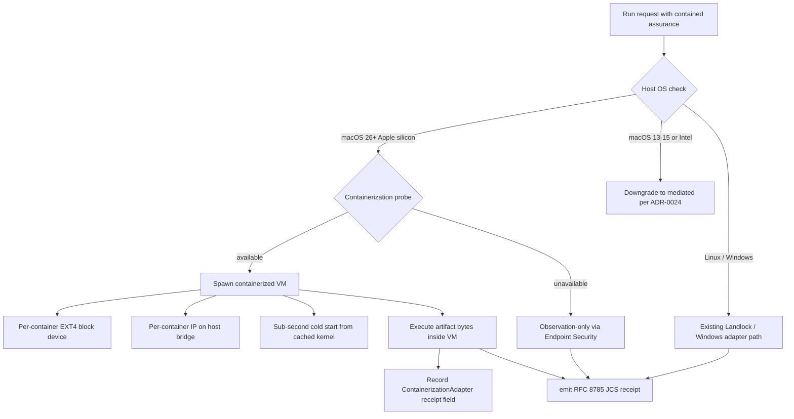

# ADR 0034: Apple Containerization GA strategy for macOS 26+

**Status:** Proposed
**Date:** 2026-07-20
**Issue:** #475
**Supersedes:** ADR-0024 (defers the GA replacement for the Endpoint Security caveat)

## Context

ADR-0024 left macOS containment **deferred** pending a documented replacement for
the deprecated `sandbox-exec`. It cited Apple Containerization
[issue 737](https://github.com/apple/containerization/issues/737) as an open
research question and pinned the recommendation to the Endpoint Security
framework (ES) for observation-only events, with `contained` assurance
unsupported.

Apple open-sourced the **Containerization** Swift framework at WWDC 2025-06-09
([WWDC25 session 346](https://developer.apple.com/videos/play/wwdc2025/346/),
[apple/containerization](https://github.com/apple/containerization)). It is the
basis of the `container` CLI shipping with macOS 26 and exposes per-container
virtual machines with the following properties:

- **One lightweight VM per Linux container** — no shared kernel, no shared
  filesystem, no shared network namespace.
- **Sub-second start times** — kernels are cached, root file systems are
  thin-provisioned EXT4 block devices, and `vminit` is replaced with a
  purpose-built minimal init.
- **Isolated IP** — each container receives a unique IPv4/IPv6 address on a
  host-side virtual network; the host-side bridge is the only shared surface.
- **Linux backend via `cloud-hypervisor` + KVM** — the same library can run on
  Linux hosts that expose `/dev/kvm`, which is relevant for cross-platform
  testing of the containment path even when Arbitraitor's primary macOS
  deployment is on Apple silicon.
- **Per-container EXT4 block device** — rootfs is a disk image, not an
  overlay; `mkfs.ext4` runs on first write, and writes go to a per-container
  copy-on-write image.

These properties map directly onto the controls required for
[ADR-0007 `contained`](https://github.com/arbsec/arbitraitor/blob/main/docs/adr/0007-assurance-levels-model.md)
assurance:

| ADR-0007 control | Containerization primitive |
|------------------|----------------------------|
| Filesystem isolation | Per-container EXT4 block device |
| Process-tree containment | Per-container lightweight VM (no shared kernel) |
| Network policy | Per-container IP on host-side bridge |
| Resource limits | cloud-hypervisor VM resource constraints |
| Privilege suppression | VM boundary — no host-side privilege to elevate |
| Capability probe | `container` CLI `inspect` / runtime introspection |

Because the VM is the trust boundary, Containerization does **not** require
System Extension installation, Developer ID signing, notarization, or
end-user install consent — eliminating the heaviest barriers flagged in
ADR-0024.

Spec §27.4 still treats Apple Containerization as "no documented replacement"
because the upstream [issue 737](https://github.com/apple/containerization/issues/737)
remained unresolved when ADR-0024 was drafted. The June 2025 GA changes that
citation and unblocks macOS `contained` assurance.

## Decision

macOS containment strategy on **macOS 26 and newer** is:

1. **Preferred path — Apple Containerization (`container` CLI + Swift
   framework).** Each contained execution runs inside a Containerization VM.
   The adapter is gated on macOS 26+ and Apple silicon (`aarch64-apple-darwin`)
   with a feature-detected probe (not a hard compile-time gate).
2. **Observation-only path — Endpoint Security framework** (unchanged from
   ADR-0024). Remains the supported fallback on macOS 13–15 and when
   Containerization is unavailable (older hardware, virtualization disabled,
   IT policy disallowing `container` CLI).
3. **Containment deferred on macOS 13–15 and Intel macOS.** `contained`
   assurance requests on those hosts continue to downgrade to `mediated`
   (or `block` per policy) per ADR-0024.

### Containment flow

### Migration path from ADR-0024

- Existing macOS deployments running `contained` requests see no change —
  they continue to downgrade to `mediated` on macOS 13–15.
- macOS 26+ users opt into Containerization by installing the `container`
  CLI and configuring the Arbitraitor sandbox backend (`arbitraitor doctor`
  surfaces Containerization availability alongside Landlock probing).
- Receipt field `containerization_available: bool` is added to the
  effective-controls matrix (§27.7) for macOS runtimes so downstream
  auditors can distinguish `contained-on-containerization` from
  `contained-on-other-adapter`.

### Out of scope for this ADR

- The Swift-side binding to the Containerization framework (lives behind
  a small FFI shim in `arbitraitor-sandbox`). Tracked as a follow-up issue.
- A `container` CLI shim path for hosts that cannot run the Swift framework
  (e.g. macOS 26 on Intel). Not part of the GA story; revisit if Apple ships
  an Intel backport.
- Cross-host container migration. Containerization does not yet support
  live migration; the architecture assumes a single-host trust boundary.

## Consequences

- macOS 26+ users can claim `contained` assurance for the first time
  (previously capped at `mediated` or `block` per policy).
- Two macOS sandbox backends coexist: `ContainerizationAdapter` (macOS 26+
  Apple silicon) and `EndpointSecurityAdapter` (observation-only,
  all macOS versions). Receipts distinguish them.
- `arbitraitor doctor` gains a Containerization probe section that reports
  framework version, CLI availability, virtualization support, and last
  probe timestamp.
- The ADR-0024 deferral becomes obsolete for macOS 26+ hosts but remains
  valid documentation for macOS 13–15 and Intel macOS. ADR-0024 is **not**
  formally superseded; this ADR is a forward-looking strategy update and a
  follow-up ADR will supersede ADR-0024 once the ContainerizationAdapter
  ships.
- No new dependency on the Swift toolchain at the Arbitraitor Rust build
  layer — the Swift framework is invoked through the user-installed
  `container` CLI, matching how `YARA-X` is invoked today.

## Alternatives considered

- **Continue deferring macOS `contained` on all macOS versions.** Status
  quo from ADR-0024. Rejected: Containerization GA makes the deferral
  gratuitous on macOS 26+.
- **Mandate Containerization for `contained` on all macOS hosts.** Would
  drop macOS 13–15 and Intel macOS from the supported surface. Rejected:
  too aggressive for a single WWDC cycle; users on older hosts still need
  a documented path.
- **Replace Endpoint Security framework entirely with Containerization.**
  Rejected: ES is still required for `inspect` assurance (observation
  events) and for `contained` on macOS 13–15. The two are complementary,
  not substitutes.
- **Run `container` CLI inside a disposable VM under Virtualization.framework.**
  Doubles the VM overhead and adds no isolation benefit over Containerization's
  own VM boundary. Rejected.

## References

- [Apple Containerization framework](https://github.com/apple/containerization)
- [`container` CLI technical overview](https://github.com/apple/container/blob/main/docs/technical-overview.md)
- [WWDC25 session 346 — Meet Containerization](https://developer.apple.com/videos/play/wwdc2025/346/)
- [Apple newsroom — developer tools announcement (June 2025)](https://www.apple.com/newsroom/2025/06/apple-supercharges-its-tools-and-technologies-for-developers/)
- [Apple Containerization issue 737 — sandbox-exec replacement (historical)](https://github.com/apple/containerization/issues/737)
- [ADR-0007 — assurance levels model](../adr/0007-assurance-levels-model.md)
- [ADR-0024 — macOS containment strategy](../adr/0024-macos-containment-strategy.md) (this ADR supersedes the GA-replacement deferral; ADR-0024 remains the binding decision for macOS 13–15 and Intel)
- [ADR-0028 — Landlock ABI probe and receipt recording](../adr/0028-landlock-abi-matrix.md)
- Spec §27.4 (macOS containment), §27.7 (effective-controls matrix)
