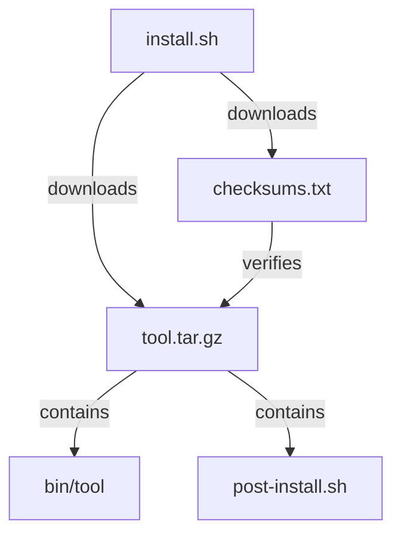

# Arbitraitor: Secure Download and Execution Gate

**Status:** Draft product and technical specification after second adversarial review (Oracle, 2026-06-29)
**Version:** 0.5
**Date:** 2026-06-29
**Implementation language:** Rust
**Project name:** Arbitraitor

> **Changelog vs v0.4 (2026-06-15):**
>
> - §8.2 threat model: added six missing adversaries (untrusted project config, confused-deputy via local IPC, undefined "mandatory scanning", release-destination attacks, privacy leakage via reputation queries, privilege-helper exception).
> - §14.2: added Sigstore Bundle v0.3 verification profile (RFC 3161 offline timestamps, sharded Rekor, single-leaf X.509 form).
> - §14.6: added SLSA Build Level target (L3 with explicit criteria) and SLSA Provenance v1 consumption model.
> - §15.2: added multi-taxonomy finding field (`taxonomies: Vec<{name, id, confidence}>`) covering CWE, CAPEC, OWASP, and project-specific categories.
> - §16.1: added Bash 5.3 syntax support commitment and ShellCheck v0.11+ code import list (SC2327–SC2335, SC3062).
> - §18.5: added optional dependency-vulnerability scanner adapter (osv-scanner-class, offline-first, bounded, policy-gated).
> - §19.5: added SBOM/VEX companion-artifact consumption model with anti-suppression rules (invariant 21 still holds).
> - §21.5: named CISA KEV as an OSV-transitive signal.
> - §21.8: added project-posture signals (OpenSSF Scorecard, deps.dev) and §21.9 supply-chain graph query (GUAC) as optional enterprise integration.
> - §23.1: added caller-origin as a first-class policy axis with authenticated-origin trust semantics.
> - §27.4: clarified macOS containment posture (Endpoint Security is observation-only, not containment).
> - §28.1: reconciled spec CLI surface with the implemented subcommand enum.
> - §31.3: added in-toto Statement receipt envelope (optional derived export; canonical Arbitraitor receipt stays RFC 8785 JCS).
> - §33.6: added remote MCP Authorization spec conformance model (OAuth 2.1 + RFC 8414/9728/8707) for when remote MCP ships.
> - §38.1: workspace layout updated to match the actual 28-crate workspace.
> - §39.14: added registry-based package-manager adapters (cargo, uv/uvx, npm, pnpm, yarn, bun) with hybrid integration pattern, per-tool recipes, lifecycle-script enforcement, and capability grants. Supporting research at `docs/research/registry-package-manager-integration.md`.
> - §41.0: added purpose note clarifying that §41/§42 are normative summaries; the standalone `docs/spec/tech-stack.md` is the authoritative operational detail and may advance faster than this spec.
> - §41.9.1: updated WASI/Component Model wording to track the stable Wasmtime Component Model rather than locking to Preview 2.
> - §41.13: concretized macOS "stable platform facilities" to name Endpoint Security framework, `xattr -p com.apple.quarantine`, and System Extension distribution model.
> - §42.7: updated ADR index from 6 placeholders to the 21 accepted ADRs.
> - §44.1: added EU CRA / US EO 14028 / NIST SSDF compliance mapping (informational evidence matrix, not procurement self-attestation).
> - §46.1: added Tirith subprocess integration model (license-clean, complementary layers).
> - §47: split "first useful release" (v0.1) from "first public pre-1.0" (v0.4) to reconcile with §42.13 milestones.
> - §49: pruned open design questions answered by accepted ADRs (4, 10, 14, 20, 29, 31) and linked each remaining question to its research issue or ADR.
>
> **Changelog vs v0.5 (2026-06-30):**
>
> - §43.8: added four-tier end-to-end testing model (unit → CLI → integration → VM) with CI strategy, container-VM boundary, golden-file comparison pattern.
> - §43.9: added threat corpus management — in-repo synthetic fixtures, on-demand malware sample fetching from MalwareBazaar/theZoo/VX Underground/MalShare, INDEX.toml format, GitHub dual-use policy compliance.
> - §43.10: added sandbox verification testing — Firecracker paired-test pattern for seccomp-BPF, prctl hardening, setrlimit enforcement, Landlock isolation, network connect-back tests, DNS rebinding verification.
> - §43.11: added CI isolation strategy — runner selection per tier, self-hosted bare-metal runner policy, cost model.
>
> **v0.5 reviewed by:** Oracle (read-only adversarial critique of the v0.4 → v0.5 gap analysis, 2026-06-29).
> **v0.6 testing strategy reviewed by:** Librarian research report on e2e testing best practices (2026-06-30).
>
> **Changelog vs v0.6 (2026-07-23):**
>
> - §40: rewrote API/daemon section around a single pipeline-engine library crate (`arbitraitor-api`, working name) consumed by the CLI, MCP, and daemon. Adds §40.0 single-pipeline principle, §40.1 pipeline-engine library, §40.3 MCP gateway as a thin consumer, §40.4 CLI integration redirecting ADR-0027 trajectory, §40.5 three integration surfaces (library / daemon / MCP) with consumer matrix, §40.6 public API stability contract for third-party embedding, §40.7 naming and boundary decisions deferred to a proposed ADR-0037, §40.8 deferred remote enterprise service.
> - §40.0: revised per adversarial review — the "three independent compositions" are now correctly framed as "silent coverage holes" (CLI does provenance but not policy; daemon does policy but not provenance; MCP does neither).
> - §40.1: added invariants 4 (bounded processing), 8 (safe temporary storage), 11 (approval integrity), 12 (deterministic enforcement) per adversarial review. Added `PipelineOperation` wiring-gap note. Added §18.3 fail-closed principle reference (was mislabeled as §9 invariant 6 — §9 #6 is "No automatic blocking from an unreviewed report", a different concept; section reference corrected in Round 4 review).
> - §40.3: added `RequestApprovalTool` to tool enumeration (was omitted). Added `build_default_server()` registration gap notice — only 5 of 7 tools registered in default server.
> - §40.4: changed "completes the trajectory defined in ADR-0027" to "redirects the trajectory" — ADR-0027 envisioned movement into `arbitraitor-core`; this design moves to a new engine crate. ADR-0037 must record the redirection.
> - §40.6: added `arbitraitor-exec` to "never exposed" list. Added migration note documenting current type leakage (`FetchPolicy`, `ReleaseMethod`, `StoreError`, `PolicyEngine`). Added receipt-type-identity unresolved question (raw `arbitraitor-receipt::Receipt` vs engine-owned wrapper) — flagged as coordination point with #492.
> - §40.7: added `arbitraitor-engine` recommendation with reasoning (avoids REST/HTTP API confusion, aligns with spec vocabulary, prevents `arbitraitor_api::ArbitraitorApi` redundancy).
> - §38.1: workspace layout updated to add `arbitraitor-api/` and to clarify `arbitraitor-daemon/` and `arbitraitor-mcp/` as consumers of the API crate.
> - Spec files moved from `.spec/` (gitignored, private) to `docs/spec/` (committed, public). All ADR cross-references updated from stale `.spec/arbitraitor-*.md` paths to canonical `docs/spec/*.md` paths.
> - Cross-references in §33 (MCP capabilities), §31 (receipt audit), and ADR-0027 (CLI pipeline boundary) are aligned with §40 below.
>
> Arbitraitor is a policy-enforced download, inspection, provenance verification, and execution gate for content retrieved from untrusted or semi-trusted sources. It buffers the complete payload, analyzes the exact bytes that may later be consumed, recursively inspects referenced payloads where possible, and only releases or executes content when configured policy permits it.

The name combines the ideas of arbitration, arbitrary-code execution, and a gatekeeper that can refuse to cooperate with a risky execution chain. The CLI command is `arbitraitor`; a shorter optional alias such as `arb` may be provided where it does not conflict with an existing local command.

---

## 1. Executive summary

Commands such as the following are common:

```sh
curl -fsSL https://example.com/install.sh | sh
wget -qO- https://example.com/bootstrap | bash
bash <(curl -fsSL https://example.com/install.sh)
powershell -Command "iex (iwr https://example.com/install.ps1)"
```

They are convenient, but they collapse retrieval, trust, inspection, and execution into one operation. The user typically executes bytes before they have been fully downloaded, cannot easily establish that the executed content is the same content they inspected, and receives little protection from redirects, compromised domains, malicious updates, obfuscated scripts, second-stage payloads, or poisoned community reputation data.

Arbitraitor separates those operations into a controlled pipeline:

```text
resolve policy
  -> retrieve once
  -> record transport metadata
  -> buffer immutable bytes
  -> identify content
  -> hash and verify provenance
  -> inspect reputation
  -> scan content
  -> recursively inspect contained and referenced payloads
  -> calculate verdict
  -> request approval when required
  -> release or execute the exact inspected bytes
  -> emit a signed receipt
```

The project is not intended to prove that content is safe. That claim is not technically defensible. It is intended to reduce risk, make trust decisions explicit, prevent premature streaming execution, provide explainable findings, and establish a reusable enforcement point for humans, scripts, CI systems, package installers, and AI coding agents.

The initial product should focus on remote scripts and downloadable artifacts rather than trying to reproduce every option supported by `curl` and `wget`. Compatibility wrappers and shell interception can be added later.

---

## 2. Problem statement

### 2.1 Current failure modes

Direct download-to-execution workflows have several weaknesses:

1. **Execution may begin before scanning is complete.**  
   A streaming scanner cannot safely forward bytes to a shell while it is still scanning the remainder. A malicious instruction near the end may be discovered after earlier instructions have already executed.

2. **Inspection and execution may use different responses.**  
   A naive workflow may download a file for inspection and then request the URL again for execution. Servers can vary content by time, IP address, user agent, cookies, geolocation, request headers, or deliberate scanner evasion.

3. **URLs are not stable identities.**  
   A URL may redirect, expire, serve mutable content, or point to an otherwise reputable hosting provider containing one malicious object.

4. **Static first-stage inspection is insufficient.**  
   Installers frequently download additional scripts, archives, packages, binaries, or configuration. The initial script can look harmless while delegating all malicious behavior to a later payload.

5. **Traditional antivirus is only one signal.**  
   Signature-based scanners can miss novel, targeted, encoded, environment-dependent, or script-only threats. They may also generate false positives.

6. **Domain blacklists are too coarse.**  
   Blocking GitHub, npm, Cloudflare, Google Drive, or another shared host because of one malicious object would make the product unusable.

7. **Community feeds can be poisoned.**  
   A public report cannot automatically become a blocking rule. Attackers may submit false reports, target competitors, or flood the system with low-quality indicators.

8. **A binary safe/unsafe verdict is misleading.**  
   The same script may be appropriate in a disposable container and unacceptable on a developer workstation containing SSH keys and cloud credentials.

9. **Automated agents increase exposure.**  
   AI coding agents may execute commands sourced from documentation, issue comments, package metadata, generated instructions, or compromised repositories. They need a machine-readable policy boundary.

### 2.2 Opportunity

There is room for a tool that combines:

- complete buffering before release;
- transport and redirect recording;
- exact-byte identity;
- cryptographic hash and signature verification;
- local static analysis;
- YARA-X and antivirus integrations;
- archive and package inspection;
- recursive second-stage payload discovery;
- community and authoritative threat intelligence;
- explainable policy decisions;
- optional containment or sandbox execution;
- shell, CI, editor, and agent integrations;
- signed update channels and tamper-evident receipts.

Existing tools cover useful subsets of this problem, but the complete fetch-inspect-release pipeline remains fragmented.

---

## 3. Product principles

### 3.1 Never execute before complete inspection

Arbitraitor must not release any payload byte to a downstream process until the full payload has been retrieved and all mandatory checks have completed.

### 3.2 Scan once, execute the same bytes

The exact immutable object that was hashed and scanned must be the object subsequently written, emitted, mounted, or executed. Arbitraitor must not fetch the primary payload again after approval.

### 3.3 Prefer evidence over opaque scores

Every verdict must be explainable through concrete findings, policy rules, provenance results, and intelligence sources. A numerical risk score may summarize evidence but must never replace it.

### 3.4 Provenance outranks absence of detection

A valid signature from a trusted identity, a pinned digest, or a verified transparency-log record provides stronger evidence than a clean antivirus result. "No detection" means only that configured detectors found nothing.

### 3.5 Local-first and privacy-preserving

Core functionality must work without uploading payloads, URLs, hashes, credentials, or environment data to third parties. Remote reputation services must be opt-in and clearly identified.

### 3.6 Community intelligence must be resistant to poisoning

Unreviewed community submissions are hints, not automatic blocking decisions. Blocking indicators require corroboration, trusted sourcing, or explicit local policy.

### 3.7 Secure defaults, explicit escape hatches

Defaults should prevent dangerous streaming execution and enforce reasonable resource limits. Overrides should be possible, visible, auditable, and difficult to trigger accidentally.

### 3.8 Composable rather than curl-compatible at first

The first release should provide a focused secure-fetch interface. Full `curl` or `wget` argument compatibility is explicitly deferred.

### 3.9 Cross-platform semantics should be consistent

Linux, macOS, and Windows should produce equivalent verdicts and receipts where capabilities overlap. Platform-specific scanners and sandboxes may enrich the result.

### 3.10 Fail closed for enforcement, fail explainably for tooling

When Arbitraitor is used as a mandatory gate, inability to complete a required check must block release. Diagnostic commands may return partial findings while clearly marking the verdict as incomplete.

### 3.11 Assurance levels

Arbitraitor must distinguish static inspection from controlled and contained execution.

- `inspect`: retrieval and analysis only; no runtime claim.
- `mediated`: exact approved artifact executed with an allowlisted environment, disabled interpreter profiles, temporary home/working directory, closed inherited descriptors, no privilege elevation, and network denied by default.
- `contained`: mediated execution plus an effective platform isolation profile for filesystem, network, process tree, privileges, and resource limits.

Receipts must record each effective control independently. Arbitraitor must not use a single `sandboxed` boolean or present unrestricted execution as equivalent to contained execution.

---

## 4. Goals

Arbitraitor should:

- replace common `curl | sh`, `wget | bash`, and `iwr | iex` workflows;
- scan scripts, binaries, archives, packages, and arbitrary files;
- buffer stdin before emitting scanned content;
- identify true file type independently of filename and `Content-Type`;
- calculate SHA-256 and optionally additional hashes;
- record redirects, response headers, TLS metadata, and retrieval timing;
- support pinned hashes and detached signature verification;
- integrate with Sigstore/cosign, minisign, and optionally OpenPGP;
- integrate YARA-X directly through its Rust API;
- integrate local antivirus engines such as ClamAV and Microsoft Defender;
- perform shell and PowerShell static analysis;
- detect common obfuscation, credential access, persistence, destructive commands, unsafe privilege escalation, and suspicious network activity;
- inspect nested archives under strict resource limits;
- discover and optionally retrieve second-stage payloads;
- construct a transitive payload graph;
- combine local findings and reputation intelligence using policy;
- support signed community rule and indicator updates;
- provide interactive, non-interactive, JSON, and SARIF output;
- execute approved scripts using explicit interpreters;
- produce immutable scan receipts;
- integrate with shells, CI, IDEs, package managers, and AI agents;
- permit enterprise-local feeds, trust roots, and policies.

---

## 5. Non-goals

The initial project will not:

- guarantee that a payload is safe;
- replace an endpoint detection and response product;
- emulate every `curl` or `wget` option;
- provide a full general-purpose malware sandbox in-process;
- execute untrusted code with kernel-level isolation on every platform;
- automatically trust a payload because a domain is popular;
- upload samples to VirusTotal or another service by default;
- decrypt arbitrary encrypted archives without user-supplied credentials;
- deobfuscate every possible script;
- statically determine all runtime-generated URLs;
- recursively retrieve unbounded dependency graphs;
- bypass authentication, access controls, anti-bot protections, or license restrictions;
- silently alter downloaded bytes before execution;
- treat a clean reputation result as positive evidence of safety;
- replace package-manager-native lockfiles, signatures, and integrity checks;
- act as a transparent TLS interception proxy in the first release.

---

## 6. Users and primary use cases

### 6.1 Individual developer

A developer wants to run an installation script from a project website without piping it directly into a shell:

```sh
arbitraitor run https://example.com/install.sh
```

Arbitraitor retrieves the script, displays redirects and provenance, reports suspicious behavior, asks for approval if policy allows, and runs the immutable buffered copy.

### 6.2 CI pipeline

A build downloads a compiler, generated tool, model, or binary asset:

```sh
arbitraitor fetch \
  https://downloads.example.com/tool.tar.zst \
  --sha256 "$EXPECTED_SHA256" \
  --output tool.tar.zst \
  --non-interactive
```

The pipeline fails unless the digest matches and all mandatory checks pass. Arbitraitor emits JSON and SARIF artifacts.

### 6.3 Shell pipeline compatibility

A user receives data on stdin:

```sh
curl -fsSL https://example.com/install.sh \
  | arbitraitor scan --stdin --emit-on-pass \
  | bash
```

Arbitraitor buffers all stdin, scans it completely, and emits no bytes unless policy passes.

This form remains less desirable than `arbitraitor run`, because Arbitraitor cannot independently record transport or redirect metadata when another downloader owns the request.

### 6.4 AI coding agent

An agent proposes:

```sh
curl -fsSL https://example.com/bootstrap | bash
```

A shell hook, MCP server, or command gateway rewrites or blocks the command and requires Arbitraitor:

```sh
arbitraitor run https://example.com/bootstrap
```

The agent receives a structured verdict and cannot bypass policy without an explicitly granted capability.

### 6.5 Enterprise workstation

An organization distributes policy requiring:

- trusted Sigstore identities for internal tools;
- no newly registered domains;
- no remote uploads;
- blocking of credential access attempts;
- approved organization feeds;
- audit receipts sent to a local collector.

### 6.6 Package and archive inspection

A user scans a downloaded npm package, Python wheel, release archive, AppImage, MSI, PKG, DMG, or ZIP before installation:

```sh
arbitraitor scan ./artifact.zip --recursive
```

---

## 7. Terminology

- **Artifact:** The immutable byte sequence retrieved or supplied to Arbitraitor.
- **Primary artifact:** The initial object requested by the user.
- **Child artifact:** A file extracted from, embedded in, or referenced by another artifact.
- **Payload graph:** A directed graph describing containment and download relationships.
- **Finding:** A detector observation such as a YARA match, suspicious AST pattern, reputation hit, or signature result.
- **Indicator:** A hash, URL, domain, IP address, certificate fingerprint, package coordinate, signer identity, or behavioral pattern.
- **Detector:** A component that produces findings.
- **Policy:** Rules that convert evidence and context into decisions.
- **Verdict:** `pass`, `warn`, `prompt`, `block`, `error`, or `incomplete`.
- **Release:** Writing, emitting, mounting, or executing the exact inspected artifact.
- **Receipt:** A structured record of retrieval, identity, findings, policy, approval, and release.
- **Trust root:** A configured cryptographic key, certificate authority, signer identity, or feed-signing authority.
- **Gate mode:** Operation in which Arbitraitor must approve before content is released.
- **Advisory mode:** Operation that reports findings but does not enforce release.
- **Quarantine store:** Restricted storage for artifacts that have not passed policy.
- **Threat intelligence feed:** A signed set of indicators, rules, and metadata from an external or local source.

---

## 8. Threat model

### 8.1 Assets to protect

Arbitraitor is intended to protect:

- user files and home directories;
- source repositories;
- SSH keys and agent sockets;
- cloud credentials and environment variables;
- browser profiles and cookies;
- package-manager credentials;
- signing keys;
- CI secrets;
- local services and networks;
- operating-system integrity;
- shell startup files and persistence locations;
- downstream systems that consume downloaded artifacts.

### 8.2 Adversaries

The design considers:

1. a malicious artifact publisher;
2. a compromised legitimate project or release pipeline;
3. a compromised CDN, mirror, DNS path, or hosting account;
4. a malicious contributor modifying an installer;
5. an attacker who controls a second-stage URL;
6. an attacker who serves scanner-specific benign content;
7. an attacker who poisons a community intelligence feed;
8. an attacker who compromises the Arbitraitor update channel;
9. an attacker who attempts parser, decompressor, or scanner exploitation;
10. a local unprivileged user attempting to tamper with quarantine or receipts;
11. a malicious AI-agent prompt that induces unsafe command execution;
12. a malicious archive designed to exhaust storage, memory, CPU, path handling, or recursion limits;
13. a compromised maintainer, source-forge account, GitHub Action, CI runner, release workflow, or dependency build script;
14. a malicious or compromised wrapper, parser, rule, plugin, package recipe, interpreter, or local child executable;
15. an attacker controlling proxy configuration, local trust roots, DNS behavior, or the system clock;
16. untrusted text attempting terminal-control, log-injection, Unicode bidi, or reviewer-confusion attacks;
17. a malicious or compromised repository shipping `.arbitraitor.toml`, wrapper plugin config, IDE settings, CI workflow fragments, or other project-local configuration intended to weaken inherited policy (cf. invariant 24);
18. a local unprivileged process, compromised AI agent, or wrong Unix-socket peer attempting confused-deputy attacks through the daemon (§40.2), MCP gateway (§33), or other local IPC channel — trying to launder authority through Arbitraitor;
19. an attacker exploiting ambiguous "mandatory scanning" coverage by routing an artifact through a class with no required detector, or by causing a detector to be unavailable (cf. §9 invariant 1 and §15 — coverage must be defined per artifact class);
20. an attacker exploiting release-destination races (symlink, hard-link, reparse-point, cross-filesystem rename, overwrite) to substitute bytes between verdict and release (cf. invariant 18 and §26.2);
21. an attacker inferring private dependency usage, incident-response activity, or enterprise intent from Arbitraitor's outbound reputation queries, sample uploads, or URL/hash disclosures (cf. invariant 9 and §18.4);
22. a privileged helper (§27.8) that, through scope creep, gains parsers, network clients, plugin loaders, or shell-command endpoints — violating the no-elevated-analysis invariant (§9 invariant 16).

### 8.3 Threats addressed

Arbitraitor should reduce risk from:

- premature streaming execution;
- known malicious URLs, hashes, packages, and signers;
- common script-based malware patterns;
- encoded and layered command execution;
- credential harvesting;
- persistence installation;
- destructive filesystem operations;
- suspicious privilege escalation;
- untrusted executable downloads;
- nested malicious payloads;
- common archive bombs and path traversal;
- mutable URL responses;
- redirect chains to lower-trust origins;
- TLS downgrades and insecure transport;
- unsigned or unexpectedly signed artifacts;
- community-feed poisoning;
- TOCTOU between scanning and execution;
- accidental execution of HTML error pages or unexpected content;
- execution of a file with a misleading extension or MIME type.

### 8.4 Threats partially addressed

Arbitraitor can provide evidence but cannot fully prevent:

- novel malware with no static indicators;
- logic bombs triggered only in specific environments;
- malicious behavior hidden behind remote feature flags;
- runtime code generation and encrypted command-and-control;
- benign-looking scripts that invoke trusted-but-dangerous tools;
- supply-chain attacks signed by a compromised trusted identity;
- compromised local scanners or operating systems;
- kernel exploits escaping an optional sandbox;
- semantic abuse of legitimate administrator actions.

### 8.5 Threats outside scope

Arbitraitor does not protect against:

- a fully compromised host operating system;
- attackers with control of Arbitraitor's process memory;
- physical attacks;
- firmware compromise;
- malicious code that is manually copied after Arbitraitor reports a block;
- users deliberately disabling all enforcement;
- flaws in external execution environments beyond reasonable integration controls.

---

## 9. Security invariants

The following invariants are mandatory:

1. **No early release:** No artifact byte is emitted to a downstream consumer before mandatory scanning and policy evaluation complete.
2. **Immutable identity:** The released bytes must hash exactly to the identity recorded in the final verdict.
3. **Single retrieval for execution:** The primary network response must not be re-fetched between approval and release.
4. **Bounded processing:** Every parser, decompressor, scanner, and recursive operation must have explicit time, memory, file-count, depth, and byte limits.
5. **No implicit trust from location:** HTTPS, a popular domain, or a successful download does not imply trust.
6. **No automatic blocking from an unreviewed report:** Community submissions cannot directly become globally enforced blocking indicators.
7. **Signed updates:** Rule, feed, binary, and trust-root updates must be authenticated.
8. **Safe temporary storage:** Quarantined content must not be executable by default and must use restrictive permissions.
9. **No hidden cloud upload:** Remote analysis must be opt-in per policy and reflected in the receipt.
10. **Interpreter explicitness:** Execution must use an explicitly selected or policy-approved interpreter.
11. **Approval integrity:** Interactive approval must show the final content identity and material findings.
12. **Deterministic enforcement:** Given the same artifact, detector versions, intelligence snapshot, context, and policy, Arbitraitor should produce the same verdict.
13. **Auditability:** Overrides and bypasses must be recorded.
14. **Parser isolation where practical:** High-risk archive and document parsers should run with reduced privileges or out of process.
15. **No archive path escape:** Extracted paths must not escape the designated inspection directory through absolute paths, `..`, symlinks, hard links, device files, or platform-specific path tricks.
16. **No elevated analysis:** Retrieval, parsing, scanning, plugin execution, and policy evaluation must not require root or administrator privileges.
17. **Controlled execution context:** A mediated execution verdict requires an allowlisted environment, disabled interpreter profiles, closed inherited descriptors, controlled working directory and home, no privilege elevation, and network denied unless policy explicitly lowers assurance.
18. **Safe destination release:** Release to a path must resist symlink, reparse-point, hard-link, overwrite, and cross-filesystem atomicity attacks.
19. **Safe presentation:** All untrusted text shown in a terminal or log must be escaped and bounded; plugins cannot render arbitrary terminal control sequences.
20. **Platform provenance preservation:** Arbitraitor must preserve or add operating-system download provenance such as macOS quarantine and Windows Mark of the Web; it must not silently remove these controls.
21. **No remote allow suppression:** Community intelligence cannot suppress integrity failures, confirmed malware, local or organization denies, required detector failures, or execution-context violations.
22. **Non-authoritative metadata index:** A metadata database may accelerate lookup but cannot independently authorize release or execution.
23. **Plan-bound approval:** Approval must bind the artifact, operation, interpreter, arguments, environment, filesystem and network grants, destination, policy, detector snapshots, expiry, and operation nonce. Artifact digest alone is insufficient.
24. **Monotonic project configuration:** Configuration discovered in an untrusted project may only tighten inherited policy or declare expectations; it cannot add trust roots, enable plugins, permit uploads, privilege elevation, or weaker execution.

---

## 10. High-level architecture

```text
+-------------------------------+
| CLI / Shell / CI / MCP / IDE  |
+---------------+---------------+
                |
                v
+-------------------------------+
| Request and Context Resolver  |
+---------------+---------------+
                |
                v
+-------------------------------+
| Policy Preflight              |
| URL, mode, auth, capabilities |
+---------------+---------------+
                |
                v
+-------------------------------+
| Retriever                     |
| HTTP(S), file, stdin          |
+---------------+---------------+
                |
                v
+-------------------------------+
| Quarantine Content Store      |
| immutable CAS by SHA-256      |
+---------------+---------------+
                |
                v
+-------------------------------+
| Artifact Identification       |
| MIME, magic, encoding, type   |
+---------------+---------------+
                |
                v
+-------------------------------+
| Analysis Coordinator          |
+--------+---------+------------+
         |         |
         |         +----------------------+
         v                                v
+------------------+           +----------------------+
| Local Detectors  |           | Reputation Providers |
| AST, YARA-X, AV  |           | local/remote feeds   |
+--------+---------+           +----------+-----------+
         |                                |
         +----------------+---------------+
                          |
                          v
+----------------------------------------------------+
| Recursive Expansion and Payload Graph              |
| archives, embedded files, package metadata, URLs   |
+---------------------------+------------------------+
                            |
                            v
+----------------------------------------------------+
| Policy Evaluation and Explainable Verdict          |
+---------------------------+------------------------+
                            |
                 +----------+----------+
                 |                     |
                 v                     v
+---------------------------+   +---------------------+
| Block / Quarantine        |   | Approve / Release   |
+---------------------------+   | emit/write/execute  |
                                +----------+----------+
                                           |
                                           v
                                +---------------------+
                                | Receipt and Audit   |
                                +---------------------+
```

### 10.1 Core subsystems

- request parser;
- policy engine;
- network retriever;
- content-addressed quarantine store;
- artifact classifier;
- static-analysis engines;
- reputation provider framework;
- recursive extraction engine;
- payload graph builder;
- provenance verifier;
- sandbox adapter;
- execution broker;
- receipt writer;
- update client;
- shell and agent integrations.

---

## 11. Retrieval subsystem

### 11.1 Supported inputs

Initial support:

- `https://` URLs;
- optionally `http://` under explicit policy;
- local files;
- standard input;
- `file://` URLs where allowed.

Deferred support:

- OCI artifacts;
- Git references;
- S3/GCS/Azure object URLs through credential-aware adapters;
- package-manager coordinates;
- BitTorrent or peer-to-peer transports.

### 11.2 HTTP behavior

The retriever must:

- use HTTPS by default;
- reject invalid certificates;
- support configurable proxy settings;
- record every redirect;
- apply redirect-count limits;
- optionally disallow HTTPS-to-HTTP redirects;
- record original and final origin;
- record status codes and selected headers;
- enforce connect, read, and total timeouts;
- enforce maximum compressed and uncompressed transfer sizes;
- use a clear Arbitraitor user agent;
- support user-supplied headers without recording secret values in logs;
- prevent header forwarding across origins unless explicitly allowed;
- strip authorization headers on cross-origin redirects by default;
- disable ambient cookie stores by default;
- disable ambient proxy, netrc, credential-helper, and downloader configuration by default;
- require proxy behavior to be explicit in the request plan;
- record whether DNS and target address selection are performed locally or by a proxy;
- avoid claiming connected-target-IP verification when only the proxy peer is observable;
- optionally support a scoped cookie jar;
- refuse unsupported URL schemes;
- resolve DNS normally while recording resolved addresses where available;
- optionally block private, loopback, link-local, or metadata-service destinations;
- defend against DNS rebinding where possible by validating connected addresses;
- support IPv4 and IPv6 policy controls;
- support expected content type and expected filename constraints;
- preserve response bytes exactly as received after transfer decoding rules are applied and documented.

### 11.3 Authentication

Supported forms may include:

- bearer token;
- basic authentication;
- custom headers;
- netrc-style credentials;
- cloud-provider adapter credentials in later releases.

Secrets must:

- never appear in normal logs or receipts;
- be redacted from diagnostics;
- be excluded from community reports;
- not be forwarded to unrelated redirect destinations;
- be passed through protected process memory where practical.

### 11.4 Redirect policy

Policy should be able to express:

```toml
[network.redirects]
max = 5
allow_cross_origin = true
allow_https_to_http = false
forward_authorization_cross_origin = false
```

Findings should be produced for:

- unexpected cross-origin redirects;
- redirect chains through URL shorteners;
- redirect to raw IP;
- redirect to newly observed or low-reputation domain;
- content-disposition filename changes;
- final content type inconsistent with expected type.

### 11.5 Retrieval receipts

The receipt must include:

- requested URL with secrets removed;
- normalized URL;
- redirect chain;
- timestamps;
- response status;
- selected response headers;
- final origin;
- byte count;
- transfer encoding;
- TLS version and peer certificate fingerprint where obtainable;
- resolved and connected IP addresses where obtainable;
- retriever version.

---

## 12. Quarantine and content-addressed storage

### 12.1 Storage model

Artifacts should be written to a content-addressed store keyed by SHA-256:

```text
~/.local/share/arbitraitor/store/sha256/ab/cd/<full-hash>
```

Windows and macOS paths should follow platform conventions.

Each object should have metadata stored separately. The metadata index is a rebuildable cache and cannot independently authorize release or execution:

```text
objects/<hash>
metadata/<hash>.json
locks/<hash>.lock
```

### 12.2 File safety

On POSIX systems:

- create files with mode `0600`;
- create directories with mode `0700`;
- remove executable bits;
- use `O_NOFOLLOW` where available;
- write to a new temporary inode;
- hash while streaming to storage;
- `fsync` where durability is requested;
- atomically rename into the CAS;
- reopen read-only for scanning and release.

On Windows:

- use a user-restricted ACL;
- avoid inherited executable or broad-write permissions;
- use delete-on-close temporary handles where practical;
- use file sharing flags that prevent modification during scanning.

### 12.3 Immutability

Arbitraitor should make accidental modification difficult through permissions and open-handle discipline. It must verify the SHA-256 digest immediately before release. If the object changed, release must fail.

### 12.4 Retention

Configurable retention modes:

- `ephemeral`: delete after operation;
- `session`: delete on process exit;
- `quarantine`: retain blocked artifacts;
- `cache`: retain passing artifacts by digest;
- `forensic`: retain all artifacts and metadata.

Sensitive artifacts should default to ephemeral retention when authentication headers or private URLs are involved.

### 12.5 Garbage collection

```sh
arbitraitor store gc --max-age 30d --max-size 5GiB
arbitraitor store list
arbitraitor store inspect sha256:...
arbitraitor store delete sha256:...
```

Garbage collection must respect active locks and forensic retention policies.

---

## 13. Artifact identification

Arbitraitor must not trust only:

- file extension;
- URL path;
- `Content-Type`;
- `Content-Disposition`.

Classification should combine:

- magic bytes;
- text encoding detection;
- shebang;
- parser probes;
- archive signatures;
- executable format parsing;
- package metadata;
- MIME heuristics.

Initial artifact classes:

- POSIX shell script;
- PowerShell script;
- Python script;
- JavaScript/TypeScript;
- Perl/Ruby;
- Windows PE executable;
- ELF executable;
- Mach-O executable;
- WebAssembly;
- ZIP and ZIP-derived formats;
- tar, gzip, bzip2, xz, zstd;
- Debian/RPM packages;
- npm package tarball;
- Python wheel/source distribution;
- JAR;
- generic text;
- generic binary;
- HTML/XML/JSON;
- PDF and Office documents as scan-only artifact classes.

An unexpected classifier result should generate a finding:

```text
Expected shell script, received HTML document.
Possible login page, error response, captive portal, or malicious substitution.
```

---

## 14. Provenance and integrity verification

### 14.1 Digest pinning

CLI:

```sh
arbitraitor fetch URL \
  --sha256 7c...fe \
  --output artifact.tar.gz
```

Policy:

```toml
[integrity]
require_digest = true
accepted_algorithms = ["sha256"]
```

SHA-256 is mandatory. Additional algorithms may be computed for interoperability but must not replace SHA-256.

### 14.2 Signature systems

Planned support:

- Sigstore/cosign blob bundles;
- minisign;
- OpenPGP detached signatures;
- platform-native signing inspection:
  - Authenticode;
  - Apple code signing and notarization;
  - Linux package signatures.

Example:

```sh
arbitraitor fetch URL \
  --cosign-bundle artifact.sigstore.json \
  --identity "https://github.com/example/project/.github/workflows/release.yml@refs/tags/*" \
  --issuer "https://token.actions.githubusercontent.com"
```

#### 14.2.1 Sigstore Bundle verification profile (v0.5)

Arbitraitor's Sigstore verifier MUST accept Bundle media-types `application/vnd.dev.sigstore.bundle+json;version=0.1`, `0.2`, and `0.3` ([protobuf-specs](https://github.com/sigstore/protobuf-specs/blob/main/protos/sigstore_bundle.proto)).

For each Bundle, the verifier records and policy evaluates:

- **Bundle version**: refusal of older versions is a policy decision; v0.3 enables single-leaf X.509 form (3) required for Fulcio keyless.
- **Verification material form**: form (1) `X509CertificateChain`, form (2) `PublicKey`, form (3) single `X509Certificate`. The verifier must accept all three; rejecting form (3) rejects every modern keyless signature.
- **Tlog entries**: `repeated` in v0.3 (Sharded Rekor). Each entry's inclusion proof is verified independently. A Bundle with no tlog entry is accepted only when policy explicitly permits offline-only mode.
- **RFC 3161 timestamps** (`TimestampVerificationData.RFC3161SignedTimestamp`): the verifier accepts these as evidence of signing time when Rekor is unreachable (air-gapped hosts, §27.4 macOS enterprise, SSRF-restricted networks, §11.2). Trusted timestamp root policy is the same as for the TUF timestamp root (§34.5).
- **Identity/issuer binding**: per `--identity` (SAN pattern) and `--issuer` (Fulcio OIDC issuer URL). Identity/issuer policy is **not** inferred from the Bundle — it is supplied by local policy.
- **Online vs offline mode**: offline verification is the default. Online Rekor search is opt-in and never produces a stronger verdict than offline inclusion-proof verification. **Rekor search is not log monitoring**: the absence of an entry in a search result is not proof of non-existence. Receipts must record the verification mode.

Receipt fields added in v0.5:

```json
"provenance": {
  "sigstore_bundle": {
    "media_type": "application/vnd.dev.sigstore.bundle+json;version=0.3",
    "verification_material_form": "x509_certificate",
    "tlog_entries": 1,
    "rfc3161_timestamps": 1,
    "identity_match": "https://github.com/example/*/.github/workflows/release.yml@refs/tags/*",
    "issuer_match": "https://token.actions.githubusercontent.com",
    "verification_mode": "offline",
    "bundle_sha256": "..."
  }
}
```

A Bundle without an inclusion proof and without an RFC 3161 timestamp is recorded as `unverified` and must not be treated as a valid signature.

### 14.6 SLSA Build Level target and provenance consumption (v0.5)

Arbitraitor's own releases target **SLSA Build L3** ([spec v1.2](https://slsa.dev/spec/v1.2-rc2/build-provenance)). L3 acceptance criteria for Arbitraitor:

1. Hermetic build on a hosted builder (GitHub Actions hosted runners satisfy the isolation requirement; self-hosted runners do not qualify for L3 unless separately hardened).
2. Provenance generation: an in-toto SLSA Provenance v1 statement (`predicateType: https://slsa.dev/provenance/v1`) attesting `buildDefinition.buildType`, `buildDefinition.externalParameters`, `buildDefinition.resolvedDependencies`, `runDetails.builder.id`, `runDetails.metadata`.
3. Signed provenance: the statement is signed and published to a transparency log or attached as a GitHub artifact attestation verifiable via `gh attestation verify`.
4. Reproducibility evidence: a second build from the same source produces bit-identical artifacts, or a documented explanation of unavoidable variance.
5. Isolated release workflow: release jobs run only from protected tags, cannot be triggered by untrusted PRs, do not share writable caches with PR workflows, and use OIDC trusted publishing rather than long-lived credentials.

Until all five criteria are met, Arbitraitor's releases self-describe as **SLSA Build L2** (provenance available, build service hosted, but no provenanced hermetic boundary). A release that claims L3 without meeting all five criteria is a security misrepresentation.

**Provenance consumption (fetched artifacts).** Arbitraitor consumes SLSA Provenance v1 statements attached to fetched release artifacts as a provenance signal (§14). Each statement's `buildDefinition.buildType` and `runDetails.builder.id` are matched against policy. Examples of policy-relevant builder identities:

- `https://github.com/actions/runner/github-hosted` — neutral; pairs with branch-protection and signed-release checks.
- `https://slsa-framework/slsa-github-generator/.github/workflows/generator_container_slsa3.yml` — strong when paired with the official SLSA generator.
- `unknown` / absent — recorded as a low-confidence provenance signal.

SLSA provenance is one input among many; it never overrides invariant 2 (immutable identity), invariant 6 (no automatic blocking from unreviewed reports is symmetric — no automatic trust from a SLSA badge), or malware findings.

### 14.3 Verification policy

Policy should support:

- required signer identities;
- required certificate issuers;
- trusted minisign keys;
- accepted OpenPGP fingerprints;
- required transparency-log inclusion;
- maximum signature age;
- tag or release constraints;
- expected repository/workflow identity;
- required number of independent signatures;
- downgrade prevention when a previously signed source becomes unsigned.

### 14.4 Trust-on-first-use

Optional TOFU mode may pin:

- artifact digest;
- signer identity;
- certificate identity;
- redirect destination;
- size and content type.

A later change should produce a prominent diff. TOFU must not be represented as cryptographic publisher verification.

### 14.5 Provenance precedence

Suggested evidence ordering:

1. pinned digest from a trusted local source;
2. valid signature from explicitly trusted identity;
3. valid package-manager or platform signature;
4. prior approved digest history;
5. authoritative reputation;
6. local static analysis;
7. absence of detections.

A trusted signature does not suppress malware findings. It changes provenance confidence, not content behavior.

---

## 15. Detection pipeline

### 15.1 Detector interface

Conceptual Rust trait:

```rust
#[async_trait::async_trait]
pub trait Detector: Send + Sync {
    fn metadata(&self) -> DetectorMetadata;

    async fn analyze(
        &self,
        artifact: &ArtifactView,
        context: &AnalysisContext,
    ) -> Result<Vec<Finding>, DetectorError>;
}
```

Detector metadata should include:

- detector ID;
- version;
- supported artifact classes;
- capabilities;
- whether it is local or remote;
- whether it may upload content or metadata;
- default timeout;
- deterministic or nondeterministic status.

### 15.2 Finding model

```rust
pub struct Finding {
    pub id: String,
    pub detector: String,
    pub category: FindingCategory,
    pub severity: Severity,
    pub confidence: Confidence,
    pub title: String,
    pub description: String,
    pub evidence: Vec<Evidence>,
    pub artifact_sha256: String,
    pub location: Option<SourceLocation>,
    pub remediation: Option<String>,
    pub references: Vec<String>,
    pub tags: Vec<String>,
    pub taxonomies: Vec<TaxonomyRef>,  // v0.5
}

// v0.5: multi-taxonomy mapping so SARIF consumers can roll up by
// CWE, CAPEC, OWASP, ATT&CK, or project-specific categories. A single
// `cwe: Option<CweId>` is too narrow — many findings map to multiple
// taxonomies simultaneously (e.g. an `eval(curl)` finding is both
// CWE-78 OS Command Injection and CAPEC-88 OS Command Injection).
pub struct TaxonomyRef {
    pub name: TaxonomyName,    // Cwe | Capec | Owasp | Attack | Custom(String)
    pub id: String,            // e.g. "CWE-78", "CAPEC-88", "A03:2021"
    pub confidence: Confidence,
    pub url: Option<String>,
}
```

**Taxonomy mapping guidance** (per the 2025 CWE Top 25, <https://cwe.mitre.org/top25/archive/2025/2025_cwe_top25.html>):

| Finding category (§15.3) | Typical CWE | Typical CAPEC |
|---|---|---|
| suspicious script behavior / command construction | CWE-78 (OS Command Injection), CWE-77 (Command Injection) | CAPEC-88 |
| dynamic code execution | CWE-94 (Code Injection) | CAPEC-242 |
| credential access | CWE-798 (Hardcoded Credentials), CWE-522 (Insufficiently Protected Credentials) | CAPEC-37, CAPEC-559 |
| archive hazard / path traversal | CWE-22 (Path Traversal), CWE-23, CWE-35, CWE-59 | CAPEC-126 |
| archive hazard / symlink | CWE-59 (Link Following), CWE-36 | CAPEC-132 |
| transport / SSRF | CWE-918 (SSRF) | CAPEC-66 |
| privilege escalation | CWE-269 (Improper Privilege Management), CWE-732 | CAPEC-122 |
| persistence | CWE-732 (Incorrect Permission Assignment), CWE-276 | CAPEC-109 |
| destructive behavior | CWE-732 | CAPEC-3, CAPEC-152 |
| obfuscation | CWE-454 (External Behavioral Integrity), CWE-346 | CAPEC-10 |

A finding may carry zero, one, or many `TaxonomyRef` entries. SARIF output (§31.4) emits these as `rule.taxonomy` per SARIF §3.59.

Severity:

- informational;
- low;
- medium;
- high;
- critical.

Confidence:

- speculative;
- low;
- medium;
- high;
- confirmed.

### 15.3 Detector categories

- provenance;
- reputation;
- transport;
- content mismatch;
- malware signature;
- suspicious script behavior;
- obfuscation;
- credential access;
- persistence;
- privilege escalation;
- destructive behavior;
- network behavior;
- dynamic code execution;
- archive hazard;
- package risk;
- policy violation;
- parser error;
- resource-limit event.

---

## 16. Script analysis

### 16.1 Shell analysis

Shell analysis should use an AST where possible rather than relying exclusively on regular expressions.

Target shells:

- POSIX `sh`;
- Bash (target **Bash 5.3** syntax support as of v0.5 — adds `${| cmd; }` modification-time substitution, `source -p`/`. -p` portable-source options, POSIX.1-2024 alignment);
- Zsh syntax where practical.

**ShellCheck import list (v0.5):** Arbitraitor's shell analyzer imports detection rules from [ShellCheck](https://github.com/koalaman/shellcheck) v0.11+ where they overlap with security-relevant behavior. Notable v0.10+ additions: SC2327/SC2328 (capturing output of redirected commands — common install-script bug that silently drops errors), SC2329 (non-escaping dead functions — common defect pattern), SC2330 (BusyBox `[[ ]]` glob), SC2331/SC2332 (unary `-a` vs `-e`, `[ ! -o opt ]` unconditionally true), SC3062 (bashism `[ -o opt ]`), SC2335 (`avoid-negated-conditions` optional). These are advisory detectors under §41.10.2; a ShellCheck subprocess invocation (`shellcheck --format=json --shell=bash`) returns findings that Arbitraitor normalizes to its own Finding model (§15.2).

Initial detections:

- `eval`;
- `source` or `.` on downloaded or writable paths;
- process substitution containing network retrieval;
- command construction through variables;
- base64, hex, gzip, xz, or OpenSSL decode-to-execute chains;
- `curl`, `wget`, `fetch`, `aria2c`, package-manager downloads;
- execution of newly downloaded files;
- `chmod +x` followed by execution;
- `sudo`, `su`, `doas`, `pkexec`;
- modifications to shell startup files;
- modifications to cron, systemd, launchd, or autostart locations;
- writes to `/etc`, `/usr`, boot configuration, or security controls;
- credential and key reads;
- SSH agent/socket access;
- cloud metadata service access;
- history deletion;
- antivirus or firewall disabling;
- destructive commands such as broad `rm`, disk writes, filesystem formatting, or fork bombs;
- hidden execution and detached background processes;
- use of `/dev/tcp`, netcat, socat, or reverse-shell patterns;
- unexpected environment exfiltration;
- package repository modifications;
- shell option changes that obscure failure;
- use of insecure TLS flags;
- raw IP or non-HTTPS retrieval;
- use of URL shorteners;
- heredoc-generated scripts;
- commands hidden in string concatenation;
- excessive Unicode or confusable characters.

### 16.2 PowerShell analysis

Use the PowerShell parser where available or a dedicated grammar.

Initial detections:

- `Invoke-Expression`;
- `Invoke-WebRequest` or `WebClient` followed by execution;
- `DownloadString`;
- encoded commands;
- reflection and in-memory assembly loading;
- AMSI bypass patterns;
- Defender exclusions or disabling;
- scheduled tasks, services, startup registry entries;
- credential-manager and browser credential access;
- execution-policy bypass;
- hidden windows;
- Base64/GZip decode chains;
- WMI persistence;
- raw shellcode allocation and execution;
- suspicious COM usage;
- remote process injection patterns.

### 16.3 Python and JavaScript

Initial support should be narrower:

- subprocess or shell invocation;
- dynamic `eval`/`exec`;
- network retrieval followed by execution;
- arbitrary deserialization;
- credential-file access;
- persistence writes;
- obfuscation and encoded payloads;
- native module loading;
- environment exfiltration.

### 16.4 Semantic normalization

The analyzer should normalize common constructions without modifying the artifact:

- constant string concatenation;
- variable assignments with literal values;
- basic command substitution;
- escaped strings;
- Base64 constants under size limits;
- common compression wrappers;
- PowerShell encoded commands;
- shell heredocs.

Decoded layers become child artifacts in the payload graph and receive their own hashes and scans.

### 16.5 Explainability

Reports should show both source location and normalized meaning:

```text
HIGH: Encoded remote execution

install.sh:42
  eval "$(printf '%s' "$PAYLOAD" | base64 -d)"

Decoded child artifact:
  sha256:...
  invokes curl from a raw IP
  writes to ~/.ssh/authorized_keys
```

---

## 17. YARA-X integration

Arbitraitor should integrate YARA-X in-process through its Rust API.

Requirements:

- compile built-in and external rule packs;
- authenticate rule-pack updates;
- expose rule namespace and metadata;
- enforce scan timeouts and memory limits;
- support per-artifact-class rule selection;
- report matched strings carefully without dumping secrets;
- permit enterprise-local rules;
- support test fixtures for every blocking rule;
- record YARA-X and rule-pack versions in receipts.

Rule sources:

- built-in Arbitraitor rules;
- signed community rules;
- enterprise rules;
- user-local rules.

Rule priority:

```text
local deny/allow policy
  > enterprise rules
  > reviewed Arbitraitor rules
  > community advisory rules
```

A YARA match should normally be evidence interpreted by policy, not an unconditional hard-coded verdict.

---

## 18. Antivirus and endpoint scanner integrations

### 18.1 Local adapters

Initial adapters:

- ClamAV through `clamd`/`clamdscan` streaming or local file scan;
- Microsoft Defender command-line or supported platform API;
- optional macOS platform checks where stable interfaces exist.

### 18.2 Adapter behavior

Each adapter must expose:

- availability;
- engine version;
- signature database version;
- last update time;
- scan result;
- timeout or engine error;
- whether content left the local machine.

### 18.3 Required versus optional scanners

Policy example:

```toml
[detectors.clamav]
enabled = "auto"
required = false
max_signature_age = "3d"

[detectors.defender]
enabled = "auto"
required_on = ["windows"]
```

If a required scanner is unavailable or stale, the verdict must be `error` or `block` according to policy. Arbitraitor must not silently treat scanner failure as clean.

### 18.4 Remote scanning

Remote sample upload must be disabled by default.

Possible modes:

- hash-only reputation query;
- URL reputation query;
- sample upload after explicit confirmation;
- enterprise-private analysis service.

The UI must state exactly what data will leave the machine.

### 18.5 Dependency vulnerability scanning (v0.5)

A dependency-vulnerability detector scans artifacts that contain package manifests or lockfiles (`package-lock.json`, `yarn.lock`, `requirements.txt`, `Pipfile.lock`, `poetry.lock`, `Cargo.lock`, `go.sum`, `Gemfile.lock`, `composer.lock`, `pnpm-lock.yaml`, conan locks, vcpkg manifests, NuGet `packages.lock.json`, container image manifests) against a local snapshot of the OSV database and CISA KEV.

**Operational model:**

- **Offline-first.** The detector runs against a local OSV/KEV snapshot updated through the same signed-update channel as intelligence feeds (§34). Live queries to OSV.dev, deps.dev, or CISA are opt-in per policy and never required for a verdict.
- **Ecosystem detection is bounded.** The detector enumerates the manifest formats present in the artifact (not in its expanded payload graph unless §20 recursive expansion is enabled). Each manifest is parsed by a per-format parser with explicit byte, line, depth, and count limits.
- **`enabled = "auto"` is forbidden.** The detector must be explicitly enabled in policy as `enabled = true` (with an `update_mode = "offline_only" | "hash_only" | "online_with_redaction"`) to avoid surprise network behavior. The default is `disabled`.
- **Findings, not verdicts.** A vulnerability match is a finding (§15) interpreted by policy. The detector does not block release on its own.
- **VEX interaction (§19.5).** A vendor VEX statement may downgrade a vulnerability finding to a lower severity, but only when the VEX issuer, subject digest/package coordinate, status, and timestamp are verified and policy explicitly permits VEX suppression. VEX can never suppress a local deny, malware finding, integrity failure, or required-detector failure (invariant 21).
- **Advisory freshness.** Receipts record the OSV/KEV snapshot digest, last-update time, and freshness policy. A stale advisory snapshot downgrades the finding's confidence, not the verdict.

Receipt fields:

```json
"detectors": [
  {
    "id": "dep-vuln",
    "version": "1.0.0",
    "ruleset": "osv-snapshot:sha256:...+kev:sha256:...",
    "status": "completed",
    "snapshot_age": "2026-06-15T00:00:00Z"
  }
]
```

---

## 19. Archive and container inspection

### 19.1 Supported formats

Initial:

- ZIP;
- tar;
- gzip;
- xz;
- bzip2;
- zstd;
- common compound tar formats.

Later:

- 7z;
- RAR through an external adapter;
- DMG;
- MSI;
- OCI layers;
- ISO;
- language-specific package formats.

### 19.2 Resource limits

Default configurable limits:

```toml
[archive]
max_depth = 5
max_files = 10000
max_total_unpacked_bytes = "1GiB"
max_single_file_bytes = "256MiB"
max_compression_ratio = 200
max_symlinks = 0
max_processing_time = "60s"
```

### 19.3 Archive hazards

Block or warn on:

- absolute paths;
- parent traversal;
- symlink or hard-link escape;
- Windows drive and UNC path escape;
- reserved device names;
- duplicate filenames with conflicting case;
- Unicode normalization collisions;
- executable files hidden by extensions;
- unexpectedly large decompression ratios;
- excessive file counts;
- nested archive recursion;
- encrypted members that cannot be inspected;
- device nodes, sockets, or FIFOs;
- permission bits such as setuid/setgid;
- archive entries that overwrite one another;
- malformed headers likely to target parser bugs.

### 19.4 Extraction semantics

Extraction for analysis must occur only in a restricted inspection directory. Arbitraitor should scan archive entries without making them available at their final destination.

When releasing an archive, Arbitraitor releases the original exact archive, not a silently rewritten version. A separate explicit `arbitraitor unpack` command may perform hardened extraction.

### 19.5 Companion-artifact consumption (SBOM, VEX) — v0.5

A fetched archive or release bundle may ship companion artifacts Arbitraitor should consume as evidence rather than ignore:

- SBOM: `*.cdx.json` / `*.cdx.xml` (CycloneDX 1.6+), `*.spdx.json` / `*.spdx.rdf` (SPDX 3.0+), `*.bom.json`;
- VEX: `*.vex.json` (OpenVEX v0.2.0+), `*.csaf.json` (CSAF v2.0), or VEX statements embedded inside a CycloneDX/SPDX SBOM;
- attestation: in-toto Statements, SLSA Provenance v1, sigstore Bundles (§14.2.1).

**Discovery.** Arbitraitor detects these by file extension inside the fetched artifact's first-level entry list (no deeper than the configured archive depth). Discovery is purely additive: unrecognized siblings are ignored, never fatal.

**Consumption rules:**

- A discovered SBOM is parsed (under §19.2 resource limits) and its components are recorded as `references` edges in the payload graph (§20.1) to the original artifact.
- A discovered VEX statement is recorded as a `verifies` edge with `vex_issuer`, `vex_subject`, `vex_status` (`not_affected` / `affected` / `fixed` / `unknown`), and `vex_justification` fields.
- A discovered attestation is recorded per its type (SLSA → `verifies`, in-toto Statement → `references`).

**Anti-suppression policy (binding).** A VEX statement may **downgrade the severity** of a vulnerability finding (e.g., from `high` to `informational`) only when **all** of the following are true:

1. the VEX issuer is in the local or organization trust root;
2. the VEX subject matches the artifact's package coordinate or digest exactly;
3. the VEX status is one of `not_affected` or `fixed`;
4. the VEX timestamp is within the policy-configured freshness window;
5. policy explicitly enables VEX-based severity downgrade for this issuer.

A VEX statement may **never** suppress:

- a local deny rule;
- a confirmed or corroborated malicious-indicator finding (invariant 6);
- an integrity or signature failure (invariant 2, 3);
- a required-detector failure or `error`/`incomplete` verdict (invariant 1, §15);
- an execution-context violation (invariant 17, §26.5).

This is a restatement of invariant 21 ("No remote allow suppression") applied to VEX specifically.

**SBOM/VEX privacy.** Receipts reference the discovered companion artifact by digest; they do not embed its content unless policy explicitly opts in. SBOM contents may include proprietary package lists; embedding them in receipts could leak supply-chain structure. Default is `references` edge only.

---

## 20. Recursive payload discovery

### 20.1 Payload graph

Each artifact is a node:

```rust
pub struct ArtifactNode {
    pub sha256: String,
    pub kind: ArtifactKind,
    pub size: u64,
    pub origin: ArtifactOrigin,
    pub findings: Vec<String>,
}
```

Edges represent:

- `contains`;
- `downloads`;
- `decodes_to`;
- `executes`;
- `loads`;
- `installs`;
- `references`;
- `verifies`.

### 20.2 Static URL discovery

Extract candidate URLs from:

- shell AST arguments;
- PowerShell commands;
- Python and JavaScript string constants;
- configuration files;
- package metadata;
- manifests;
- installer scripts;
- HTML and JSON responses.

Classify candidates as:

- definitely fetched;
- conditionally fetched;
- referenced only;
- dynamically constructed;
- unresolved.

### 20.3 Recursive retrieval policy

Default behavior should not automatically fetch every discovered URL. Policy modes:

- `off`;
- `report`;
- `same-origin`;
- `known-executed`;
- `all-within-limits`.

Example:

```toml
[recursive_downloads]
mode = "known-executed"
max_depth = 3
max_artifacts = 50
max_total_bytes = "512MiB"
allow_cross_origin = "prompt"
```

### 20.4 Dynamic URLs

When a URL depends on runtime values, Arbitraitor should report the unresolved expression:

```text
Unable to inspect second-stage payload:
  https://releases.example.com/${ARCH}/${VERSION}/tool
```

Policy may require sandbox execution or block unresolved executable downloads.

### 20.5 Script dependencies

For scripts that fetch checksums or signatures, graph relationships should reflect verification:

```text
install.sh
  downloads -> tool.tar.gz
  downloads -> checksums.txt
  verifies  -> tool.tar.gz
```

Arbitraitor should recognize common verification patterns and distinguish meaningful cryptographic verification from cosmetic checks.

### 20.6 Graph output

```sh
arbitraitor graph receipt.json
arbitraitor graph receipt.json --format dot
arbitraitor graph receipt.json --format mermaid
```

Example:



---

## 21. Reputation and threat intelligence

### 21.1 Indicator types

Support:

- SHA-256;
- exact URL;
- normalized URL;
- URL prefix;
- hostname;
- registrable domain;
- IP address;
- CIDR range;
- TLS certificate fingerprint;
- package ecosystem/name/version;
- signer identity;
- signing key fingerprint;
- file magic or fuzzy hash where justified;
- YARA rule;
- behavioral signature;
- campaign or malware family.

### 21.2 Match specificity

Specific indicators should generally outweigh broad ones:

```text
exact hash
  > exact URL
  > package coordinate
  > signer identity
  > URL prefix
  > hostname
  > registrable domain
  > IP/CIDR
```

A domain-level entry must not automatically block all content unless its source and confidence meet strict policy.

### 21.3 Feed entry schema

Signed feed records use versioned JSON:

```json
{
  "schema_version": 1,
  "id": "arb-indicator-01J...",
  "indicator": {
    "type": "sha256",
    "value": "..."
  },
  "classification": "malicious",
  "severity": "critical",
  "confidence": "confirmed",
  "disposition": "block",
  "first_seen": "2026-06-15T12:00:00Z",
  "last_seen": "2026-06-15T15:00:00Z",
  "expires_at": "2026-09-15T00:00:00Z",
  "sources": [
    {
      "type": "urlhaus",
      "reference": "..."
    }
  ],
  "evidence": {
    "malware_family": "example-family",
    "notes": "Observed distributing credential stealer"
  },
  "review": {
    "status": "reviewed",
    "reviewers": ["did:key:..."]
  }
}
```

### 21.4 Feed source classes

- authoritative security provider;
- Arbitraitor reviewed feed;
- enterprise-local feed;
- trusted organization feed;
- corroborated community feed;
- unreviewed community reports.

Default enforcement:

| Source class | Default effect |
|---|---|
| Enterprise deny feed | Block |
| Arbitraitor reviewed confirmed malicious | Block |
| Authoritative confirmed malicious | Block |
| Corroborated community | Warn or block by policy |
| Single unreviewed report | Informational |
| Unknown/no record | No positive trust |

### 21.5 Existing feed integrations

Potential adapters include:

- URLhaus;
- ThreatFox;
- OpenSSF malicious package reports;
- OSV-compatible sources (including CISA KEV — Known Exploited Vulnerabilities — which flows into OSV's `CVE`/`GHSAL`/`OSV` ecosystems and is also queried directly by the dependency-vulnerability detector in §18.5);
- organization-maintained allow/deny lists;
- commercial intelligence providers through optional plugins.

Arbitraitor should prefer local snapshots and signed update bundles over mandatory live queries.

### 21.6 Freshness

Every indicator must have:

- publication time;
- source update time;
- optional expiration;
- confidence;
- provenance.

Expired indicators should not silently remain blocking unless policy says so.

### 21.7 False-positive handling

Users should be able to:

```sh
arbitraitor explain <receipt>
arbitraitor report false-positive <finding-id>
arbitraitor allow sha256:<hash> --scope project --expires 7d
```

All exceptions must be scoped and auditable.

### 21.8 Project-posture signals (v0.5)

Beyond artifact-level indicators (hash, URL, signer), Arbitraitor consumes **project-posture** signals about the source repository when the artifact traceability allows resolving one:

- **[OpenSSF Scorecard](https://scorecard.dev/)** — 18 checks across holistic (Vulnerabilities, Dependency-Update Tool, Maintained, Security Policy, License, CII Best Practices, CI Tests, Fuzzing, SAST), source (Binary Artifacts, Branch Protection, Dangerous Workflow, Code Review, Contributors), and build (Pinned Dependencies, Token Permissions, Packaging, Signed Releases) themes. Each scored 0–10 with risk weight.
- **[deps.dev](https://docs.deps.dev/api/)** — license info, package deprecation, dependency resolution depth, OpenSSF Package Analysis metadata.

Posture signals are **advisory** inputs to policy — they never authorize release on their own (invariant 5, invariant 22). A low Scorecard on a project lowers confidence in artifacts sourced from that project; it does not block release unless policy says so. A high Scorecard raises provenance confidence but never overrides malware findings (invariant 21).

Posture signals require the artifact's source repository to be resolvable (e.g. via SLSA Provenance `builder.id`, release-URL pattern, or `.artifact-source` companion metadata). When unresolvable, the signals are absent and the receipt records `project_posture: unavailable` — never `passing`.

### 21.9 Supply-chain graph query (enterprise, v0.5)

[GUAC (Graph for Understanding Artifact Composition)](https://github.com/guacsec/guac) aggregates SBOM, DSSE, deps.dev, in-toto ITE-6, Scorecard, OSV, SLSA, SPDX, CSAF VEX, and OpenVEX into a queryable graph (keyvalue or ent+PostgreSQL backend over GraphQL). Arbitraitor receipts are designed to be **ingestible by GUAC** as DSSE-wrapped in-toto Statements (§31.3) so an enterprise can answer questions like "is any artifact in my fleet reachable from a package flagged by OSV?" or "which releases were built by a builder now known to be compromised?".

GUAC integration is **opt-in enterprise architecture** — Arbitraitor operates fully without it. The integration contract is: Arbitraitor emits signed receipts → GUAC ingests them alongside SBOMs/Scorecard/OSV → enterprise policy queries GUAC. Receipts do not depend on GUAC availability (invariant: "fail closed for enforcement, fail explainably for tooling", §3.10).

---

## 22. Community intelligence governance

### 22.1 Submission lifecycle

```text
submitted
  -> syntactic validation
  -> duplicate/correlation check
  -> automated evidence enrichment
  -> unreviewed advisory
  -> corroborated
  -> reviewer decision
  -> published in signed feed
  -> expired, revoked, or superseded
```

### 22.2 Submission requirements

A report should include:

- indicator;
- classification;
- evidence type;
- first-seen time;
- source context;
- optional artifact sample or hash;
- reporter identity or anonymous rate-limited token;
- attestation that the reporter is permitted to share submitted data.

### 22.3 Anti-abuse controls

- rate limits;
- proof-of-work or reputation for anonymous bulk submissions;
- duplicate collapse;
- reporter trust scores;
- reviewer separation;
- conflict-of-interest disclosure;
- signed moderation actions;
- public revocation history;
- anomaly detection for coordinated submissions;
- no immediate blocking effect from public reports;
- appeals and false-positive workflow;
- legal takedown process that does not erase security history silently.

### 22.4 Transparency log

Published feed releases, additions, removals, and revocations should be committed to an append-only transparency mechanism. At minimum:

- signed release manifest;
- previous release hash;
- Merkle root or equivalent;
- public history;
- reproducible feed build.

### 22.5 Rule review

Blocking rules should require:

- test sample that must match;
- benign corpus tests;
- performance benchmark;
- explanation;
- reviewer approval;
- versioned metadata;
- rollback path.

### 22.6 Privacy

Community reporting must strip:

- credentials;
- query-string secrets;
- local paths;
- usernames;
- private hostnames;
- environment variables;
- source code not necessary for the report.

Hash-only reporting should be the default when useful.

---

## 23. Policy engine

### 23.1 Policy inputs

The policy engine evaluates:

- operation mode;
- artifact identity and type;
- source URL and redirect chain;
- network properties;
- provenance results;
- findings;
- intelligence matches;
- detector health;
- recursive graph completeness;
- execution environment;
- user/project/organization scope;
- interactive versus non-interactive mode;
- requested interpreter;
- sandbox availability;
- **caller-origin class (v0.5)** — see §23.1.1.

#### 23.1.1 Caller-origin policy axis (v0.5)

Every operation request carries a caller-origin class. Policy may branch on this class to express rules such as "an MCP request from server X requires human approval, but the same operation requested directly by a human does not" or "operations requested by AI agent sessions cannot enable network grants".

The caller-origin classes are:

| Class | Authenticated by | Trust semantics |
|---|---|---|
| `human_tty` | TTY ownership of stdin/stderr | Highest; the prompt UI is rendered to this peer |
| `human_ipc` | Local IPC peer credential (Unix peer cred, Windows named-pipe ACL) | High; the requestor is a known local user process |
| `ci` | Pre-configured CI identity (run ID, repository, environment) | Medium; binding is established at install time |
| `mcp_server` | MCP server identifier (transport-bound, see §33) | Medium when local; low when remote until §33.6 is implemented |
| `agent_session` | Agent session identifier from a trusted integrator | Low; session IDs are self-reported unless bound to `human_tty` approval |
| `daemon_local` | Unix-socket peer cred on the daemon socket (§40.2) | Medium; matches the daemon's authenticated local user |
| `unknown` | Default | Lowest; treated as untrusted unless policy explicitly handles it |

**Spoofing rules (binding):**

- All non-`human_tty` classes are spoofable by a malicious local process unless the transport authenticates them. Policy MUST NOT treat any self-reported field (agent session ID, MCP server ID, CI run ID) as authoritative unless the corresponding transport-level authentication is verified for the request.
- A `human_tty` approval binds the resulting capability to the artifact, plan, and caller-origin class (per ADR-0013). An approval issued to `human_tty` cannot be replayed by `agent_session` even if the plan digest matches.
- The daemon (§40.2) MUST record the peer-cred-derived caller-origin class on every request and refuse to honor a class the peer cannot authenticate.
- §33.3 (approval-channel separation) is implemented by treating the approval-issuing capability as `human_tty`-only and the request-executing capability as bound to a different class.

**Policy example:**

```toml
[[rules]]
id = "agent-network-denied"
action = "block"

[rules.when]
all = [
  { field = "caller_origin.class", equals = "agent_session" },
  { field = "execution.network", equals = "allow" },
]

[[rules]]
id = "mcp-server-requires-human-approval"
action = "prompt"

[rules.when]
all = [
  { field = "caller_origin.class", equals = "mcp_server" },
  { field = "caller_origin.mcp_server_id", not_in = ["trusted-mcp-server-1"] },
]
```

### 23.2 Verdicts

- `pass`: all required checks passed, no approval needed;
- `warn`: release permitted with warning;
- `prompt`: interactive approval required;
- `block`: release prohibited;
- `error`: required operation failed;
- `incomplete`: analysis finished but mandatory coverage was not achieved.

Exit codes should distinguish them.

### 23.3 Example policy

```toml
version = 1

[defaults]
action = "prompt"
non_interactive_prompt_action = "block"

[network]
require_https = true
block_private_networks = true

[network.redirects]
max = 5
allow_https_to_http = false

[limits]
max_download_bytes = "1GiB"
max_analysis_time = "120s"

[provenance]
require_signature_for = ["executable"]

[[provenance.trusted_sigstore_identities]]
issuer = "https://token.actions.githubusercontent.com"
subject = "https://github.com/acme/*/.github/workflows/release.yml@refs/tags/*"

[detectors.yara_x]
required = true

[detectors.clamav]
required = false

[detectors.script_ast]
required_for = ["shell", "powershell"]

[[rules]]
id = "block-confirmed-malware"
action = "block"

[rules.when.finding]
category = "malware_signature"
confidence = "confirmed"

[[rules]]
id = "block-credential-access"
action = "block"

[rules.when]
all = [
  { field = "finding.category", equals = "credential_access" },
  { field = "finding.severity", one_of = ["high", "critical"] },
]

[[rules]]
id = "require-prompt-for-sudo"
action = "prompt"

[rules.when.finding]
tags_contains = "privilege-escalation"

[[rules]]
id = "allow-pinned-release"
action = "pass"

[rules.when]
all = [
  { field = "integrity.digest_match", equals = true },
  { field = "findings.max_severity", equals = "low" },
]
```

### 23.4 Policy language

For the MVP, use a constrained declarative TOML schema compiled into an internal expression tree. Avoid embedding a general scripting language.

Later options:

- CEL;
- Rego/OPA adapter;
- Cedar adapter;
- WASM policy plugins.

### 23.5 Policy precedence

Suggested order:

```text
hard safety invariants
  > organization policy
  > project policy
  > user policy
  > command-line tightening
  > command-line override with audit
```

A lower scope may tighten but should not weaken organization policy unless explicitly delegated.

### 23.6 Allow rules

Allow rules must be narrow:

- prefer SHA-256 over URL;
- require expiry for broad indicators;
- scope to user/project/organization;
- record creator and reason;
- avoid "allow entire GitHub" patterns.

---

## 24. Risk scoring

Do not implement a scalar risk score in the MVP. Policy must rely on explicit evidence, severity, confidence, provenance, detector status, and execution-context coverage.

A future presentation-only score may be considered after calibration against a versioned corpus, but it must never authorize release or cancel hard findings.

Hard blocks cannot be offset by positive evidence. A trusted signature changes provenance confidence but cannot cancel a malware, integrity, or execution-context finding.

Recommended labels:

- low observed risk;
- elevated observed risk;
- high observed risk;
- blocked by policy;
- analysis incomplete;
- unrestricted runtime.

Avoid the label "safe".

---

## 25. Interactive review experience

### 25.0 Untrusted presentation boundary

All URLs, headers, filenames, source text, package metadata, detector evidence, and plugin messages are untrusted.

The core renderer must:

- escape C0/C1 controls, ANSI CSI sequences, OSC sequences, carriage returns, and terminal hyperlinks;
- visualize Unicode bidi controls and suspicious invisible characters;
- identify mixed-script confusables where relevant;
- bound line length, nesting, and total output;
- prevent plugins from emitting terminal control sequences;
- keep machine JSON structurally encoded rather than terminal-rendered.

### 25.1 Summary

Example:

```text
Arbitraitor analysis

Requested:  https://example.com/install.sh
Final URL:  https://cdn.example.net/releases/install.sh
SHA-256:    7c...
Type:       Bash script, UTF-8, 14.2 KiB
Signature:  Not provided
Reputation: No known malicious indicators
Payloads:   3 discovered, 2 inspected, 1 unresolved

Findings:
  HIGH    Reads ~/.ssh/id_ed25519
  HIGH    Sends environment variables to api.example.net
  MEDIUM  Requests sudo
  MEDIUM  Downloads and executes an unsigned ELF file

Verdict: BLOCK
Policy: organization/default.toml:block-credential-access
```

### 25.2 Script review

The UI should support:

- syntax-highlighted content;
- diff against previously approved digest;
- jump to findings;
- decoded-layer view;
- payload graph;
- redirect chain;
- signer details;
- exact command that would execute;
- immutable artifact hash;
- escaped rendering of control characters, ANSI/OSC sequences, bidi controls, and suspicious Unicode;
- explicit indication when displayed source differs from raw byte order.

### 25.3 Approval

Approval prompt:

```text
Proceed with execution of sha256:7c...? [y/N]
```

For elevated findings, require an explicit confirmation bound to both artifact and execution-plan digests:

```text
Artifact: sha256:7c...
Plan:     sha256:91...
Type the first 12 characters of the plan digest to override:
```

Organization policy may forbid overrides. Approval includes an expiry and operation nonce and cannot be reused for a different interpreter, argument vector, environment, destination, network grant, or policy snapshot.

### 25.4 Non-interactive mode

`--non-interactive` must never infer approval. A prompt verdict becomes block unless policy defines an alternative.

---

## 26. Release and execution

### 26.1 Release modes

- emit to stdout;
- write to a named file;
- copy into destination;
- execute with interpreter;
- execute native binary;
- mount or expose read-only to a sandbox;
- unpack through hardened extraction.

### 26.2 Exact-byte and destination-safe release

Before release:

1. reopen the CAS object read-only;
2. recompute SHA-256;
3. compare with scanned identity;
4. verify no policy or intelligence update invalidated the verdict if freshness policy requires it;
5. open the destination parent through a capability-rooted handle;
6. reject symlinks, junctions, reparse points, hard-link surprises, and unexpected replacement;
7. create a new sibling temporary destination with restrictive permissions and no-follow semantics;
8. write and verify the final digest;
9. atomically rename when the filesystem supports it;
10. report and require policy approval for non-atomic cross-filesystem copies or replacement;
11. preserve or add platform download provenance;
12. record the final destination identity and release method.

Arbitraitor must not overwrite an existing destination by default. Replacement requires an explicit option and policy approval.

### 26.3 Script execution

```sh
arbitraitor run URL
arbitraitor run URL --interpreter bash
arbitraitor run URL --interpreter pwsh
arbitraitor run URL -- --script-argument value
```

Arbitraitor should:

- avoid executable temporary files when interpreter stdin or file descriptor execution is possible;
- pass the script from the immutable CAS object;
- bind execution to a revalidated or descriptor-pinned interpreter where the platform permits it;
- use a temporary working directory and home by default;
- construct an allowlisted environment rather than inheriting the caller's environment;
- disable shell and interpreter startup profiles by default;
- clear dynamic-loader, language-runtime, package-manager, Git, cloud, and credential-injection variables unless explicitly allowed;
- close inherited file descriptors and handles;
- use a controlled PATH;
- deny privilege elevation;
- deny network by default;
- avoid shell string interpolation;
- pass arguments as an argument vector;
- place the complete process tree under cancellation and resource control;
- report the effective assurance level and child exit status.

### 26.4 Native binaries

Native execution should require:

- explicit `--native` or policy approval;
- executable format classification;
- platform compatibility;
- provenance checks where configured;
- preservation or creation of macOS quarantine and Windows Mark of the Web where applicable;
- no silent removal of platform provenance or reputation controls;
- optional sandbox.

### 26.5 Environment controls

Policy may define:

```toml
[execution]
assurance = "mediated"
inherit_environment = false
home_directory = "temporary"
working_directory = "temporary"
network = "deny"
allow_privilege_elevation = false
close_inherited_descriptors = true
disable_interpreter_profiles = true

execution.allow_environment = ["LANG", "LC_ALL", "TERM"]
execution.deny_environment_patterns = [
  "BASH_ENV",
  "ENV",
  "ZDOTDIR",
  "LD_*",
  "DYLD_*",
  "PYTHON*",
  "NODE_OPTIONS",
  "RUBY*",
  "PERL5*",
  "GIT_CONFIG_*",
  "SSH_AUTH_SOCK",
  "AWS_*",
  "AZURE_*",
  "GOOGLE_*",
  "GITHUB_*",
]
```

### 26.6 Privilege boundary

Arbitraitor's main process, parsers, scanners, plugin hosts, and policy engine must run without elevation.

If a future operation requires system modification, use a separately installed minimal privileged helper that:

- accepts only authenticated local requests;
- receives immutable artifact digests and declarative operations;
- does not parse untrusted archives, scripts, policy, or plugin output;
- does not perform network retrieval;
- has no general shell-command endpoint;
- revalidates authorization immediately before the privileged operation;
- records the operation in the receipt.

Installer scripts that invoke `sudo`, `su`, `doas`, `pkexec`, UAC elevation, or equivalent mechanisms are blocked in mediated execution by default.

---

## 27. Sandboxing and dynamic analysis

### 27.1 Purpose

Sandboxing complements static analysis when behavior depends on runtime conditions or second-stage URLs cannot be resolved statically.

### 27.2 Modes

- `none`;
- `observe`;
- `restricted`;
- `disposable`.

### 27.3 Linux adapters

Potential mechanisms:

- namespaces;
- seccomp;
- Landlock;
- bubblewrap;
- systemd-run;
- container runtimes;
- eBPF-based observation where available.

### 27.4 macOS adapters

Do not treat deprecated `sandbox-exec` profile APIs as a production containment baseline.

Potential mechanisms requiring dedicated research:

- a signed helper embedded in an appropriately entitled App Sandbox application;
- a disposable virtual machine;
- Endpoint Security integration as an external enterprise component. **Note (v0.5):** the [Endpoint Security framework](https://developer.apple.com/videos/play/wwdc2020/10159/) provides **observation only** (via `es_subscribe`, ~60 MAC hooks). It is **not** a containment primitive — it does not enforce filesystem/network/process restrictions. Distributing an Endpoint Security client requires a Developer-ID-signed System Extension (not Mac App Store), notarization, and an end-user install consent flow. As of May 2026 ([Apple containerization issue 737](https://github.com/apple/containerization/issues/737)) Apple has no documented replacement for non-App-Store server-side process sandboxing.

Until a profile is independently validated, macOS supports `inspect` and `mediated` assurance only and must not claim parity with Linux or Windows containment. The receipt's effective-controls matrix (§27.7) must record `filesystem_isolation`, `network_isolation`, `process_tree_containment`, and `privilege_suppression` as `unavailable` on macOS for any `contained` request; the verdict must downgrade to `mediated` (or `block`, per policy) rather than misrepresent the runtime.

### 27.5 Windows adapters

Potential mechanisms:

- Windows Sandbox;
- AppContainer;
- Job Objects;
- WDAC/AppLocker-aware execution;
- Defender integration;
- Hyper-V disposable VM adapter.

### 27.6 Observed events

Dynamic adapter should report:

- process tree;
- file reads and writes;
- registry modifications;
- network connections;
- DNS requests;
- privilege changes;
- service/task/persistence creation;
- access to credentials and browser stores;
- child downloads and their hashes;
- loaded libraries;
- attempted security-control modification.

### 27.7 Sandbox limitations and capability reporting

Arbitraitor must clearly state:

- observation may be incomplete;
- malware may detect the sandbox;
- platform isolation strength varies;
- a sandbox pass is not proof of safety;
- a requested containment level fails closed if a required control is unavailable.

Receipts must report effective controls independently:

- filesystem isolation;
- network isolation;
- process-tree containment;
- privilege suppression;
- system-call filtering;
- registry or platform-settings isolation;
- resource limits.

### 27.8 Architecture boundary

The core Rust binary should define a sandbox adapter interface. Heavy platform-specific components may run as separate privileged or isolated services.

---

## 28. CLI specification

### 28.1 Command overview

The full v1.0 command surface:

```text
arbitraitor fetch       Retrieve, inspect, and write an artifact
arbitraitor run         Retrieve, inspect, and execute an artifact
arbitraitor scan        Inspect a local file or buffered stdin
arbitraitor unpack      Hardened archive extraction after inspection
arbitraitor inspect     Show artifact or receipt details
arbitraitor explain     Explain a verdict and policy path
arbitraitor graph       Render a payload graph
arbitraitor policy      Validate and test policy
arbitraitor rules       Manage local rule packs
arbitraitor intel       Manage intelligence feeds
arbitraitor update      Update Arbitraitor metadata and rule bundles
arbitraitor store       Manage quarantined/cache content
arbitraitor doctor      Check scanner and integration health
arbitraitor hook        Install or print shell integration
arbitraitor wrap        Run a supported downloader, shell, or package manager through Arbitraitor
arbitraitor wrappers    Manage curl/wget PATH shims and shell init
arbitraitor plugin      Install, inspect, trust, update, and remove plugins
arbitraitor shim        Manage optional compatibility shims for wrapped tools
arbitraitor mcp         Run MCP or agent gateway integration
arbitraitor daemon      Start/stop/status the local Unix-socket daemon
arbitraitor status      Show store, daemon, and recent operations status
arbitraitor approve     Bind a receipt to a plan-bound approval capability
arbitraitor execute     Execute an artifact referenced by an approval capability
arbitraitor version     Show versions and build provenance
```

**v0.5 implementation status** (verified against `crates/arbitraitor-cli/src/main.rs`):

| Command | Status |
|---|---|
| `inspect`, `run`, `unpack`, `intel`, `status`, `wrappers`, `daemon` | Implemented |
| `fetch` | Hidden alias behind wrappers / curl, wget translation |
| `scan`, `explain`, `graph`, `policy`, `rules`, `update`, `store`, `doctor`, `hook`, `wrap`, `plugin`, `shim`, `mcp`, `approve`, `execute`, `version` | Spec-defined, not yet implemented as top-level subcommands |

Receipt, policy, rules, doctor, hook, plugin, shim, mcp, approve, and execute surface in the spec because the v0.4 milestone plan (§42.13) delivers them across v0.2–v0.4. They are tracked as separate work items in the GitHub project, not as v0.5 deliverables.

### 28.2 Fetch

```sh
arbitraitor fetch <URL> [OPTIONS]
```

Important options:

```text
-o, --output <PATH>
--sha256 <HEX>
--signature <PATH_OR_URL>
--cosign-bundle <PATH_OR_URL>
--identity <PATTERN>
--issuer <URL>
--expected-type <TYPE>
--expected-content-type <MIME>
--max-bytes <SIZE>
--header <NAME:VALUE>
--policy <PATH>
--recursive <MODE>
--sandbox <MODE>
--non-interactive
--json
--sarif <PATH>
--receipt <PATH>
--no-cache
```

### 28.3 Run

```sh
arbitraitor run <URL> [OPTIONS] [-- <ARGS>...]
```

Important options:

```text
--interpreter <sh|bash|zsh|pwsh|python|node|PATH>
--native
--working-directory <PATH>
--clean-environment
--allow-env <NAME>
--sandbox <MODE>
--approve <APPROVAL_FILE>
```

`--approve` accepts a signed or authenticated approval capability generated for the canonical execution plan. It must not accept a bare artifact digest or act as a generic `--yes`.

### 28.4 Scan

```sh
arbitraitor scan <PATH>
arbitraitor scan --stdin
```

Options:

```text
--emit-on-pass
--recursive
--type <TYPE>
--name <DISPLAY_NAME>
--source-url <URL>
--json
--sarif <PATH>
```

`--emit-on-pass` buffers all stdin and emits only after a passing verdict.

### 28.5 Approve and execute

```sh
arbitraitor approve receipt.json --output approval.json
arbitraitor execute --approval approval.json
```

An approval capability binds:

- artifact digest;
- operation and release mode;
- interpreter identity;
- argument vector;
- environment and working-directory profile;
- filesystem and network grants;
- destination;
- policy and detector snapshot digests;
- expiry and nonce;
- approver identity.

Any material plan difference invalidates the approval.

### 28.6 Explain

```sh
arbitraitor explain receipt.json
arbitraitor explain sha256:<hash>
```

Output should show:

- decisive findings;
- policy rules evaluated;
- detector failures;
- provenance chain;
- intelligence sources;
- override history.

### 28.7 Wrappers and plugins

Explicit wrapping is the preferred compatibility mode:

```sh
arbitraitor wrap curl -- -fsSL https://example.com/install.sh
arbitraitor wrap wget -- -qO- https://example.com/install.sh
arbitraitor wrap bash -- ./approved-script.sh
arbitraitor wrap brew -- install example
arbitraitor wrap paru -- -S example
arbitraitor wrap yay -- -S example
```

The wrapper parses the original tool invocation, creates a normalized operation plan, and submits that plan to the Arbitraitor core. The plugin does not determine the final verdict and does not release content directly.

Plugin management:

```sh
arbitraitor plugin list
arbitraitor plugin search downloader
arbitraitor plugin inspect official/curl
arbitraitor plugin install official/curl
arbitraitor plugin update --all
arbitraitor plugin enable official/curl
arbitraitor plugin disable official/curl
arbitraitor plugin remove official/curl
arbitraitor plugin trust <PLUGIN_DIGEST_OR_SIGNER>
arbitraitor plugin doctor
```

Optional compatibility shims:

```sh
arbitraitor shim install curl
arbitraitor shim install wget
arbitraitor shim install brew
arbitraitor shim status
arbitraitor shim remove curl
```

Shims must be installed into a dedicated directory that the user explicitly adds before the real tools in `PATH`. Arbitraitor must not silently replace system binaries.

A shim invocation must preserve access to the original tool through an explicit mechanism:

```sh
arbitraitor shim real curl --version
command /usr/bin/curl --version
```

Policy determines whether unsupported operations are blocked, passed through to the real tool, or require interactive approval. Any operation that may feed uninspected network content into execution must fail closed.

### 28.7.1 Shell integration

The `wrappers` surface is supported by `arbitraitor wrappers init <shell>` and a hidden alias `arbitraitor env`:

```sh
# Print mode — emit shell-specific PATH-prepend snippet to stdout
arbitraitor wrappers init
eval "$(arbitraitor wrappers init)"

# Auto-install mode — write a marker-blocked snippet to the rcfile
arbitraitor wrappers init --install

# Remove the marker block
arbitraitor wrappers init --uninstall

# Specify shell explicitly (default: auto-detected from $SHELL with
# parent-process fallback)
arbitraitor wrappers init zsh
arbitraitor wrappers init fish --install
```

Supported shells: bash, zsh, sh (POSIX), fish, nu (Nushell), xonsh, powershell, elvish, posix, tcsh, oil (also osh / ysh).

Default shim directory: `~/.arbitraitor/shims`. This directory is **not** on any operating system's default `$PATH`; the rcfile snippet written by `wrappers init --install` puts it on `$PATH` regardless of distro defaults. Users may override with `--shim-dir` (e.g. `--shim-dir ~/.local/bin`, which is on default `$PATH` on Debian bash ≥ 4.3-15, Ubuntu ≥ 16.04, Fedora bash ≥ 4.2.10-3 — but **not** on Arch, RHEL, NixOS, Alpine, or in minimal containers).

Idempotency at three layers:

1. **rcfile block** wrapped in markers `# >>> arbitraitor wrappers >>>` / `# <<< arbitraitor wrappers <<<`. Re-install replaces in place; never appends.
2. **install_to_rcfile** atomic write through `<target>.arbitraitor.<pid>.tmp` then `rename(2)`.
3. **runtime snippet** uses POSIX `case ":${PATH}:"` guard (bash/zsh/sh), `typeset -aU path` (zsh), `fish_add_path --move --path` (fish), `if ... -notcontains` (powershell), etc. Re-`eval` must not duplicate `PATH` entries.

Default backup behaviour: writes `<rcfile>.arbitraitor.bak` before editing. Pass `--no-backup` to skip.

`arbitraitor hook init` (bash DEBUG trap that intercepts `curl|sh` patterns at prompt time) is **deprecated** in favour of the shell-agnostic `wrappers install` + `wrappers init --install` pair. The DEBUG trap runs on every command, has measurable overhead in interactive sessions, and only supports bash.

This pattern matches industry practice (starship, zoxide, atuin, mise, direnv): the verb `init` prints a shell snippet; an `--install` flag writes to the rcfile. Arbitraitor's implementation also auto-detects the shell with a parent-process fallback, supports 11 shells (matching starship's coverage), and writes backup files by default — all three are stricter than the typical industry implementation.

Public-facing documentation: `book/src/cli/wrappers.md`, `book/src/getting-started/wrappers.md`, `book/src/cli-reference.md`, `README.md` "Use wrappers" and "Shell integration" sections. See ADR-0027 for the CLI inspect pipeline boundary (orthogonal: `wrap` is the per-invocation form, `wrappers` is the persistent-shell-integration form).

### 28.8 Doctor

```sh
arbitraitor doctor
```

Checks:

- policy validity;
- store permissions;
- YARA-X rules;
- ClamAV/Defender availability;
- scanner freshness;
- feed signature validity;
- update trust root;
- sandbox adapters;
- shell hooks;
- installed plugin manifests and signatures;
- plugin protocol compatibility;
- wrapper semantic coverage for installed tool versions;
- shim path order and original-tool resolution;
- clock skew;
- proxy settings;
- receipt signing key.

---

## 29. Exit codes

Proposed stable exit codes:

| Code | Meaning |
|---:|---|
| 0 | Passed and requested release completed |
| 1 | General operational error |
| 2 | Invalid arguments or configuration |
| 10 | Warning verdict, no release requested |
| 20 | Interactive approval declined |
| 21 | Prompt required in non-interactive mode |
| 30 | Blocked by policy |
| 31 | Confirmed malicious indicator |
| 32 | Integrity or signature failure |
| 33 | Required detector unavailable or stale |
| 34 | Analysis incomplete due to resource limit |
| 40 | Network retrieval failure |
| 41 | Redirect or transport policy violation |
| 42 | Content type or size policy violation |
| 50 | Execution failed after approval |
| 60 | Internal integrity invariant failure |

Machine consumers should primarily use structured output rather than relying only on exit codes.

---

## 30. Configuration

### 30.1 Locations

Suggested precedence:

```text
built-in defaults
/etc/arbitraitor/config.toml
organization-managed config
project .arbitraitor.toml
user config
command-line options
```

Platform-specific conventional paths should be used.

### 30.2 Example configuration

```toml
version = 1
mode = "enforce"

[network]
require_https = true
block_private_networks = true
timeout = "60s"
max_download_bytes = "1GiB"

[analysis]
timeout = "120s"
recursive_downloads = "known-executed"

[detectors.yara_x]
enabled = true
required = true

[detectors.clamav]
enabled = "auto"
required = false

[detectors.shell_ast]
enabled = true

[detectors.powershell_ast]
enabled = true

[[intel.feeds]]
name = "arbitraitor-reviewed"
source = "https://updates.example.arbitraitor.invalid/intel/stable"
trust_root = "builtin"
enforcement = "reviewed"

[[intel.feeds]]
name = "company"
source = "file:///etc/arbitraitor/company-feed"
trust_root = "sha256:..."
enforcement = "authoritative"

[privacy]
remote_queries = "hash-only"
sample_upload = "never"
redact_query_parameters = ["token", "signature", "key"]

[store]
mode = "quarantine"
max_size = "5GiB"

[output]
color = "auto"
receipt = true
```

### 30.3 Configuration trust boundaries

Organization and user configuration are trusted according to local file ownership and policy. Project configuration is repository content and is untrusted by default.

A project `.arbitraitor.toml` may:

- require stricter detectors;
- lower resource limits;
- declare expected hashes or signer identities;
- deny network, plugins, or execution modes.

It may not:

- add trust roots or allowed publishers;
- enable a plugin;
- permit remote sample upload;
- relax HTTPS, network, sandbox, or privilege restrictions;
- weaken required detectors;
- create allow exceptions;
- alter update channels;
- select a privileged helper.

Project configuration is loaded only when enabled by user or organization policy, and its origin is shown in the policy trace.

### 30.4 Secret configuration

Credentials should be loaded from:

- environment variables;
- OS keychain;
- protected credential helper;
- external command returning a secret.

Secrets should not be stored directly in normal TOML.

---

## 31. Structured output and receipts

### 31.1 JSON output

Top-level structure:

```json
{
  "schema_version": 1,
  "request": {},
  "artifact": {},
  "retrieval": {},
  "provenance": {},
  "payload_graph": {},
  "detectors": [],
  "findings": [],
  "policy": {},
  "verdict": {},
  "release": {},
  "timestamps": {}
}
```

### 31.2 Receipt requirements

A receipt should include:

- Arbitraitor version and build digest;
- configuration and policy digest;
- intelligence snapshot IDs;
- detector versions;
- artifact hash and size;
- retrieval metadata;
- signature verification results;
- payload graph;
- findings;
- final verdict;
- approval or override details;
- canonical execution-plan digest;
- approval expiry, nonce, and bound capability;
- release identity and destination;
- execution exit status;
- local timestamp and monotonic timing where useful.

### 31.3 Receipt signing

Optional receipt signing:

- minisign;
- Sigstore;
- local enterprise key;
- TPM-backed key in later releases.

Signed receipts support CI attestations and audit pipelines.

#### 31.3.1 in-toto Statement envelope (v0.5)

The canonical Arbitraitor receipt format remains RFC 8785 JCS JSON (ADR-0014) and is **not** changed by this section. For interoperability with supply-chain tools (GUAC, Sigstore, in-toto verifylib, dependency-management platforms), Arbitraitor additionally supports exporting a receipt as an [in-toto Statement](https://github.com/in-toto/attestation/blob/main/spec/v1/README.md) per ITE-6:

```json
{
  "_type": "https://in-toto.io/Statement/v1",
  "subject": [
    {
      "name": "sha256:6ad7...",
      "digest": { "sha256": "6ad7..." }
    }
  ],
  "predicateType": "https://arbitraitor.dev/verdict/v1",
  "predicate": {
    /* the full Arbitraitor receipt object, verbatim */
  }
}
```

**Rules:**

- The export is **derived and optional**. The canonical on-disk receipt format is unchanged.
- Two predicate types are defined: `https://arbitraitor.dev/verdict/v1` (the verdict receipt) and `https://arbitraitor.dev/payload-graph/v1` (the payload graph alone).
- The Statement is signed with the same key/capability as the canonical receipt (§31.3) and the signature envelope is DSSE ([Dead Simple Signing Envelope](https://github.com/secure-systems-lab/dsse)) per in-toto conventions.
- The export is requested via `arbitraitor inspect --receipt receipt.json --export-intoto statement.json` or via the daemon library API.
- Consumers verify by: (1) verifying the DSSE signature against the issuer's key, (2) checking `predicateType` matches expected, (3) reading `predicate` as the Arbitraitor receipt.
- Anti-forgery: the in-toto export MUST include the canonical receipt's own signature in `predicate.provenance.receipt_signature` so a downstream consumer can detect if the Statement and the receipt disagree.

This makes Arbitraitor receipts natively consumable by [GUAC](https://github.com/guacsec/guacsec) (§21.9) and other in-toto-compatible supply-chain tools without changing Arbitraitor's internal data model.

### 31.4 SARIF

Static findings should map to SARIF for:

- GitHub code scanning;
- CI annotations;
- IDE diagnostics;
- security dashboards.

Locations inside decoded or extracted child artifacts should include artifact hashes and virtual paths.

---

## 32. Shell integration

### 32.1 Detection targets

Hooks should detect:

```sh
curl URL | sh
curl URL | bash
wget -qO- URL | sh
bash <(curl URL)
sh -c "$(curl URL)"
source <(curl URL)
powershell -Command "iex (iwr URL)"
```

### 32.2 Modes

- `warn`: show a safer equivalent;
- `rewrite`: replace recognized simple forms;
- `block`: refuse unsafe forms;
- `agent-enforce`: deny commands originating from configured automation unless routed through Arbitraitor.

### 32.3 Limitations

Shell hooks cannot reliably parse all shell syntax before the shell itself does. Integrations must be explicit about supported patterns and avoid breaking legitimate commands.

### 32.4 Recommended UX

```text
Blocked unsafe streaming execution:

  curl -fsSL https://example.com/install.sh | bash

Use:

  arbitraitor run https://example.com/install.sh --interpreter bash
```

### 32.5 Audit

Hooks should record:

- intercepted command hash;
- recognized pattern;
- rewrite or block action;
- calling shell;
- agent identity where provided.

Raw commands may contain secrets, so logging should default to redacted or hashed representations.

### 32.6 Wrapper integration

Shell hooks and wrapper plugins serve different purposes:

- shell hooks recognize dangerous command composition, such as a downloader piped into a shell;
- downloader wrappers model the downloader's own arguments and retrieval behavior;
- shell execution adapters run an already approved immutable artifact;
- package-manager adapters model resolution, retrieval, build, and installation stages.

For a recognized pipeline:

```sh
curl -fsSL https://example.com/install.sh | bash -s -- --prefix ~/.local
```

the integration should produce a normalized equivalent:

```sh
arbitraitor run \
  https://example.com/install.sh \
  --interpreter bash \
  -- --prefix ~/.local
```

The rewrite must preserve arguments but must not preserve unsafe streaming semantics.

For complex syntax that cannot be translated with high confidence, the hook must explain the unsupported construct and either block or leave the command unchanged according to policy. In enforcement mode, commands that combine remote retrieval with execution must fail closed.

---

## 33. AI agent and MCP integration

### 33.1 Capabilities

An MCP or tool gateway should expose:

- `inspect_url`;
- `fetch_artifact`;
- `scan_artifact`;
- `explain_verdict`;
- `request_approval`;
- `run_approved_artifact`;
- `query_receipt`.

### 33.2 Capability separation

The agent should not receive one unrestricted "download and run anything" tool.

Suggested capabilities:

- inspect without execution;
- retrieve without release;
- execute only passing artifacts;
- request human approval;
- execute only a plan-bound approved capability;
- deny network access during execution.

### 33.3 Approval-channel separation

An agent that requests inspection or execution cannot also satisfy human approval through the same capability.

- `inspect`, `request_approval`, and `execute_approved` are separate tools;
- approval is rendered by the core or another authenticated trusted UI;
- agent-provided prose is never inserted into the approval prompt as trusted explanation;
- approval is bound to the canonical execution-plan digest;
- unattended execution requires a pre-issued policy capability, not simulated consent.

### 33.4 Agent identity

Receipts should record:

- calling integration;
- agent/tool name;
- session identifier;
- repository/workspace;
- human approval identity where available.

### 33.5 Prompt-injection resistance

Arbitraitor should treat all artifact content, documentation, filenames, metadata, and feed descriptions as untrusted data. They must never become instructions to the policy engine or agent gateway.

### 33.6 Remote MCP server conformance (v0.5)

The MCP surface in §33.1–§33.5 describes a **local** MCP server where capability separation and trust derive from local process boundaries. When Arbitraitor exposes a **remote** MCP server (deferred per §40.8), it MUST conform to the [MCP Authorization spec (2025-06-18)](<https://modelcontextprotocol.io/specification/2025-06-18/basic/authorization>) and its successors. Conformance requirements:

- **OAuth 2.1** (IETF draft `draft-ietf-oauth-v2-1-13`) is REQUIRED for remote servers.
- **RFC 8414** (OAuth 2.0 Authorization Server Metadata) is REQUIRED.
- **RFC 9728** (OAuth 2.0 Protected Resource Metadata) is REQUIRED — the server publishes PRM at `/.well-known/oauth-protected-resource` and returns `WWW-Authenticate: resource_metadata="…"` on 401.
- **RFC 8707** (Resource Indicators) is REQUIRED — clients send `resource=` to bind tokens to the specific MCP server, preventing token replay across servers.
- **PKCE** is REQUIRED for all authorization flows.
- **Long-lived bearer tokens are forbidden** — refresh tokens rotate; access tokens have short TTLs.
- **SEP-985** (Final, 2025-07-16) alignment: MCP resource metadata exactly matches RFC 9728 — no MCP-specific extensions to the PRM shape.

Until a remote MCP server ships, this section describes the **target conformance contract**, not a current implementation. Local MCP (Unix socket, stdio) does not require OAuth and remains the local-capability model from §33.1–§33.4.

---

## 34. Update security

### 34.1 Update channels

Separate channels:

- binary releases;
- built-in rule packs;
- intelligence feeds;
- trust-root metadata;
- parser compatibility data.

### 34.2 TUF-style model and implementation selection

Use a TUF-compatible or equivalent signed metadata model with:

- offline root keys;
- threshold signatures;
- role separation;
- version rollback protection;
- expiration;
- freeze-attack resistance;
- delegated feed roles;
- consistent snapshots.

No Rust TUF library is selected normatively until an ADR records:

- current security advisories and fixed versions;
- official conformance-suite results;
- delegated-role threshold, expiry, hash, length, cycle, and path-traversal tests;
- cache corruption behavior;
- root bootstrap and recovery;
- key separation and threshold policy.

If `tough` is selected, the minimum acceptable version must include the May 2026 fixes, currently version 0.22.0 or later, and must still pass Arbitraitor's own tests.

### 34.3 Binary release verification

Arbitraitor releases should provide:

- reproducible-build information where practical;
- SHA-256 digests;
- Sigstore bundles or equivalent signatures;
- provenance attestations;
- SBOM;
- release notes describing rule and schema changes.

### 34.4 Database rollback

The client must reject older intelligence or rule snapshots unless the user explicitly performs a recorded rollback.

### 34.5 Key operations, trusted time, and compromise response

The project must define:

- separate keys for binary releases, update metadata, plugins, and receipts;
- offline threshold root keys;
- hardware-backed or otherwise protected release keys;
- root bootstrap in the binary;
- out-of-band root recovery;
- monotonic operation timers and wall-clock rollback detection;
- explicit offline expiry grace policy;
- trust-root rotation;
- compromised signer revocation;
- emergency feed disablement;
- client warning channel;
- offline recovery procedure.

---

## 35. Privacy model

### 35.1 Default behavior

By default, Arbitraitor:

- performs local analysis;
- downloads configured signed feed snapshots;
- does not upload artifacts;
- does not submit URLs;
- does not query hashes live;
- does not collect telemetry.

### 35.2 Optional reputation queries

Policy options:

```toml
[privacy]
remote_queries = "never" # never | hash-only | url-and-hash | full
sample_upload = "never"  # never | prompt | allowed
```

### 35.3 Redaction

Redact:

- URL credentials;
- configured query parameters;
- authorization headers;
- cookies;
- local usernames;
- home-directory paths;
- environment values;
- private repository names where configured.

### 35.4 Telemetry

Any project telemetry must be opt-in and limited to operational metrics. Security findings and URLs must never be collected by default.

---

## 36. Performance and resource targets

Rust is selected primarily for safety, portability, predictable resource use, and deployment as a small native binary. Network and external scanner latency will often dominate.

MVP targets on a typical developer workstation:

- startup under 50 ms excluding dynamic scanner initialization;
- SHA-256 throughput above 500 MB/s where hardware permits;
- streaming download directly into quarantine without a second copy;
- script analysis under 200 ms for files below 1 MiB;
- cached YARA-X rule initialization under 500 ms;
- memory below 100 MiB for ordinary script scans;
- no whole-file memory requirement for large binary scans;
- bounded archive processing;
- cancellation within 500 ms for cooperative detectors;
- concurrent detector execution where safe;
- deterministic detector scheduling for reproducible receipts.

Performance must never justify violating the no-early-release invariant.

---

## 37. Reliability and cancellation

### 37.1 Cancellation

Ctrl-C or API cancellation should:

- stop retrieval;
- cancel detectors;
- terminate sandbox processes;
- remove incomplete temporary objects;
- preserve already committed forensic objects according to policy;
- write a partial receipt when configured.

### 37.2 Crash recovery

On startup or `doctor`:

- identify orphaned temporary files;
- verify CAS metadata consistency;
- clear stale locks;
- retain possible forensic artifacts safely;
- never execute from incomplete objects.

### 37.3 Timeouts

Timeouts must exist at:

- DNS;
- connect;
- TLS;
- response headers;
- read idle;
- total retrieval;
- each detector;
- archive expansion;
- recursive graph;
- sandbox execution;
- external scanner invocation.

---

## 38. Rust implementation design

### 38.1 Workspace layout

```text
arbitraitor/
  Cargo.toml
  crates/
    arbitraitor-cli/
    arbitraitor-core/
    arbitraitor-model/
    arbitraitor-policy/
    arbitraitor-fetch/
    arbitraitor-store/
    arbitraitor-artifact/
    arbitraitor-analysis/
    arbitraitor-shell/         # POSIX shell AST analysis (sh/bash/zsh)
    arbitraitor-powershell/    # PowerShell AST analysis
    arbitraitor-yarax/         # YARA-X scanner integration
    arbitraitor-av/            # ClamAV, Microsoft Defender adapters
    arbitraitor-archive/       # archive inspection under resource limits
    arbitraitor-intel/         # signed feed, URLhaus, transparency log
    arbitraitor-provenance/    # minisign, cosign, TUF, TOFU
    arbitraitor-exec/          # script + native + PowerShell execution broker
    arbitraitor-sandbox/       # platform sandbox adapters
    arbitraitor-receipt/       # RFC 8785 JCS canonicalized receipts
    arbitraitor-update/        # signed update verification
    arbitraitor-plugin-api/    # plugin trait hierarchy + capability model
    arbitraitor-plugin-host/   # Wasmtime Component Model + subprocess runtime
    arbitraitor-wrapper/       # curl/wget translators, shims
    arbitraitor-package-manager/  # package-manager lifecycle adapters (research)
    arbitraitor-api/          # (planned, see §40 + ADR-0037) public pipeline-engine library
    arbitraitor-daemon/        # local Unix-socket daemon; thin consumer of arbitraitor-api (see §40.2)
    arbitraitor-mcp/           # MCP server + AI-agent gateway; thin consumer of arbitraitor-api (see §40.3)
    arbitraitor-testkit/       # testing infrastructure (mock servers, fixtures)
    arbitraitor-workspace-hack/  # hakari-managed dedup crate (autogenerated)
    xtask/                     # repo tasks (docs-check, future generators)
  plugins/
    official/
      curl/
      wget/
      shell-posix/
      powershell/
      brew/
      arch-community/
  rules/
  schemas/
  docs/
    adr/
    threat-model/
  fixtures/
  fuzz/
  wit/
```

### 38.2 Normative technology selection

The normative dependency, runtime, testing, release, and GitHub selections are defined in Sections 41 and 42. New production dependencies must follow the admission checklist there and, when architecturally significant, require an ADR.

### 38.3 Core state machine

```text
Created
  -> Retrieving
  -> Stored
  -> Identified
  -> Analyzing
  -> Expanding
  -> Evaluating
  -> AwaitingApproval
  -> Approved
  -> Released
  -> Completed

Any state may transition to:
  -> Blocked
  -> Failed
  -> Cancelled
```

Transitions must be explicit and receipt-safe.

### 38.4 Error model

Errors should preserve:

- stage;
- component;
- retryability;
- source error;
- artifact identity if known;
- whether release remains prohibited;
- user-facing remediation.

### 38.5 Unsafe code policy

Project policy should:

- deny unsafe code in core crates;
- isolate required unsafe code in narrowly reviewed crates;
- document invariants;
- use Miri, sanitizers, fuzzing, and dependency auditing;
- avoid executing parsers with ambient privileges.

---

## 39. Plugin, wrapper, and adapter system

### 39.1 Design objective

Arbitraitor should support popular downloaders, shells, package managers, scanners, intelligence feeds, and sandbox providers without placing every integration inside the core binary.

The plugin system must preserve a strict trust boundary:

```text
external command
  -> wrapper plugin parses intent
  -> normalized operation plan
  -> Arbitraitor core retrieves, stores, scans, evaluates, and releases
  -> execution adapter invokes an approved immutable artifact
```

A wrapper plugin may describe what a tool invocation means. It must not:

- declare an artifact safe;
- bypass mandatory detectors;
- release unscanned bytes;
- execute arbitrary content directly;
- weaken organization policy;
- modify the immutable artifact after analysis;
- silently upload content;
- receive credentials it has not been granted permission to access.

The Arbitraitor core remains the sole authority for:

- artifact acquisition when Arbitraitor can own the transfer;
- quarantine storage;
- artifact identity;
- detector coordination;
- policy evaluation;
- approval;
- exact-byte release;
- receipt creation.

However, semantic translators, execution adapters, and package-manager lifecycle adapters are part of the extended trusted computing base because the core cannot prove that they faithfully represented the original tool invocation. Community plugins in these classes are disabled in enforcement mode by default. Evidence-only detectors remain policy inputs and cannot directly authorize release.

### 39.2 Plugin classes

The system should define distinct plugin classes with separate protocols and capabilities.

#### 39.2.1 Downloader wrapper plugins

Downloader wrappers parse invocations of tools such as:

- `curl`;
- `wget`;
- platform-native HTTP clients;
- future download accelerators or object-storage clients.

They translate supported command-line semantics into a normalized retrieval plan.

Example:

```sh
arbitraitor wrap curl -- \
  --fail \
  --location \
  --header "Authorization: Bearer $TOKEN" \
  --output tool.tar.gz \
  https://example.com/tool.tar.gz
```

The `curl` wrapper should translate this into:

```json
{
  "operation": "fetch",
  "request": {
    "method": "GET",
    "url": "https://example.com/tool.tar.gz",
    "follow_redirects": true,
    "headers": [
      {
        "name": "Authorization",
        "value_ref": "secret:invocation-header-1"
      }
    ]
  },
  "release": {
    "mode": "file",
    "path": "tool.tar.gz"
  },
  "compatibility": {
    "source_tool": "curl",
    "source_version": "...",
    "semantic_confidence": "exact"
  }
}
```

The core then performs the request and writes the result only after policy permits release.

#### 39.2.2 Shell execution adapters

Shell adapters execute an already approved immutable artifact with a specific interpreter.

Initial first-party adapters:

- POSIX `sh`;
- Bash;
- Zsh;
- PowerShell;
- Fish as a separate shell language, not as a POSIX-shell alias.

Later adapters may support:

- Python;
- Node.js;
- Ruby;
- Perl;
- Nushell;
- other interpreters.

Execution adapters receive:

- a read-only handle or path to the approved CAS object;
- the verified SHA-256 digest;
- an argument vector;
- an explicitly constructed environment;
- a working directory;
- sandbox capabilities;
- resource limits.

They must not receive the original URL as authority to download the script again.

#### 39.2.3 Package-manager wrapper plugins

Package-manager adapters model operations performed by:

- Homebrew;
- `paru`;
- `yay`;
- future package managers and community repositories.

A package-manager adapter may cover several stages:

```text
resolve package request
  -> retrieve metadata or recipe
  -> inspect recipe and install hooks
  -> resolve source artifacts
  -> retrieve through Arbitraitor
  -> verify declared digests and signatures
  -> inspect source and binary artifacts
  -> build in a constrained environment where configured
  -> inspect resulting package
  -> approve installation
  -> invoke the real package manager for the approved local artifact
```

Package-manager adapters are more complex than downloader wrappers because package managers may execute repository metadata, build recipes, post-install scripts, service definitions, or hooks.

#### 39.2.4 Detector plugins

Detector plugins analyze an immutable artifact and return findings. They do not return final verdicts.

Examples:

- antivirus adapters;
- language analyzers;
- binary metadata analyzers;
- organization-specific scanners.

#### 39.2.5 Intelligence-provider plugins

Intelligence providers resolve indicators against signed local snapshots or explicitly permitted remote services.

#### 39.2.6 Sandbox plugins

Sandbox adapters execute approved or quarantined artifacts under restricted capabilities and return observed behavior.

#### 39.2.7 Provenance plugins

Provenance adapters verify signatures, attestations, package metadata, or platform-native signing formats.

### 39.3 Built-in, first-party, and community plugins

Plugins should have three distribution classes:

1. **Built-in adapters**  
   Shipped in the Arbitraitor binary for small, security-critical functionality.

2. **First-party plugins**  
   Maintained in the Arbitraitor organization, released independently, and signed by project-controlled keys.

3. **Community plugins**  
   Maintained externally, installed explicitly, and subject to stricter default capabilities.

Recommended initial classification:

| Integration | Distribution |
|---|---|
| Core HTTP retriever | Built in |
| Generic POSIX shell executor | Built in |
| YARA-X detector | Built in |
| `curl` wrapper | First party |
| `wget` wrapper | First party |
| Bash/Zsh/PowerShell executors | First party or built in |
| Homebrew adapter | First party |
| `paru` adapter | First party or reviewed community |
| `yay` adapter | First party or reviewed community |
| Additional package managers | Community or first party |
| Commercial intelligence services | Community or vendor plugin |

The public plugin registry must display distribution class prominently. "Available in the registry" must not imply endorsement or trust.

### 39.4 Runtime model

Arbitrary in-process dynamic libraries must not be supported initially. They create ABI instability and make plugin compromise equivalent to core compromise.

Supported runtimes:

- built-in Rust adapters compiled with the core;
- WASI/WASM components with explicit capabilities;
- subprocess plugins using a versioned framed JSON protocol;
- declarative rule packs for YARA-X and policy;
- signed static feed bundles.

Preferred runtime by plugin class:

| Plugin class | Preferred runtime |
|---|---|
| Downloader parser | WASM or subprocess |
| Shell executor | Built-in or tightly controlled subprocess |
| Package-manager adapter | Subprocess or WASM coordinator |
| Detector | WASM or restricted subprocess |
| Intelligence snapshot | Declarative signed data |
| Sandbox | Platform service or subprocess adapter |
| Provenance verifier | Built-in or restricted subprocess |

### 39.5 Normalized operation plan

Wrapper plugins must produce a tool-independent operation plan. The core validates the plan before acting on it.

Conceptual model:

```rust
pub struct OperationPlan {
    pub protocol_version: u32,
    pub plugin: PluginIdentity,
    pub original_tool: ToolIdentity,
    pub original_argv_digest: String,
    pub semantic_confidence: SemanticConfidence,
    pub unsupported_semantics: Vec<UnsupportedSemantic>,
    pub operations: Vec<PlannedOperation>,
    pub requested_capabilities: CapabilitySet,
    pub redactions: Vec<RedactionRule>,
}
```

Operation types may include:

- retrieve;
- verify digest;
- verify signature;
- decode;
- extract;
- execute interpreter;
- execute native file;
- build package;
- install package;
- enable service;
- modify repository configuration;
- pass through to original tool.

Each operation must identify:

- its inputs;
- expected outputs;
- ordering dependencies;
- whether it may execute code;
- whether it requires network access;
- whether it requires elevated privileges;
- whether Arbitraitor can fully mediate it;
- whether a fallback would weaken inspection.

### 39.6 Semantic confidence

Every wrapper translation must state one of:

- `exact`: supported semantics are fully represented;
- `equivalent`: behavior differs in non-security-relevant ways;
- `partial`: some options or side effects are not modeled;
- `opaque`: the plugin cannot determine the operation safely.

Examples:

```text
curl -fsSL URL -o file
  -> exact

curl URL --retry 3 --compressed -o file
  -> equivalent, if Arbitraitor implements documented equivalent behavior

curl -T local-file ftp://host/path
  -> unsupported or opaque for a download-only adapter

curl URL | bash
  -> exact after conversion to buffered Arbitraitor retrieval plus shell adapter
```

Policy should default to:

```toml
[wrappers]
minimum_semantic_confidence = "exact"
allow_equivalent = "prompt"
partial = "block"
opaque = "block"
```

A plugin may not label a translation `exact` unless it passes the official conformance suite for that command shape.

### 39.7 Unsupported and pass-through behavior

A wrapper may encounter features outside Arbitraitor's supported model, such as:

- uploads;
- arbitrary HTTP methods with request bodies;
- FTP or other protocols;
- bidirectional streaming;
- range writes;
- resume semantics;
- cookie-jar mutation;
- client certificates;
- interactive authentication;
- downloader-specific scripting;
- multiple output streams;
- proxy tunneling;
- remote-name templates;
- recursive website mirroring.

The wrapper must return a structured unsupported result rather than guessing.

Policy options:

```toml
[wrappers.unsupported]
harmless_non_execution = "prompt_passthrough"
remote_content_to_execution = "block"
package_installation = "block"
```

Pass-through must invoke the resolved original binary directly, never recurse into the shim. The receipt must record that Arbitraitor did not mediate the operation.

### 39.8 Invocation and interception modes

#### 39.8.1 Explicit wrapper mode

Preferred and least surprising:

```sh
arbitraitor wrap curl -- -fsSL URL -o file
arbitraitor wrap brew -- install package
```

#### 39.8.2 Compatibility binary mode

Arbitraitor may install names such as:

```text
arbitraitor-curl
arbitraitor-wget
arbitraitor-brew
arbitraitor-paru
arbitraitor-yay
```

These expose compatible argument parsing without pretending to be the system binary.

#### 39.8.3 PATH shim mode

Optional shims may be named `curl`, `wget`, `brew`, `paru`, or `yay` and placed in a dedicated Arbitraitor shim directory.

Requirements:

- explicit installation;
- explicit user PATH change;
- reliable resolution of the real binary;
- recursion prevention;
- visible status command;
- one-command removal;
- warnings when shell hashing or aliases bypass the shim;
- no modification of system-managed binaries;
- no silent installation by another plugin.

#### 39.8.4 Shell rewrite mode

Shell integrations may rewrite recognized dangerous compositions such as downloader-to-shell pipelines.

#### 39.8.5 Tool-native hook mode

Where a package manager exposes stable hooks or a custom downloader configuration, an adapter may integrate through those mechanisms. The plugin must declare which portions of the lifecycle remain outside Arbitraitor control.

### 39.9 Downloader wrapper requirements

The official `curl` and `wget` plugins should initially support the high-value subset needed for secure downloads:

- one or more HTTP/HTTPS GET URLs;
- redirects;
- response failure handling;
- output file;
- stdout output buffered by Arbitraitor;
- request headers;
- bearer/basic authentication through secret references;
- user agent;
- proxy selection;
- timeout;
- expected content type;
- digest and signature companion files;
- retries implemented by Arbitraitor;
- IPv4/IPv6 preference;
- certificate validation controls that cannot weaken organization policy.

Dangerous downloader flags must produce findings or blocks:

- certificate verification disabled;
- downgrade to insecure protocol;
- credentials forwarded across origins;
- output written directly into executable or privileged paths;
- remote content emitted into an execution pipeline;
- headers containing likely secrets without redaction policy;
- raw IP destination where policy disallows it.

Multi-URL invocations must create independent artifact identities and verdicts. The wrapper must not concatenate unrelated responses into one executable stream unless the original semantics and policy explicitly support it.

### 39.10 Shell execution adapter requirements

A shell adapter must:

- accept only an approved artifact identity;
- verify the SHA-256 digest immediately before invocation;
- invoke the interpreter by argument vector, not a constructed shell string;
- preserve script arguments exactly;
- use a declared shell language;
- construct the environment according to policy;
- use an explicit working directory;
- apply sandbox and resource limits;
- capture child exit status;
- record interpreter path, version, and binary digest where configured;
- prevent the shell from re-reading the original URL;
- avoid process substitution or stdin streaming from an unverified source.

Example normalized execution:

```json
{
  "operation": "execute_interpreter",
  "artifact": "sha256:6ad7...",
  "interpreter": {
    "id": "shell/bash",
    "path": "/usr/bin/bash"
  },
  "arguments": [
    "--prefix",
    "/home/user/.local"
  ],
  "environment_profile": "minimal",
  "working_directory": "temporary",
  "network": "denied"
}
```

Shell-specific notes:

- `sh`, Bash, and Zsh must be treated as distinct interpreters when syntax matters.
- Fish must not be used to execute POSIX shell content merely because it is the user's interactive shell.
- PowerShell execution must avoid `Invoke-Expression` and should invoke the approved script file directly.
- `-c` command strings require separate parsing and policy because they are commands, not immutable script artifacts.
- Interactive shells are outside the initial execution-adapter scope.

### 39.11 Homebrew research adapter

Homebrew formulae, casks, taps, and external commands are executable Ruby. Loading an untrusted tap may execute code. The adapter must therefore acquire and inspect tap/formula data before evaluating it in the user's normal Homebrew process.

The Homebrew adapter should model:

- requested formulae and casks;
- dependency resolution;
- repository/tap origin;
- formula or cask definition identity;
- source archives;
- prebuilt bottles or application bundles;
- declared digests;
- signatures or notarization where available;
- patches;
- install and post-install actions;
- service definitions;
- external commands or arbitrary Ruby executed by definitions;
- changes requiring elevated privileges.

Suggested workflow:

```text
retrieve tap/API metadata as inert data
  -> snapshot and hash metadata
  -> inspect before Ruby evaluation
  -> evaluate only in an isolated environment
  -> resolve formula/cask
  -> statically inspect definition
  -> enumerate source artifacts
  -> fetch artifacts through Arbitraitor
  -> verify declared digests
  -> inspect artifacts
  -> optionally build in constrained environment
  -> inspect produced package tree
  -> approve installation
  -> invoke Homebrew with approved cached artifacts
```

The adapter must report where Homebrew semantics prevent complete mediation. A formula or cask definition is executable logic, so metadata review alone is insufficient for a strong passing verdict. Prefer bottles with declared SHA-256 values and Homebrew's tap-trust model, but do not treat either as proof of benign behavior. Homebrew support remains experimental until formula evaluation and installation stages are isolated.

### 39.12 Arch community-package research adapter

`PKGBUILD` files contain arbitrary shell commands. Arbitraitor must never source or evaluate an untrusted `PKGBUILD` on the host. `paru` and `yay` are command-compatibility front ends; the security implementation is a shared isolated Arch build workflow.

The adapters should inspect:

- package identity and requested version;
- repository origin;
- `PKGBUILD`;
- `.SRCINFO`;
- source URLs;
- VCS repository and pinned commit or tag;
- checksums and skipped checksums;
- PGP key requirements;
- `prepare`, `build`, `check`, and `package` functions;
- included patches and scripts;
- install scripts;
- generated package files;
- pacman hooks;
- dependency changes;
- use of network access during build;
- privilege requirements.

Suggested workflow:

```text
resolve package
  -> retrieve PKGBUILD and metadata
  -> hash and inspect recipe
  -> present diff from previously approved recipe
  -> resolve and scan all declared sources
  -> verify checksums and signatures
  -> build in clean chroot or restricted sandbox
  -> prevent undeclared network access by default
  -> scan resulting package archive
  -> inspect install script and hooks
  -> install approved local package through pacman
```

The adapter must require a clean chroot or equivalent disposable build environment before `makepkg` sources the recipe. Building community recipes in the user's home environment is outside enforcement mode. Declared sources should be staged first, and build network should be denied by default.

Special findings should include:

- `SKIP` or absent checksums;
- moving VCS branches without pinned commits;
- network access during build;
- access to home-directory secrets;
- downloads not declared in package metadata;
- obfuscated shell in build functions;
- install hooks modifying startup, services, boot, or security configuration;
- recipe changes since previous approval;
- package source domain changes;
- mismatch between declared and observed files.

`paru` and `yay` may share a common Arch User Repository adapter for recipe analysis while retaining separate command-line compatibility plugins.

### 39.13 Package-manager lifecycle mediation

Package-manager plugins should report coverage per stage:

```toml
[coverage]
resolution = "complete"
metadata = "complete"
source_downloads = "complete"
build = "sandboxed"
package_artifact = "complete"
install_hooks = "complete"
final_installation = "delegated"
```

Possible coverage values:

- complete;
- observed;
- sandboxed;
- delegated;
- partial;
- unavailable.

Policy may require specific coverage:

```toml
[package_managers.community_sources]
allow_installation_delegation = true

[package_managers.community_sources.require]
metadata = "complete"
source_downloads = "complete"
build = "sandboxed"
package_artifact = "complete"
```

A plugin must not produce a normal passing verdict while hiding an unmediated build or install stage.

### 39.14 Registry-based package-manager adapters (v0.5)

§39.11 (Homebrew) and §39.12 (Arch AUR) cover **source-based** package managers whose recipe file (`*.rb` formula, `PKGBUILD`) is itself executable. This section covers **registry-based** package managers — cargo, uv/uvx, npm, pnpm, yarn (classic + berry), and bun — whose model is fundamentally different:

- The "recipe" is declarative metadata (`Cargo.toml`, `pyproject.toml`, `package.json`), not executable code.
- The registry serves static tarballs; verification is byte-identity against a lockfile (`Cargo.lock`, `uv.lock`, `package-lock.json`, `pnpm-lock.yaml`, `yarn.lock`, `bun.lock`).
- Some managers (cargo, uv with PEP 517 backends, npm/pnpm/yarn/bun with lifecycle scripts) execute arbitrary code during install — that code is the primary supply-chain RCE surface and is **outside the registry boundary**.

Full per-tool interception mechanisms, prior art (Socket, Phylum, cargo-vet, osv-scanner, OpenSSF Package Analysis), threat surface, and integration-pattern tradeoffs are documented in `docs/research/registry-package-manager-integration.md`. This section is the normative spec; the research report is the supporting evidence.

#### 39.14.1 Hybrid integration pattern (binding)

Each registry-based adapter MUST combine multiple integration patterns because no single pattern covers every tool's threat surface:

| Pattern | What it catches | What it misses | Applies to |
|---|---|---|---|
| **Registry proxy** (Arbitraitor acts as the configured registry URL) | All tarball downloads; tampered tarballs; malicious metadata | Lifecycle scripts executed after tarball extraction; build.rs / PEP 517 build execution | npm, pnpm, yarn classic, yarn berry, bun, uv (all speak an HTTP registry protocol) |
| **Lockfile pre-scan** (Arbitraitor inspects the committed lockfile before tool runs) | Known-vulnerable versions (OSV/KEV); known-malicious packages; missing hash pins; suspicious package names (typosquatting) | New dependencies not yet in lockfile; build-time code execution; packages added by lifecycle scripts at runtime | All tools — lockfile is the unit of inspection |
| **Wrapper command** (`arbitraitor wrap <tool> -- <args>`) | Argument parsing; `--ignore-scripts` enforcement; credential scope; workspace detection | Cannot intercept build.rs or PEP 517 builds that the tool itself invokes | All tools |
| **Post-install scan** (Arbitraitor scans the populated cache / `node_modules` / `~/.cargo/registry/src` / `site-packages`) | Files actually written to disk; artifacts introduced by lifecycle scripts | Cannot prevent execution — only detects after the fact | All tools (defense in depth, not primary gate) |
| **Build-script sandbox** (Arbitraitor isolates `build.rs` / PEP 517 / postinstall execution) | Build-time RCE; source exfiltration via build scripts | Does not address registry-level attacks | cargo (build.rs), uv (PEP 517 sdists), npm/pnpm/yarn/bun (postinstall with `--ignore-scripts=false`) |

**Per-tool recipe (binding):**

| Tool | Primary | Secondary | Notes |
|---|---|---|---|
| cargo | Lockfile pre-scan + post-install scan | Build.rs static analysis + optional sandbox detonation | No first-party proxy support. `build.rs` executes outside any registry boundary — this is the binding constraint. |
| uv / uvx | Registry proxy (`UV_DEFAULT_INDEX`) + lockfile pre-scan | `UV_MALWARE_CHECK=1` interop; PEP 517 build isolation preserved | uv already ships OSV-backed malware checks — Arbitraitor extends, not duplicates. |
| npm | Registry proxy (`.npmrc registry=`) | Post-install scan; `--ignore-scripts=true` default with per-package approval | npm v11 `approve-scripts` enables selective re-enabling. |
| pnpm | Registry proxy (`pnpm-workspace.yaml` registries) | Lockfile pre-scan; extend pnpm's built-in `minimumReleaseAge` / `trustPolicy` | pnpm 11.4.0 made tarball-integrity mismatch a hard failure — Arbitraitor layers on top. |
| yarn classic | Registry proxy (`.npmrc`) | Lockfile pre-scan | Lockfile integrity is opt-in in v1; proxy is the safer bet. |
| yarn berry | Registry proxy (`.yarnrc.yml npmRegistryServer`) | Lockfile pre-scan; populate `enableHardenedMode` / `npmMinimalAgeGate` / `npmPreapprovedPackages` | Berry defaults are already strong (`enableScripts: false` for third-party packages). |
| bun | Registry proxy (`bunfig.toml`) | Publish an Arbitraitor scanner via the [Bun Security Scanner API](https://bun.com/docs/pm/security-scanner-api) | Bun is the only tool with a first-party security hook designed for external mediation. |

#### 39.14.2 Adapter classification

Per §39.3 (built-in / first-party / community):

| Tool | Class | Rationale |
|---|---|---|
| cargo | First-party | `build.rs` is the most security-sensitive single vector; Rust ecosystem moves fast; needs CVE-feed freshness tracking. |
| uv / uvx | First-party | uv ships multiple breaking changes per year; `UV_MALWARE_CHECK` interop requires tight coupling; uvx ephemeral-env semantics are unique. |
| npm | First-party | Largest ecosystem by package count and incident count; registry signature changes and lifecycle-script gates evolve actively. |
| pnpm | First-party | pnpm's own supply-chain features (`minimumReleaseAge`, `trustPolicy`, `blockExoticSubdeps`) are themselves enforcement — Arbitraitor configures and extends, not duplicates. |
| yarn berry | First-party | Berry's config surface (`enableHardenedMode`, `npmMinimalAgeGate`, `npmPreapprovedPackages`) benefits from first-party policy authoring. |
| bun | First-party | Bun's Security Scanner API is the highest-impact integration point in any registry client; publishing an Arbitraitor scanner package is high-value. |
| yarn classic | Community | Yarn 1 is maintenance-only; ecosystem shrinking; a community plugin covers the gap. |

None of these are **built-in** — each adapter is several thousand LOC of tool-specific protocol handling, auth, lockfile parsing, and lifecycle-script mediation. Per §39.4, package-manager adapters run as subprocess or WASM coordinator plugins, not compiled into the binary.

#### 39.14.3 Lifecycle-script enforcement (binding)

All adapters MUST enforce `--ignore-scripts` (or equivalent) by default. Selective re-enabling of lifecycle scripts for trusted packages requires explicit policy approval per package coordinate (name + version + integrity hash).

Tool-specific enforcement:

- **npm / pnpm / yarn classic / bun**: pass `--ignore-scripts` (or set `ignore-scripts=true` in config). Bun additionally uses a curated `trustedDependencies` allowlist; Arbitraitor's policy becomes the source of truth for that allowlist.
- **yarn berry**: `enableScripts: false` is already the default for third-party packages; Arbitraitor populates `dependenciesMeta: { <pkg>: { built: true } }` for policy-approved packages.
- **cargo**: there is no first-party "disable build scripts" flag. The adapter MUST either (a) refuse to build crates with `build.rs` unless policy-approved, (b) isolate `build.rs` execution in a sandbox (recommended: OpenSSF Package Analysis-style gVisor), or (c) report `incomplete` coverage. Building with an uninspected `build.rs` is **outside enforcement mode** (parallel to §39.12's `makepkg` requirement).
- **uv / uvx**: PEP 517 build backends execute during sdist installation. The adapter preserves uv's `--no-build` / build-isolation defaults and runs the output wheel through the inspection pipeline before release.

#### 39.14.4 Capability grants

Per §39.15, each adapter declares required/optional capabilities:

| Capability | All registry adapters |
|---|---|
| `parse_argv` | required |
| `read_env` | required (tool config: `.npmrc`, `.cargo/config.toml`, `pyproject.toml`, `bunfig.toml`, `.yarnrc.yml`) |
| `write_env` | required (enforce `--ignore-scripts`, set registry URL to Arbitraitor proxy) |
| `read_lockfile` | required |
| `write_lockfile` | optional (only if Arbitraitor generates its own lockfile) |
| `read_cache` | required (post-install scan) |
| `spawn_tool` | required (invoke the wrapped tool as subprocess) |
| `sandbox_exec` | required for cargo (build.rs) and uv (PEP 517); optional for npm-family (postinstall) |
| `network_egress` | **denied by default** — Arbitraitor mediates all network through the retriever (§39.9) |
| `filesystem_write` | scoped to `~/.arbitraitor/staging/<tool>/` |

#### 39.14.5 Receipt fields

Each registry-mediated operation records:

```json
{
  "package_manager": {
    "tool": "cargo",
    "tool_version": "1.96.0",
    "lockfile_digest": "sha256:...",
    "packages_inspected": 142,
    "packages_blocked": 1,
    "packages_incomplete": 0,
    "lifecycle_scripts": "denied",
    "build_sandbox": "gvisor",
    "proxy_mode": "lockfile_prescan"
  }
}
```

#### 39.14.6 Relationship to existing tools

Arbitraitor does **not** duplicate:

- **cargo-audit / cargo-deny / cargo-vet** — these are advisory tools that inspect `Cargo.lock`. Arbitraitor consumes their output as detector findings.
- **osv-scanner** — cross-ecosystem vulnerability scanner. Arbitraitor invokes it as a detector (§18.5).
- **Socket / Phylum** — commercial package firewalls. Arbitraitor's proxy mode is the open-source equivalent; the two can compose (Socket inspects inside Arbitraitor's proxy).
- **uv's `UV_MALWARE_CHECK`** — Arbitraitor extends uv's OSV check with its own intelligence feeds; the two compose, with Arbitraitor's verdict authoritative.
- **pnpm's `minimumReleaseAge` / `trustPolicy`** — Arbitraitor populates these config fields from policy rather than duplicating the logic.

#### 39.14.7 Open questions (research)

These are flagged for ADR resolution before each adapter ships:

1. **Lockfile trust model** — should Arbitraitor accept a committed lockfile, require a separate signed lockfile, or generate its own (à la `cargo vendor`)?
2. **Audit publication** — should Arbitraitor ship an "audits" repo (cargo-vet model) that downstream consumers import?
3. **Build-time provenance** — should Arbitraitor enforce provenance-attested-only policy (PEP 740 for PyPI, npm provenance, Sigstore for crates.io)?
4. **`UV_MALWARE_CHECK` interaction** — use uv's check and add Arbitraitor's intelligence on top, or bypass and run its own?
5. **Cargo `verify-sources`** — advocate for [rust-lang/cargo#16850](https://github.com/rust-lang/cargo/issues/16850), or ship an external verifier?
6. **Multi-registry composition** — handle pnpm `namedRegistries` + cargo `[registries]` + uv multi-index without leaking credentials between registries.
7. **Workspace detection** — treat `pnpm-workspace.yaml` / `Cargo.toml [workspace]` / `pyproject.toml [tool.uv.workspace]` as a unit.

### 39.14 Plugin manifest

Example:

```toml
schema_version = 1
id = "dev.arbitraitor.official.curl"
name = "Arbitraitor curl wrapper"
version = "0.1.0"
api_version = 1
class = "downloader-wrapper"

[runtime]
type = "wasm"
entrypoint = "plugin.wasm"

[publisher]
identity = "https://github.com/arbitraitor/plugins/curl"

[supported]
operating_systems = ["linux", "macos", "windows"]

[[supported.tools]]
name = "curl"
version = ">=8.0,<10"

[capabilities]
required = ["parse_argv"]
optional = ["secret_reference_metadata"]

[permissions]
network = false

[permissions.filesystem]
read = []
write = []

[permissions.environment]
read = ["PATH"]

[signing]
required = true
```

The manifest must declare:

- stable plugin ID;
- version and API version;
- plugin class;
- runtime;
- publisher identity;
- supported operating systems and architectures;
- supported tool and version ranges;
- required capabilities;
- requested permissions;
- entrypoint digest;
- update channel;
- signature and provenance requirements.

### 39.15 Capability and permission model

Potential capabilities:

- parse argument vector;
- resolve original executable;
- read tool version;
- request secret references without reading secret values;
- read immutable artifact;
- emit findings;
- request network operation through the core;
- request sandbox execution;
- request package-manager delegation;
- access local package metadata cache.

Potential permissions:

- network;
- filesystem read/write by scoped path;
- environment variable names;
- process execution;
- package-manager socket or database;
- platform keychain;
- temporary storage;
- user interaction.

Community plugins should receive no network, process execution, arbitrary filesystem access, or terminal-rendering authority by default. Plugins return bounded structured data; the core owns all user-facing rendering.

### 39.16 Wrapper protocol

Parse request:

```json
{
  "protocol_version": 1,
  "request_id": "01J...",
  "plugin_class": "downloader-wrapper",
  "tool": {
    "name": "curl",
    "resolved_path": "/usr/bin/curl",
    "version": "8.12.1"
  },
  "argv": [
    "curl",
    "-fsSL",
    "https://example.com/install.sh"
  ],
  "context": {
    "operating_system": "linux",
    "working_directory_ref": "cwd:1",
    "interactive": true
  }
}
```

Response:

```json
{
  "protocol_version": 1,
  "request_id": "01J...",
  "status": "planned",
  "semantic_confidence": "exact",
  "operations": [
    {
      "id": "retrieve-1",
      "type": "retrieve",
      "method": "GET",
      "url": "https://example.com/install.sh",
      "follow_redirects": true,
      "fail_on_http_error": true
    },
    {
      "id": "release-1",
      "type": "emit_stdout",
      "input": "retrieve-1"
    }
  ],
  "redactions": [],
  "unsupported_semantics": []
}
```

The host must enforce per-instance memory, table, fuel, wall-clock, host-call-count, input, output, and nesting limits. Fuel or epoch interruption does not bound a guest blocked inside a host call, so every host call requires its own deadline and cancellation.

The core must validate that:

- operation references are acyclic;
- requested operations are allowed for the plugin class;
- URLs and paths satisfy policy;
- secret values remain in core-managed references;
- execution operations reference immutable artifacts;
- the plugin cannot request direct arbitrary host execution.

### 39.17 Detector protocol

Input:

```json
{
  "protocol_version": 1,
  "artifact_handle": "artifact:sha256:...",
  "artifact_sha256": "...",
  "artifact_type": "shell",
  "timeout_ms": 10000,
  "capabilities": {
    "network": false
  }
}
```

Output:

```json
{
  "protocol_version": 1,
  "detector": {
    "id": "example",
    "version": "1.2.3"
  },
  "findings": []
}
```

The artifact should be exposed through a restricted read-only handle, preopened WASI directory, pipe, or platform-specific immutable descriptor rather than an arbitrary writable host path where practical.

### 39.18 Plugin lifecycle

States:

```text
discovered
  -> downloaded to quarantine
  -> signature and provenance verified
  -> manifest validated
  -> compatibility checked
  -> permissions reviewed
  -> installed disabled
  -> explicitly enabled
  -> active
  -> updated, disabled, quarantined, revoked, or removed
```

A plugin with an invalid signature, revoked publisher, incompatible API, undeclared capability request, or changed digest must not load.

### 39.19 Plugin registry

The registry should contain signed metadata, not execute remote code.

Registry entries should include:

- plugin ID;
- description;
- class;
- publisher;
- source repository;
- version history;
- supported platforms and tool versions;
- requested permissions;
- signatures and provenance;
- security audit status;
- conformance status;
- known vulnerabilities;
- revocation status;
- download digest.

Search results should allow filtering:

```sh
arbitraitor plugin search \
  --class package-manager \
  --permission no-network \
  --publisher reviewed
```

### 39.20 Plugin signing and updates

Plugins must support:

- digest pinning;
- signed release metadata;
- provenance attestations;
- rollback protection;
- publisher revocation;
- API compatibility checks;
- staged rollout;
- explicit permission-diff approval.

An update that adds a permission must disable the plugin until the user or organization approves the new permission.

### 39.21 Plugin trust policy

Plugins may be allowed by:

- exact plugin digest;
- publisher identity;
- first-party distribution class;
- organization allowlist;
- explicit local approval.

Example:

```toml
[plugins]
allowed_publishers = [
  "https://github.com/arbitraitor/*",
  "https://github.com/acme-security/*",
]
require_signature = true
require_provenance = true
permission_escalation = "block"
revoked = "block"

[plugins.community]
default = "disabled"
```

"Signed" means the plugin's origin is authenticated. It does not mean the plugin is benign or correct.

### 39.22 Version compatibility

Wrapper plugins must declare supported versions of the wrapped tool. At runtime Arbitraitor should:

1. resolve the real binary;
2. query its version without invoking untrusted project configuration where possible;
3. select a compatible parser profile;
4. refuse `exact` confidence outside the tested range;
5. report version drift through `doctor`.

Package-manager plugins should additionally record repository format and package-manager database versions where relevant.

### 39.23 Conformance testing

Every wrapper plugin should pass a shared conformance suite.

Downloader tests:

- option parsing;
- URL normalization;
- redirect semantics;
- output behavior;
- headers and secret redaction;
- multiple URLs;
- unsupported operations;
- retry behavior;
- stdin/stdout semantics;
- dangerous pipeline conversion.

Shell adapter tests:

- exact artifact identity;
- argument preservation;
- environment filtering;
- working directory;
- exit status;
- signal propagation;
- interpreter version recording;
- no network re-fetch;
- no shell-string injection.

Package-manager tests:

- metadata capture;
- source enumeration;
- recipe change detection;
- digest verification;
- undeclared download detection;
- build sandbox coverage;
- install-hook inspection;
- delegation boundary reporting.

### 39.24 Plugin failure behavior

A plugin failure must not be interpreted as a clean result.

Possible outcomes:

- `plugin_error`;
- `unsupported_tool_version`;
- `unsupported_semantics`;
- `permission_denied`;
- `protocol_violation`;
- `timeout`;
- `revoked`;
- `signature_invalid`;
- `coverage_incomplete`.

In enforcement mode, failure of a required wrapper or adapter blocks the operation.

### 39.25 Receipts and auditing

Receipts should include:

```json
{
  "plugins": [
    {
      "id": "dev.arbitraitor.official.curl",
      "version": "0.1.0",
      "digest": "sha256:...",
      "publisher": "https://github.com/arbitraitor/plugins/curl",
      "class": "downloader-wrapper",
      "runtime": "wasm",
      "semantic_confidence": "exact",
      "permissions_used": [
        "parse_argv"
      ]
    }
  ]
}
```

For wrapper operations, receipts must also include:

- original tool name and version;
- digest of the original argument vector after redaction;
- normalized operation plan;
- unsupported semantics;
- pass-through boundaries;
- real executable path and digest where appropriate;
- lifecycle coverage for package-manager operations.

### 39.26 Initial implementation recommendation

Implement the plugin framework in this order:

1. versioned manifest and capability schema;
2. subprocess protocol and conformance harness;
3. WASI runtime for argument-parser plugins;
4. official `curl` and `wget` wrappers;
5. Bash and PowerShell execution adapters;
6. explicit `arbitraitor wrap` command;
7. optional PATH shims;
8. common package-recipe model;
9. Homebrew adapter;
10. shared Arch community-package adapter;
11. thin `paru` and `yay` command-compatibility plugins;
12. signed public plugin registry.

Package-manager adapters are research-grade and outside the initial enforcement claim until they can prove lifecycle coverage, isolate recipe evaluation, and cleanly expose every unmediated stage.

---

## 40. API, library surface, and daemon mode

### 40.0 Purpose and single-pipeline principle

Arbitraitor separates a *pipeline engine* from its *integration surfaces*. The
pipeline engine owns the orchestration of retrieval, storage, analysis,
provenance verification, receipt assembly, verdict, and release. Every
consumer — CLI, MCP server, Unix-socket daemon, embedded library — routes
through the same engine. Independent re-composition of pipeline steps in each
consumer is a recurring invariant-divergence risk (see §9 and §26).

This section codifies the trust boundary: only the pipeline engine may
transition the state machine in §38.3 across retrieval → release. Integration
surfaces are adapters that map their transport (CLI args, JSON-RPC
parameters, Unix-socket messages, in-process calls) onto a single typed API
exposed by the engine.

**Note on §9 codification:** The single-pipeline principle ("only the
pipeline engine may transition the state machine across retrieval → release")
is a security-relevant assertion but is not yet codified as §9 invariant 25.
ADR-0037 should decide whether to add it to §9; if added, the `invariants.yml`
CI workflow must test it. Until then, §40.0 is a design principle, not a
tested invariant.

The need is concrete in the current codebase: `arbitraitor-cli/src/pipeline.rs`
(ADR-0027), the MCP `InspectUrlTool`/`FetchArtifactTool`/`ScanArtifactTool`
handlers, and `arbitraitor-daemon::ArbitraitorApi` each compose the pipeline
independently today, with `arbitraitor-mcp` not even consuming the daemon API.
The three compositions cover different subsets of the pipeline — the CLI does
provenance but not policy evaluation; the daemon API does policy but not
provenance; the MCP tools do neither. Each composition silently omits different
invariants, and a consumer switching between surfaces gets different security
coverage without knowing it. This is worse than uniform divergence: it is silent
coverage holes.

### 40.1 Pipeline engine library

The pipeline engine is an embeddable Rust library crate. Working name:
`arbitraitor-api`. Final naming is deferred to an ADR (see §40.7).

The crate owns:

- `Arbitraitor` — entry-point struct exposing a fluent builder.
- `ArbitraitorBuilder` — config, policy, signature inputs, detector list.
- `ArbitraitorApi` — the in-process API; cheap to clone-share behind `Arc`
  and safe to call from multiple tasks via `&self`. Already exists in
  `arbitraitor-daemon` and is moved/extracted (ADR-0037 decides which).
- `Config` — store path, fetch policy, retention policy, receipts directory.
- `InspectResult` — typed result carrying `verdict`, `findings`, `receipt`,
  `sha256`, and either a borrowed view of the bytes or an `Arc<Vec<u8>>`.
  The engine does not return raw bytes by default — bytes stay
  CAS-addressed (see §26.2 and invariant 2); release happens through a typed
  destination-safe path.

The engine is the single authority for the following invariants from §9 and
§26:

- invariant 1 (no early release);
- invariant 2 (immutable identity — reverify digest before every release);
- invariant 3 (single retrieval);
- invariant 4 (bounded processing — the engine enforces size/time/depth limits
  on every parser, scanner, and recursive operation it orchestrates);
- §18.3 fail-closed principle (required scanner failure must block or produce
  `incomplete`, never "not detected" — the engine enforces this for every
  detector it orchestrates; also partially covered by §9 invariant 21 which
  prevents remote suppression of required detector failures);
- invariant 8 (safe temporary storage — the engine owns CAS storage and
  enforces restrictive permissions on quarantined content);
- invariant 11 (approval integrity — the engine owns the inspection result
  that feeds the approval display, ensuring the approver sees the final
  content identity and material findings);
- invariant 12 (deterministic enforcement — the engine enforces deterministic
  detector scheduling for reproducible verdicts);
- invariant 22 (metadata index is non-authoritative);
- invariant 23 (plan-bound approval capability);
- §26.2 (safe destination release).

Custom detectors (via `arbitraitor-plugin-host`) and custom fetchers (via the
`arbitraitor-fetch::Fetcher` trait) may be plugged through the builder, but
consumers cannot bypass mandatory stages. Consumers receive a typed
`InspectResult`; they do not compose fetch → store → scan themselves.

State transitions (§38.3) remain owned by `arbitraitor-core`; the engine drives
them through the API. The engine is therefore *above* the `arbitraitor-core`
boundary and *below* the CLI/MCP/daemon consumers.

**Note (current-state gap):** `PipelineOperation` in `arbitraitor-core` is fully
implemented (state transitions, verdict recording, approval gates, release
verification) but is not wired into any of the three existing compositions
today — CLI, MCP, and daemon each bypass it. Integrating the state machine
into the engine is a **prerequisite** for the single-pipeline principle, not a
consequence of it. This wiring must land in Stage 1 of the rollout (see §40.7
and tech-stack §36.1) before the engine crate can claim to be the single
authority for state transitions.

```rust
// Working API sketch. Final shape decided by ADR-0037.
let api = Arbitraitor::builder()
    .config(config)
    .policy(policy_engine)
    .yara_rules(rules_dir)
    .signatures(sig_inputs)
    .build()?;

let result = api.inspect(url).await?;
// result.verdict, result.findings, result.receipt, result.sha256
// Bytes remain CAS-addressed; release happens through api.release(...)
// after approval (invariant 23) or through the daemon approval flow.
```

### 40.2 Local daemon

The Unix-socket daemon is a thin consumer of `arbitraitor-api`. The
`arbitraitor-daemon` crate owns only socket I/O, the operation queue
(`OperationQueue`), capability-token verification, and rate-limiting.
Pipeline code lives in `arbitraitor-api`; the daemon delegates `inspect`
requests to `ArbitraitorApi::inspect(&url).await`.

Persistent daemon value (inherited from v0.4 §40.2):

- warm YARA-X rules;
- shared CAS across processes;
- antivirus connectivity;
- enterprise policy enforcement;
- agent integrations;
- centralized audit.

Security requirements (inherited from v0.4 §40.2 and unchanged):

- authenticated local IPC;
- per-user isolation;
- no unauthenticated network listener by default;
- capability-based requests;
- policy-owned release;
- strict path validation.

A third-party product on the same host may either link `arbitraitor-api`
directly (skipping the daemon) or connect to a running daemon via the typed
Unix-socket protocol. The daemon is not a required hop; it is an
optimization and centralization surface.

### 40.3 MCP gateway

The MCP server (`arbitraitor-mcp`) is a thin consumer of `arbitraitor-api`. It
owns MCP JSON-RPC protocol handling, tool discovery (`McpServer`),
implemented tool handlers (`InspectUrlTool`, `ScanArtifactTool`,
`FetchArtifactTool`, `QueryReceiptTool`, `ExplainVerdictTool`,
`RequestApprovalTool`, `RunApprovedArtifactTool`), capability
classes (`McpCapability::Inspect`/`Approve`/`Execute`), and `AgentIdentity` audit
attribution (§33.4).

Tool handlers translate MCP parameters into typed `ArbitraitorApi` calls; no
pipeline composition is reimplemented in `arbitraitor-mcp`. The capability
classes align with §33.2: `Inspect`-class tools cannot release or execute;
`Approve`-class tools cannot execute; `Execute`-class tools require a
pre-issued approval token (ADR-0013).

The full set of tool handlers in `arbitraitor-mcp`:
`InspectUrlTool`, `ScanArtifactTool`, `FetchArtifactTool`, `QueryReceiptTool`,
`ExplainVerdictTool`, `RequestApprovalTool`, `RunApprovedArtifactTool`.

**Note (current-state gap):** `build_default_server()` in `arbitraitor-mcp`
currently registers only the five inspect-class tools (`InspectUrlTool`,
`FetchArtifactTool`, `ScanArtifactTool`, `QueryReceiptTool`,
`ExplainVerdictTool`). `RequestApprovalTool` and `RunApprovedArtifactTool` are
implemented but not registered in the default server. The migration to
thin-consumer MCP must also wire the approval and execution tools into the
default server.

Agent harnesses and AI-integration consumers consume Arbitraitor only through
the MCP gateway today, transporting over stdio (local) or HTTP/SSE (remote,
deferred, see §33.6 and §40.8).

### 40.4 CLI integration

Per ADR-0027, inspection orchestration was moved out of
`arbitraitor-cli/src/main.rs` into `arbitraitor-cli/src/pipeline.rs`. With the
pipeline engine now in `arbitraitor-api`, the CLI's `pipeline.rs` becomes a
thin adapter that builds an `ArbitraitorBuilder` from CLI args, calls
`ArbitraitorApi::inspect`, and formats results through the CLI's presentation
helpers.

The CLI owns:

- argument parsing (via `clap`);
- presentation, output formatting, terminal UX (§28 and §16);
- approval UX (interactive prompt per §25.3);
- audit-event emission (per §31 receipts).

It does not own pipeline state transitions. Per ADR-0027, inspection
orchestration was moved out of `arbitraitor-cli/src/main.rs` into
`arbitraitor-cli/src/pipeline.rs` as an interim step "until the core state
machine can own the pipeline more fully." This design **redirects** that
trajectory: ADR-0027 envisioned future movement *into `arbitraitor-core`*;
this design moves orchestration to the engine crate instead, because the
pipeline composes I/O-producing crates and ADR-0002 keeps `arbitraitor-core`
free of I/O. ADR-0037 must record this redirection — either as a formal
supersession of ADR-0027's stated direction, or as an explicit closure of its
"until" clause with the engine crate as the new destination.

### 40.5 Three integration surfaces

Third-party products vary in language, lifecycle, and trust posture. Three
integration surfaces over a single engine serve them:

| Surface | Transport | Lifecycle | Trust domain | Use case |
|---|---|---|---|---|
| Library (`arbitraitor-api`) | In-process Rust typed API | Linked into binary | Same process as consumer | "Shelly"-style package managers in Rust; CI binaries; compilers; CLIs that need artifact inspection |
| Daemon | Unix-socket JSON-RPC | Long-running host service | Same UID, separate process | Non-Rust products (Go, Python, Node) on the same host; IDE plugins; build systems; agents |
| MCP gateway | MCP JSON-RPC over stdio | Subprocess spawned by consumer | Same user, separate process | AI agent harnesses, IDEs, MCP-client runtimes |

The agent harness the project intends to build around Arbitraitor's ideas
uses the MCP gateway (§33 and §6.4). It is a separate product in a separate
repository. It does not duplicate the pipeline; it adds agent-specific
concerns (prompt injection as content findings, receipt summarization into
the agent context, replannable approval tokens extending ADR-0013,
agent-side policy enforced by Arbitraitor's monotonic project configuration
per ADR-0017). Those concerns live in the harness; the pipeline engine lives
in Arbitraitor.

#### 40.5.1 Library contract constraints

- The library is the only surface that may publish to crates.io before 1.0
  (see §21.1 and §40.6).
- The daemon and MCP crates remain `publish = false` until `arbitraitor-api`
  stabilizes; they depend on the API crate by path.
- Reusable adapters (`arbitraitor-fetch`, `arbitraitor-store`,
  `arbitraitor-analysis`, `arbitraitor-receipt`, `arbitraitor-provenance`,
  `arbitraitor-plugin-host`) remain `publish = false` and are not part of the
  public embedding surface. Third parties that need finer-grained
  composability propose changes via issues, not crate dependencies.

### 40.6 Public API stability contract

Before 1.0, the published `arbitraitor-api` crate uses SemVer `0.x`:

- breaking changes are tracked in `CHANGELOG.md` and flagged in the release PR;
- the crate exposes a deliberately narrow surface: `Arbitraitor`,
  `ArbitraitorBuilder`, `ArbitraitorApi`, `Config`, `InspectResult`, and an
  error type derived from `thiserror`;
- feature flags gate heavier integrations (`yara-x`, `sigstore`,
  `package-manager`, `plugin-host`) so minimal consumers do not pull those
  transitive dependencies by default;
- the public API never exposes types from `arbitraitor-fetch`,
  `arbitraitor-store`, `arbitraitor-analysis`, `arbitraitor-receipt`,
  `arbitraitor-provenance`, or `arbitraitor-exec` verbatim — they are wrapped
  or mapped to ID-stable structs in `arbitraitor-api` so internal
  refactorings do not trigger a semver bump;

  **Migration note (current state):** the existing `ArbitraitorApi` in
  `arbitraitor-daemon` currently leaks internal types: `Config` exposes
  `FetchPolicy` (from `arbitraitor-fetch`) as a public field, `ReleaseResult`
  exposes `ReleaseMethod` (from `arbitraitor-exec`), `ApiError` exposes
  `StoreError` (from `arbitraitor-store`), and the builder takes
  `PolicyEngine` (from `arbitraitor-policy`) directly. Wrapping all of these
  into engine-owned types is a pre-1.0 release blocker (see tech-stack §36.1
  item 6). Until that wrapping is complete, consumers of the published crate
  take a transitive dependency on the internal adapter crates and will see
  breaking changes whenever their types change.

  **Receipt type identity (unresolved):** §40.1 says `InspectResult` carries
  a `receipt`. If that field is the raw `arbitraitor-receipt::Receipt` type,
  every receipt schema change (e.g. the envelope restructure in #492) becomes
  a breaking API change for consumers. If `InspectResult.receipt` is a new
  engine-owned wrapper struct that maps from internal receipt types, the
  breaking change is absorbed by the engine crate before consumers see it.
  The engine-owned wrapper is the correct choice for the public API; ADR-0037
  must record this decision explicitly.
- on `1.0`, breaking changes follow Rust RFC 1105: minor versions are
  additive, breaking changes require a major bump.

After 1.0, the daemon socket protocol and the MCP tool catalogue version
independently from the library crate, following the §33.6 and §32
versioning strategy.

### 40.7 Naming and boundary decisions deferred to ADR

The following decisions are deferred to a focused ADR (proposed ADR-0037):

1. Final crate name (`arbitraitor-engine` vs `arbitraitor-api` vs
   `arbitraitor-runtime` vs moving the API into `arbitraitor-core`). The
   working name in this spec is `arbitraitor-api`, but
   `arbitraitor-engine` is recommended: it aligns with the spec's own "pipeline
   engine" vocabulary, avoids confusion with REST/HTTP APIs, and prevents
   the redundant `arbitraitor_api::ArbitraitorApi` path that would arise if
   both the crate and struct share the "api" suffix.
2. Whether `ArbitraitorApi`, `ArbitraitorBuilder`, and `Config` move out of
   `arbitraitor-daemon` (extract) or `arbitraitor-daemon` is renamed to
   `arbitraitor-api` and the socket server moves into a new
   `arbitraitor-daemon` (rename + split).
3. Whether the CLI's `pipeline.rs` (ADR-0027) and MCP tool handlers gain a
   typed `InspectResult` from the API crate, or whether they continue to
   format MCP/CLI output inline by destructuring `ArbitraitorApi` returns.

Alternatives already rejected in pre-design:

- **Multi-pipeline composition per consumer:** rejected; reintroduces the
  divergence risk that motivated the extraction.
- **A "toolkit" crate exposing individual `HttpFetcher`, `ContentStore`, and
  `AnalysisCoordinator` directly to third parties:** rejected; third parties
  would re-implement invariants (§9 and §26.2) and the security boundary
  becomes advisory rather than enforced.
- **Library embedding as the only surface (no daemon, no MCP):** rejected;
  non-Rust consumers (Go, Python, Node, IDE plugins) need a stable
  out-of-process surface.
- **Moving the pipeline into `arbitraitor-core`:** rejected; ADR-0002 keeps
  `arbitraitor-core` free of I/O and presentation. The pipeline engine
  composes I/O-producing crates, which is above the core boundary.

### 40.8 Deferred: remote enterprise service

A remote enterprise service — i.e. Arbitraitor as a multi-tenant SaaS or
shared cluster service — is deferred. It requires tenant isolation, sample
privacy, authentication, rate limiting, and significantly more operational
security than a single-tenant workstation product. The MCP remote
conformance contract in §33.6 is the longest-range target; it does not
commit to a deployment model.

---

## 41. Technology stack and engineering standards

> **§41 purpose note (v0.5).** This section is a **normative summary** of technology and engineering decisions that affect the security boundary. It is the authoritative spec text for invariants, constraints, and roles (e.g. "reqwest is hidden behind the Fetcher trait", "redb is non-authoritative", "TUF implementation choice is reopened"). It is **not** the authoritative source for tool versions, GitHub workflow configuration, or release-engineering operational detail — those live in `docs/spec/tech-stack.md` and may advance faster than this spec. When the two documents disagree on operational detail, the tech-stack plan wins; when they disagree on a security invariant or trust-boundary rule, this spec wins.

### 41.1 Recommended baseline

| Concern | Recommendation |
|---|---|
| Language | Rust 2024 edition |
| Bootstrap toolchain | Rust 1.96.0, pinned in `rust-toolchain.toml` |
| Workspace resolver | Cargo resolver 3 |
| Async runtime | Tokio |
| HTTP client | reqwest over rustls, behind an internal `Fetcher` trait |
| TLS trust | rustls with policy-selectable platform verifier or static WebPKI roots |
| DNS | System resolution initially; optional Hickory resolver behind the fetch abstraction |
| Artifact identity | SHA-256 using `sha2` |
| Filesystem confinement | `cap-std`, `cap-tempfile`, and narrowly scoped `rustix` use |
| Metadata index | `redb`, with artifact bytes kept outside the database |
| Configuration | TOML with `serde` and `toml` |
| Machine protocols | Strict JSON with `serde_json`; RFC 8785 canonical bytes for signed receipts |
| Schemas | `schemars`, JSON Schema 2020-12 |
| CLI | `clap` derive |
| Diagnostics | `thiserror` in libraries, `miette` at the CLI boundary |
| Logging | `tracing` and `tracing-subscriber` |
| Secrets | `secrecy` and `zeroize` |
| Plugin runtime | Wasmtime Component Model with WIT and WASI Preview 2 |
| Plugin fallback | Capability-restricted subprocesses using framed JSON |
| Malware rules | YARA-X |
| Script parsing | Tree-sitter plus official language parsers where available and Arbitraitor semantic analysis |
| External script linting | ShellCheck and PSScriptAnalyzer adapters |
| Binary parsing | `goblin` |
| File identification | Strict recognizers plus `infer` as a heuristic |
| Compression | `async-compression` plus format-specific archive crates |
| Update metadata | TUF-style metadata; implementation choice reopened after May 2026 `tough` advisories |
| Simple offline signatures | `minisign-verify` |
| OpenPGP | Sequoia OpenPGP, optional |
| Sigstore | `cosign` subprocess first; Rust library integration behind an experimental feature |
| Unit/integration test runner | `cargo-nextest`; `cargo-hack` for feature combinations |
| Property testing | `proptest`; scheduled `cargo-mutants` for critical decision logic |
| Snapshot testing | `insta`, used sparingly |
| Fuzzing | `cargo-fuzz` and libFuzzer |
| Concurrency model testing | `loom` for critical state machines |
| Coverage | `cargo-llvm-cov` |
| Dependency policy | `cargo-deny`, `cargo-audit`, and GitHub dependency review |
| Dependency trust | `cargo-vet`, introduced progressively |
| Unsafe inventory | `cargo-geiger`, advisory rather than a verdict |
| API compatibility | `cargo-semver-checks` for published crates |
| Release automation | release-plz plus cargo-dist |
| SBOM | `cargo-cyclonedx` and cargo-dist release metadata |
| Build provenance | GitHub artifact attestations |
| Hosting | Public GitHub organization and repository |
| Planning | Organization-level GitHub Project with issue types, fields, sub-issues, and dependencies |

---

### 41.2 Language and toolchain policy

#### 2.1 Rust edition and compiler

Use Rust 2024 with Cargo resolver 3:

```toml
[workspace]
resolver = "3"

[workspace.package]
edition = "2024"
rust-version = "1.96"
license = "MIT OR Apache-2.0"
repository = "https://github.com/OWNER/arbitraitor"
```

At the time of research, Rust 1.96.0 is the current stable release. Rust 2024 enables the Rust-version-aware resolver 3. For the first pre-1.0 releases, pin the current stable compiler rather than carrying an artificially old minimum supported Rust version. Security-sensitive dependencies such as Wasmtime, YARA-X, TLS libraries, and parsers move quickly; forcing an old MSRV would create patch lag for little practical benefit.

Recommended policy:

- commit `rust-toolchain.toml`;
- use an exact stable toolchain for reproducible CI;
- run an additional CI job against the current stable channel to detect drift;
- reconsider a rolling six-month MSRV only after the public API and downstream users exist;
- commit `Cargo.lock`, including for library crates in this monorepo;
- prohibit nightly-only production features;
- use nightly only in isolated CI jobs such as Miri or sanitizer testing.

Example:

```toml
[toolchain]
channel = "1.96.0"
components = ["clippy", "rustfmt"]
profile = "minimal"
```

#### 2.2 Compilation profiles

```toml
[profile.release]
codegen-units = 1
lto = "thin"
panic = "abort"
strip = "symbols"

[profile.release-with-debug]
inherits = "release"
debug = 1
strip = "none"

[profile.test]
debug = 1
```

Do not enable maximum optimization blindly for scanners and parsers before profiling. `panic = "abort"` is appropriate for the shipped CLI, but reusable library crates should not rely on process abortion as error handling.

#### 2.3 Lints

Workspace defaults:

```toml
[workspace.lints.rust]
unsafe_code = "forbid"
missing_docs = "warn"
unexpected_cfgs = "warn"

[workspace.lints.clippy]
all = "deny"
pedantic = "warn"
cargo = "warn"
unwrap_used = "deny"
expect_used = "deny"
panic = "deny"
todo = "warn"
unimplemented = "deny"
dbg_macro = "deny"
print_stdout = "deny"
print_stderr = "deny"
```

Exceptions should be local and explained. CLI presentation modules may allow output macros. Tests may allow `unwrap` where failure context remains clear.

Do not set every Clippy nursery or restriction lint globally. That creates churn and encourages broad `allow` attributes. Adopt individual lints after evaluating their signal.

---

### 41.3 Workspace and crate boundaries

Use one monorepo initially. Splitting into many repositories early makes atomic security changes, versioning, and cross-platform CI harder.

Recommended workspace:

```text
arbitraitor/
  Cargo.toml
  Cargo.lock
  rust-toolchain.toml
  deny.toml
  release-plz.toml
  dist-workspace.toml

  crates/
    arbitraitor-cli/
    arbitraitor-core/
    arbitraitor-model/
    arbitraitor-policy/
    arbitraitor-fetch/
    arbitraitor-store/
    arbitraitor-artifact/
    arbitraitor-analysis/
    arbitraitor-shell/
    arbitraitor-powershell/
    arbitraitor-yarax/
    arbitraitor-av/
    arbitraitor-archive/
    arbitraitor-intel/
    arbitraitor-provenance/
    arbitraitor-exec/
    arbitraitor-sandbox/
    arbitraitor-receipt/
    arbitraitor-update/
    arbitraitor-plugin-api/
    arbitraitor-plugin-host/
    arbitraitor-wrapper/
    arbitraitor-package-manager/
    arbitraitor-testkit/

  plugins/
    curl/
    wget/
    shell-posix/
    powershell/
    brew/
    arch-community/

  wit/
    wrapper/
    detector/
    intelligence/
    provenance/

  schemas/
  rules/
  fixtures/
  fuzz/
  docs/
    adr/
    threat-model/
  .github/
```

Boundary rules:

- `arbitraitor-model` contains serializable domain types and no I/O.
- `arbitraitor-core` owns state transitions and invariants, not presentation.
- `arbitraitor-fetch` knows networking but not policy syntax.
- `arbitraitor-policy` consumes normalized facts and produces decisions.
- `arbitraitor-cli` performs argument parsing and presentation only.
- platform-specific code lives behind traits in dedicated modules.
- plugin ABI types live in `arbitraitor-plugin-api` and WIT definitions.
- no detector may call the release or execution layer directly.
- no wrapper plugin may directly perform network I/O unless a narrowly documented mode requires it.

Keep public crates to a minimum before 1.0. Most workspace crates should use `publish = false`. Initially publish only the CLI and, later, a deliberately stable plugin SDK.

---

### 41.4 HTTP and transport stack

#### 4.1 Use reqwest, but hide it

Choose `reqwest` with Tokio and rustls for the MVP. It provides redirects, proxies, TLS configuration, timeout controls, custom DNS resolution, and a mature async API. Put it behind an internal trait:

```rust
#[async_trait::async_trait]
pub trait Fetcher: Send + Sync {
    async fn fetch(
        &self,
        request: FetchRequest,
        sink: &mut dyn ArtifactSink,
    ) -> Result<FetchReceipt, FetchError>;
}
```

This preserves the option to use Hyper directly for a lower-level connector later. Do not expose reqwest types across crate boundaries.

#### 4.2 Exact-byte semantics

The project must define what is hashed and scanned. HTTP transfer framing is not the artifact. Content coding can transform the response before execution.

Default behavior:

- send `Accept-Encoding: identity`;
- compile reqwest without automatic gzip, Brotli, deflate, or zstd response decoding where possible;
- explicitly disable auto-decompression in the client builder;
- hash and store the HTTP representation bytes received after transfer framing;
- if wrapper semantics request content decoding, store the encoded artifact and create a separately hashed decoded child artifact;
- scan and execute the decoded child;
- record both identities and the transformation edge.

This avoids a quiet mismatch where the library removes `Content-Encoding` and changes the bytes before Arbitraitor records them.

#### 4.3 TLS

Use rustls with a policy-selectable verifier. Workstation mode may use `rustls-platform-verifier` for operating-system trust and enterprise roots. Hermetic CI and reproducible policy may use a pinned WebPKI root set. Hostile-endpoint scanning should evaluate whether platform verifier implementations introduce an unnecessary native parsing surface.

Recommended defaults:

- TLS 1.2 and 1.3 only;
- certificate validation mandatory;
- hostname validation mandatory;
- no user-facing "ignore all TLS errors" shortcut;
- insecure modes require explicit policy and cannot be used for execution in enforcement mode;
- record peer certificate fingerprints and negotiated protocol where available;
- do not treat a valid certificate as publisher provenance.

#### 4.4 Redirects and credentials

Implement redirects in Arbitraitor policy rather than accepting reqwest defaults unchanged.

On every redirect:

- normalize and re-evaluate the URL;
- enforce maximum count;
- block HTTPS-to-HTTP downgrade by default;
- remove authorization and cookies on cross-origin redirects;
- re-run IP-range and network-boundary policy;
- record the chain;
- detect loops and suspicious origin changes.

#### 4.5 SSRF and DNS rebinding

A URL allow/deny check before resolution is insufficient.

The transport layer must:

1. parse and normalize the hostname;
2. resolve all candidate addresses;
3. reject disallowed address classes;
4. connect only to an approved resolved address;
5. verify the connected peer address where the platform exposes it;
6. repeat the process for every redirect and retry;
7. apply policy to IPv4-mapped IPv6 and unusual textual representations;
8. block cloud metadata, loopback, link-local, multicast, and private networks by default.

Start with the system resolver. Add Hickory behind a resolver trait when deterministic resolution, DNSSEC-aware experiments, or custom caching are justified. A custom DNS resolver alone does not solve rebinding; the connector must bind policy to the address actually used.

#### 4.6 Backpressure and limits

- stream directly into the quarantine sink while hashing;
- enforce compressed and decoded size limits separately;
- never buffer an unbounded response in RAM;
- use `bytes` and bounded channels;
- place CPU-heavy hashing, parsing, and decompression outside Tokio executor threads when necessary;
- use cancellation tokens across retrieval and analysis;
- distinguish connect, first-byte, idle-read, and total deadlines.

---

### 41.5 Filesystem and content-addressed store

#### 5.1 Capability-oriented filesystem access

Use `cap-std` and `cap-tempfile` for operations rooted in known directories. Use `rustix` only in a narrowly reviewed platform crate for primitives not expressed safely enough by the standard library, such as `openat`-style handling, no-follow flags, durable atomic replacement, and descriptor operations.

Do not build security around string-prefix path checks.

#### 5.2 Artifact storage

Use ordinary files for artifact bytes and a small metadata database for indexes.

Recommended layout:

```text
store/
  objects/sha256/ab/cd/<digest>
  metadata.redb
  staging/
  locks/
  receipts/
```

Rules:

- artifacts are addressed by SHA-256;
- staging files use restrictive permissions;
- commit through atomic rename on the same filesystem;
- reopen objects read-only;
- verify the digest before every release;
- artifact data is never stored as large database blobs;
- metadata points to hashes, not mutable temporary paths.

#### 5.3 Metadata database

Use `redb` initially as a rebuildable index and cache:

- pure Rust;
- ACID embedded key-value model;
- portable single-file storage;
- sufficient for digest-to-metadata, leases, retention, and receipt indexes;
- never authoritative for approval or artifact integrity.

Keep a `StoreIndex` trait so SQLite remains an option if ad-hoc querying and operational tooling become more important. Avoid introducing SQLite and its C FFI solely for key-value lookups.

#### 5.4 Locking and recovery

- use per-digest leases rather than one global lock;
- make incomplete staging objects unaddressable;
- reconcile orphaned staging files during `doctor`;
- use generation/version fields for metadata migrations;
- make migrations transactional and backup before destructive changes;
- fuzz metadata decoders;
- never execute directly from staging.

---

### 41.6 Serialization, configuration, and schemas

#### 6.1 TOML for human-authored configuration

Use TOML for:

- user configuration;
- organization policy configuration;
- plugin manifests where human editing is expected;
- release configuration.

Avoid YAML for Arbitraitor policy. YAML's implicit typing, aliases, complex parsing surface, and multiple interpretations are a poor fit for a security policy language. The widely used `serde_yaml` crate is deprecated. GitHub Actions still requires YAML, but that does not require Arbitraitor itself to do so.

#### 6.2 JSON for protocols and receipts

Use canonical, versioned JSON for:

- plugin subprocess messages;
- receipts;
- findings;
- intelligence records;
- SARIF adapters;
- test fixtures.

Requirements:

- explicit `schema_version`;
- `#[serde(deny_unknown_fields)]` for security-critical input structures;
- bounded message size and nesting;
- no untagged enums for ambiguous security-sensitive data;
- stable string enums;
- deterministic field ordering when signing serialized objects;
- sign a canonical binary or canonical JSON representation, not arbitrary pretty-printed JSON.

#### 6.3 Schemas

Use `schemars` to derive JSON Schema where practical. Hand-review generated schemas and commit snapshots.

Schemas should:

- use JSON Schema 2020-12;
- disallow unknown properties in enforcement documents;
- define maximum string and array sizes where consumers support it;
- version independently from the binary;
- include migration tests;
- preserve forward compatibility only where explicitly intended.

#### 6.4 Domain types

Prefer newtypes:

```rust
pub struct Sha256Digest([u8; 32]);
pub struct ArtifactId(Sha256Digest);
pub struct PluginId(String);
pub struct OperationId(uuid::Uuid);
```

Avoid passing raw `String` values for hashes, URLs, paths, signer identities, and policy rule IDs.

Use `url::Url` for network URLs, but retain the redacted original textual form for receipts. Use `PathBuf` and `OsString` at OS boundaries; do not assume all filenames are UTF-8.

---

### 41.7 Error handling and diagnostics

Use:

- `thiserror` for typed library errors;
- `miette` for user-facing reports and source spans;
- `tracing` for structured operational events;
- stable machine error codes separate from prose.

Library errors should include:

- stage;
- artifact or operation ID;
- retryability;
- policy consequence;
- underlying source;
- safe diagnostic context.

Never place secrets, full authorization headers, cookies, or unredacted signed URLs inside error strings.

CLI rules:

- artifact bytes or JSON results go to stdout;
- diagnostics, progress, and logs go to stderr;
- `--json` disables decorative output;
- color is auto-detected and can be disabled;
- machine output is versioned;
- a detector error is not represented as a clean scan.

---

### 41.8 Secrets and sensitive values

Use `secrecy` wrappers and `zeroize` for values that genuinely need memory clearing.

Create types that do not implement `Debug`, `Display`, or `Serialize` by default:

```rust
pub struct SecretHeaderValue(SecretString);
```

Best practices:

- pass secret references through plugin plans, not values;
- core resolves the reference only at the last responsible moment;
- redact known query parameters and user info in URLs;
- keep a separate safe diagnostic representation;
- avoid cloning secrets;
- do not persist them in receipts;
- prevent cross-origin forwarding;
- test redaction with property tests.

Memory zeroing is defense in depth, not a claim that secrets cannot remain in allocator copies, kernel buffers, or external processes.

---

### 41.9 Plugin runtime

#### 9.1 Primary runtime: Wasmtime Component Model

Use Wasmtime components and WIT interfaces for portable plugins. The stable Wasmtime Component Model release line is the baseline; the specific WASI profile (Preview 2, WASI 0.3, or a future profile) is selected by ADR and must be a Wasmtime-supported stable profile at the time of release. Experimental or newly ratified profiles (for example, WASI 0.3, ratified [2026-06-11](https://bytecodealliance.org/articles/WASI-0.3)) may be adopted once Arbitraitor has conformance tests for the host-call, capability, async, and resource-limit interactions the profile exposes; they are not mandated by this spec. Do not build new code around experimental host↔guest binding features (for example the proposed `implements` static bindings) until they are stable and have Arbitraitor-side conformance tests.

Benefits:

- typed host/guest contracts;
- language-independent plugin development;
- explicit host capabilities;
- no native ABI stability problem;
- memory isolation from the host process;
- deterministic resource controls.

Default plugin instance:

- no network;
- no ambient filesystem;
- no inherited environment;
- deterministic or host-provided clock only when requested;
- bounded memory;
- bounded table count;
- fuel or epoch-based interruption;
- total execution deadline;
- output-size limit;
- no dynamic loading;
- no access to artifact paths, only an opaque read capability or preopened read-only handle.

#### 9.2 WIT interfaces

Define separate worlds:

```text
arbitraitor:plugin/wrapper
arbitraitor:plugin/detector
arbitraitor:plugin/intelligence
arbitraitor:plugin/provenance
```

Do not create one universal plugin interface. A downloader argument parser should not automatically gain detector or network capabilities.

Version WIT packages semantically. Add compatibility fixtures and generated bindings to CI.

#### 9.3 Subprocess fallback

Some integrations, including platform AV and package managers, require native subprocesses.

Use a framed protocol:

```text
4 or 8 byte unsigned length
JSON message
```

Never use newline-delimited JSON for arbitrary diagnostic text unless output streams are strictly separated.

Subprocess controls:

- absolute executable path;
- expected binary digest or signer policy;
- clean environment;
- dedicated working directory;
- closed inherited descriptors;
- stdout protocol only;
- stderr captured as bounded diagnostics;
- process group or Windows Job Object;
- timeout and kill-tree behavior;
- output and memory limits;
- no shell interpolation;
- platform sandbox where available.

#### 9.4 No native dynamic plugin ABI initially

Do not support `.so`, `.dylib`, or `.dll` plugins in-process. A native plugin would have the same memory authority as Arbitraitor and would make community plugin compromise equivalent to core compromise.

---

### 41.10 Static analysis stack

#### 10.1 YARA-X

Use the official YARA-X Rust API for rule compilation and scanning.

Operational model:

- compile signed rule snapshots once;
- cache compiled rules keyed by snapshot digest;
- scan immutable artifact handles;
- run high-risk scans in workers if parser/runtime risk warrants it;
- enforce per-artifact time and memory budgets;
- record engine and rule-set versions;
- make matches findings, not hard-coded final verdicts.

#### 10.2 Shell and PowerShell parsing

Use Tree-sitter grammars for syntax trees and source spans. Tree-sitter is error-tolerant, which is useful for inspection, but it is not a complete shell interpreter. Arbitraitor needs its own conservative semantic layer for:

- command and argument extraction;
- constant propagation;
- literal string concatenation;
- pipe and redirection graph;
- decode-to-execute chains;
- known downloader invocation parsing;
- environment and path access;
- second-stage URL extraction.

Use ShellCheck as an optional advisory subprocess detector. Its JSON/checkstyle output is easy to normalize, but its primary job is shell correctness, not malware detection.

Use the official `System.Management.Automation.Language.Parser` through a restricted helper where PowerShell is available. Use PSScriptAnalyzer as an optional advisory detector. Tree-sitter provides portable fallback coverage, not authoritative PowerShell semantics.

#### 10.3 Binary inspection

Use `goblin` for PE, ELF, Mach-O, and archive metadata. Keep parsing read-only and bounded. Do not turn the MVP into a disassembler.

Potential findings:

- entry point and architecture;
- import tables;
- executable sections;
- suspicious subsystem or permissions;
- embedded signer metadata;
- setuid/setgid bits from containers;
- platform mismatch;
- malformed structure.

#### 10.4 File type identification

Use a layered classifier:

1. strict, project-owned recognizers for critical formats;
2. shebang and encoding inspection;
3. parser probes;
4. `infer` as a heuristic;
5. declared MIME type and filename as low-confidence evidence.

No single magic-number crate should decide whether something is executable.

---

### 41.11 Archives and decompression

Use format-specific crates and `async-compression` for stream codecs. Start with ZIP, tar, gzip, xz, and zstd. Add formats only with a concrete use case and security review.

Architecture:

- archive metadata parser runs under resource limits;
- extraction target is a capability-rooted directory;
- every entry path is normalized as a platform-independent virtual path first;
- reject absolute paths, parent traversal, Windows drive prefixes, UNC paths, device names, symlink escape, hard-link escape, and Unicode/case collisions;
- count entries before or during extraction;
- track cumulative decoded bytes and compression ratio;
- recursively inspect children through the same artifact pipeline;
- encrypted or unsupported members produce incomplete coverage, never a clean result.

Prefer out-of-process workers for complex native parsers. Pure Rust reduces memory-corruption risk but does not remove denial-of-service or logic vulnerabilities.

---

### 41.12 Provenance and update libraries

#### 12.1 TUF metadata

Use TUF-style signed metadata for first-party rules, intelligence snapshots, and plugin registry metadata.

The Rust TUF implementation decision is reopened. AWS published multiple May 2026 security fixes for `tough` affecting delegated metadata and path handling before version 0.22.0. Any candidate must pass current advisory review, the official TUF conformance suite, and Arbitraitor-specific delegated-role and filesystem tests.

Decision:

- use a narrowly scoped TUF-compatible first-party channel first;
- keep the update verifier behind an internal trait;
- require rollback, freeze, mix-and-match, endless-data, and path-traversal protection;
- if `tough` is selected, require version 0.22.0 or later plus local conformance tests;
- design the community registry only after delegated trust requirements are proven.

#### 12.2 Sigstore

For the first production release, invoke a pinned or system-approved `cosign` executable through the subprocess adapter. The Rust Sigstore library has historically marked parts of its API as experimental and changes faster than the desired core compatibility boundary.

Later:

- evaluate embedded verification;
- keep exact identity/issuer policy in Arbitraitor;
- test offline bundle verification;
- avoid mandatory network transparency-log queries during local scans.

#### 12.3 Minisign

Use `minisign-verify` for simple offline verification of first-party metadata and emergency bootstrap material. It has a small surface and supports streaming verification.

Do not invent a custom signature format.

#### 12.4 OpenPGP

Use Sequoia OpenPGP only where ecosystem compatibility requires it, such as package-source signatures. OpenPGP policy is complicated; keep it optional and isolate trust-policy interpretation from packet parsing.

---

### 41.13 Antivirus integrations

Prefer protocol or subprocess adapters over embedding AV engines.

- ClamAV: speak the documented `clamd` protocol or invoke `clamdscan` with a fixed argument vector.
- Microsoft Defender: use supported command-line or platform interfaces (`MpCmdRun.exe`, `MpClient.dll` export, or the Defender for Endpoint API for enterprise deployments).
- macOS: use **only** documented, stable platform facilities:
  - `xattr -p com.apple.quarantine <path>` and `xattr -p com.apple.provenance <path>` to read quarantine / provenance attributes;
  - `mdfind`/`mdimport` for Spotlight-indexed metadata (advisory only);
  - Endpoint Security framework via a Developer-ID-signed System Extension (observation only, not containment — see §27.4). Endpoint Security is not distributed via Mac App Store and requires notarization. The `es_subscribe` API is the supported observation surface; the audit subsystem is deprecated;
  - do not scrape UI surfaces, undocumented databases, or private SPIs.

Record:

- engine version;
- signature age;
- local versus remote processing;
- scan mode;
- timeout;
- error status.

Required scanner failure must block or produce `incomplete`, never "not detected."

---

### 41.14 Policy engine implementation

Start with a typed, constrained policy model rather than Rego, Cedar, or a general expression language.

Why:

- smaller attack surface;
- deterministic evaluation;
- simpler explainability;
- easier schema validation;
- no embedded scripting runtime in the security core.

Use TOML as authoring syntax and compile into an immutable internal AST. Separate:

- facts;
- predicates;
- rules;
- precedence;
- decision;
- explanation trace.

Requirements:

- total evaluation, with no unbounded loops;
- deterministic ordering;
- explicit default;
- three-valued handling for unavailable evidence;
- stable rule IDs;
- test vectors;
- policy digest in every receipt.

Consider CEL, Cedar, or Rego only after the native policy model becomes demonstrably insufficient.

---

### 41.15 CLI and terminal UX

Use `clap` derive and generate:

- shell completions;
- man pages;
- Markdown command reference.

Use `miette` for source-oriented findings. Use `indicatif` only for interactive progress, behind an output abstraction.

Rules:

- no hidden network actions;
- no generic `--yes` bypass;
- explicit `--non-interactive`;
- approval binds to artifact digest;
- every override requires reason and scope when policy permits it;
- stable exit codes;
- `--json` and `--sarif`;
- all commands support cancellation;
- error messages state whether release occurred.

---

### 41.16 Concurrency model

Use Tokio for network and orchestration, not for CPU-bound scanner work.

- async tasks own I/O state;
- CPU parsers use bounded worker pools or subprocesses;
- external detector concurrency is capped;
- recursive graph expansion uses a global byte, node, and depth budget;
- cancellation propagates through a shared token;
- no detached tasks may outlive the operation receipt;
- deterministic mode fixes detector ordering and disables nondeterministic concurrency where reproducibility matters.

Use `loom` for:

- CAS commit/lease state;
- approval-to-release transitions;
- cancellation races;
- cache invalidation;
- daemon request ownership.

---

### 41.17 Testing stack

#### 17.1 Fast test suite

Use `cargo-nextest` for unit and integration tests. Keep tests deterministic and parallel-safe.

Test layers:

- unit tests per crate;
- contract tests for plugin protocols;
- local HTTP server integration tests;
- cross-platform execution tests;
- golden receipt and finding tests;
- adversarial archive corpus;
- end-to-end CLI tests.

#### 17.2 Property tests

Use `proptest` for:

- URL normalization;
- path normalization;
- redaction;
- policy monotonicity;
- receipt round trips;
- no-release-before-verdict state transitions;
- archive virtual paths;
- wrapper argument parsing.

#### 17.3 Snapshot tests

Use `insta` for reviewed human-facing diagnostics, receipts, and operation plans. Avoid snapshots for logic that should be asserted structurally.

#### 17.4 Fuzzing

Use `cargo-fuzz` for:

- policy and manifest parsers;
- protocol decoders;
- URL and header normalization;
- archive metadata;
- script normalization;
- finding and receipt readers;
- wrapper CLI parsers.

Run short smoke fuzzing on pull requests and longer scheduled campaigns.

#### 17.5 Miri and sanitizers

Run Miri on selected pure-Rust core crates. Run address and undefined-behavior sanitizers on supported Linux targets for crates containing or depending on unavoidable unsafe code.

#### 17.6 Coverage

Use `cargo-llvm-cov`. Coverage is a navigation aid, not a merge-quality metric by itself. Require meaningful tests around security invariants rather than a single global percentage.

---

### 41.18 Dependency and unsafe-code governance

#### 18.1 Admission checklist

Before adding a production dependency, record:

- exact capability needed;
- why the standard library or an existing dependency cannot provide it;
- maintenance activity;
- owner concentration;
- release and security history;
- unsafe code;
- native dependencies and build scripts;
- network behavior;
- license;
- MSRV impact;
- transitive dependency increase;
- alternative considered.

Put significant decisions in ADRs.

#### 18.2 Automated controls

Use:

- `cargo-deny` for advisories, licenses, bans, sources, and duplicates;
- `cargo-audit` for RustSec advisory checks;
- GitHub dependency review to block vulnerable additions in pull requests;
- Dependabot for Cargo and GitHub Actions updates;
- `cargo-semver-checks` for public crates;
- `cargo-hack` for feature combinations;
- scheduled `cargo-mutants` for policy and state-machine tests;
- `cargo-geiger` as an unsafe inventory;
- `cargo-vet` after the initial dependency graph stabilizes.

`cargo-vet` should be introduced incrementally. It is designed to verify that third-party dependencies have audits from trusted entities without requiring the entire graph to be audited on day one.

#### 18.3 Build scripts and proc macros

Treat build scripts and proc macros as executable supply-chain dependencies.

Policy:

- minimize them;
- list them in dependency review;
- do not add Git dependencies without a pinned commit and explicit approval;
- deny unknown registries;
- use Cargo source replacement only through documented organization policy;
- inspect changes to `Cargo.lock` as security-relevant.

#### 18.4 Unsafe code

- `#![forbid(unsafe_code)]` in core policy, receipt, model, and state-machine crates;
- isolate required unsafe code in platform or FFI crates;
- require two maintainer approvals for unsafe changes;
- document safety invariants beside every unsafe block;
- run dedicated Miri/sanitizer/fuzz jobs;
- track unsafe dependency changes through `cargo-geiger` diffs.

---

### 41.19 CI architecture on GitHub Actions

All third-party actions must be pinned to full commit SHA with a version comment. GitHub documents a full-length commit SHA as the only immutable action reference. Dependabot should update those pins.

Use least-privilege `GITHUB_TOKEN` permissions at workflow and job level. Use OIDC or trusted publishing instead of long-lived release credentials.

#### 19.1 Required pull-request workflows

`ci.yml`:

- format check;
- Clippy with all targets and features;
- `cargo check --workspace --all-targets --all-features`;
- `cargo nextest run`;
- documentation build;
- Linux primary job;
- Windows and macOS integration matrix;
- toolchain pin verification;
- schema generation diff check;
- WIT binding generation diff check.

`security.yml`:

- cargo-deny;
- cargo-audit;
- dependency review;
- CodeQL for Rust and GitHub Actions;
- secret scanning and push protection configured at repository level;
- optional OpenSSF Scorecard.

`invariants.yml`:

- state-machine property tests;
- exact-byte scan/release tests;
- redirect and SSRF regression tests;
- archive traversal corpus;
- plugin capability tests.

#### 19.2 Scheduled workflows

- nightly or weekly fuzz smoke;
- weekly dependency audit;
- weekly cargo-vet verification;
- weekly rule and fixture corpus tests;
- monthly MSRV/current-stable review;
- scheduled cross-platform full suite;
- stale intelligence/update metadata simulation.

Do not run untrusted pull-request code with repository secrets. Avoid `pull_request_target` for build or test workflows.

Untrusted pull-request jobs must not share writable caches with privileged workflows. Do not use `workflow_run` to ingest and execute artifacts produced by untrusted code. Release workflows rebuild from the protected tag, and public pull requests never run on self-hosted release infrastructure.

#### 19.3 Workflow validation

Treat `.github/workflows` as production code:

- CODEOWNERS review;
- action SHA pins;
- explicit permissions;
- concurrency cancellation for superseded PR runs;
- timeouts on every job;
- no unchecked interpolation into shell scripts;
- use environment files correctly;
- quote shell variables;
- prefer small scripts committed under `scripts/` over long inline shell blocks.

---

### 41.20 Release engineering

#### 20.1 Versioning

Use SemVer. Before 1.0:

- minor versions may contain deliberate breaking changes;
- changelog must identify them;
- receipt, policy, and plugin protocol schemas version independently.

Use conventional PR titles rather than requiring every contributor commit to follow Conventional Commits. Squash merge uses the reviewed PR title as the release commit.

Examples:

```text
feat(fetch): enforce connected-peer address policy
fix(store): prevent release from stale artifact handle
security(plugin): reject undeclared WASI imports
docs(spec): define encoded HTTP artifact identity
```

#### 20.2 release-plz

Use release-plz to maintain version and changelog release PRs for publishable crates. It supports workspaces, conventional commits, changelog generation, and semver checks.

Do not allow an automation bot to publish immediately from arbitrary main-branch changes. The release PR is reviewed and merged first.

#### 20.3 cargo-dist

Use cargo-dist for:

- cross-platform binary archives;
- checksums;
- installers where appropriate;
- GitHub Releases;
- release manifests;
- SBOM integration where supported.

Initial targets:

- `x86_64-unknown-linux-gnu`;
- `aarch64-unknown-linux-gnu`;
- `x86_64-apple-darwin`;
- `aarch64-apple-darwin`;
- `x86_64-pc-windows-msvc`;
- Windows ARM64 later if demand and dependencies support it.

Consider musl only after testing TLS roots, DNS, antivirus adapters, and platform behavior. "Static binary" is not automatically a better security choice.

#### 20.4 SBOM and provenance

Generate CycloneDX SBOMs with `cargo-cyclonedx`. Attach:

- SBOM;
- SHA-256 checksum file;
- release manifest;
- GitHub artifact attestation;
- source commit;
- build instructions.

GitHub artifact attestations establish GitHub Actions build provenance and can be verified using the GitHub CLI. They do not establish that source or dependencies are benign, and GitHub's attestation service does not provide a public transparency log. Retain independent checksums/signatures and reproducibility work.

#### 20.5 Publishing credentials

Use crates.io trusted publishing through OIDC where supported by the chosen release tool. Avoid long-lived `CARGO_REGISTRY_TOKEN` secrets.

Release jobs should:

- run only from protected tags or reviewed release workflow;
- use GitHub environments with approval for production publication;
- have narrowly scoped permissions;
- attest artifacts after build;
- never build release artifacts from untrusted forks.

---

---

## 42. GitHub OSS, governance, and project operations

Arbitraitor should be developed publicly in a GitHub organization, using a single monorepo and an organization-level GitHub Project as the initial source of planning truth.

### 42.1 GitHub organization and repository structure

#### 21.1 Organization versus personal repository

Create a GitHub organization if the name is available. The exact account and package-name availability must be checked manually before launch.

An organization is preferable because GitHub supports organization-level:

- issue types;
- reusable issue fields;
- Projects;
- teams;
- rulesets;
- security roles;
- future plugin and rule repositories.

Suggested initial repositories:

```text
arbitraitor/arbitraitor       Core monorepo
arbitraitor/.github           Organization profile and shared community files, later
```

Do not split rules, plugins, website, registry, and documentation immediately. Add repositories when release cadence, permissions, or trust roots genuinely differ.

#### 21.2 License

Use dual licensing:

```text
MIT OR Apache-2.0
```

This is conventional in the Rust ecosystem and gives downstream users flexibility. Include both license files and SPDX expressions in every publishable crate.

Use Developer Certificate of Origin sign-off rather than a custom CLA unless a future legal need arises. A CLA adds friction and centralizes rights unnecessarily for an early community project.

#### 21.3 Required community files

At launch:

- `README.md`;
- `LICENSE-MIT`;
- `LICENSE-APACHE`;
- `CONTRIBUTING.md`;
- `CODE_OF_CONDUCT.md`;
- `SECURITY.md`;
- `SUPPORT.md`;
- `GOVERNANCE.md`;
- `CHANGELOG.md`;
- `CODEOWNERS`;
- `CITATION.cff`, optional but cheap;
- issue forms;
- pull request template.

`SECURITY.md` must direct vulnerability reports to GitHub private vulnerability reporting, not public issues.

#### 21.4 Repository settings

Recommended:

- default branch: `main`;
- squash merge enabled;
- merge commits disabled;
- rebase merge disabled initially;
- automatically delete head branches;
- Discussions enabled for ideas, Q&A, and announcements;
- Issues enabled for actionable work;
- Wiki disabled; documentation remains versioned in the repository;
- private vulnerability reporting enabled;
- Dependabot alerts and security updates enabled;
- secret scanning and push protection enabled;
- CodeQL enabled;
- dependency graph enabled.

---

### 42.2 Branch and tag protection

Use repository rulesets rather than a collection of overlapping legacy branch-protection rules.

#### 22.1 `main` ruleset

Require:

- pull request;
- one approval by default;
- two approvals for security-critical paths through CODEOWNERS/team policy;
- dismissal of stale approvals;
- approval of the most recent reviewable push;
- conversation resolution;
- required status checks;
- linear history;
- no force push;
- no deletion;
- merge queue later if contribution volume justifies it.

Require status checks from the expected GitHub App source where possible.

Do not require every external contributor commit to be cryptographically signed. That creates unnecessary onboarding friction and interacts awkwardly with contributor histories. Require verified release tags and trusted maintainer/release automation instead. GitHub-created squash/release commits can remain verified.

#### 22.2 Tag ruleset

Protect:

```text
v*
arbitraitor-v*
```

Requirements:

- only release workflow or release maintainers can create tags;
- no update or deletion;
- release commit must be on `main`;
- artifacts must correspond to the tag commit;
- release workflow creates attestations and checksums.

#### 22.3 CODEOWNERS

Example:

```text
/.github/                     @arbitraitor/maintainers
/Cargo.lock                   @arbitraitor/security
/deny.toml                    @arbitraitor/security
/crates/arbitraitor-core/     @arbitraitor/security
/crates/arbitraitor-fetch/    @arbitraitor/security
/crates/arbitraitor-store/    @arbitraitor/security
/crates/arbitraitor-exec/     @arbitraitor/security
/crates/arbitraitor-update/   @arbitraitor/security
/crates/arbitraitor-plugin-host/ @arbitraitor/security
/wit/                         @arbitraitor/plugin-maintainers
/rules/                       @arbitraitor/rule-reviewers
```

Initially, one person may occupy multiple teams. The structure still documents future review boundaries.

---

### 42.3 Issue forms and Discussions

Create YAML issue forms for:

1. bug report;
2. feature proposal;
3. false positive or false negative;
4. plugin proposal;
5. rule proposal;
6. package-manager compatibility report;
7. documentation problem;
8. research or ADR proposal.

Disable blank issues.

Security form text must say:

```text
Do not report vulnerabilities here. Use GitHub private vulnerability reporting according to SECURITY.md.
```

Use Discussions for:

- broad ideas;
- user support;
- design exploration before an actionable issue exists;
- announcements;
- show-and-tell for plugins and rules.

Convert a Discussion into an issue when scope and acceptance criteria are clear.

---

### 42.4 GitHub Projects design

Create one organization-level Project:

```text
Arbitraitor Roadmap
```

GitHub recommends using Projects as the single source of truth, with sub-issues, issue types, custom fields, views, and automation. Organization-level issue fields can be reused across projects.

#### 24.1 Issue types

Use organization issue types:

- Epic;
- Feature;
- Bug;
- Security hardening;
- Research;
- Task;
- Documentation;
- Plugin;
- Rule.

A type describes the work. Do not duplicate it with labels.

#### 24.2 Fields

#### Status

```text
Inbox
Triage
Ready
In progress
In review
Blocked
Done
```

#### Priority

```text
P0 - immediate/security incident
P1 - next critical work
P2 - planned
P3 - backlog
```

#### Area

```text
Core
Fetch
Store
Policy
Analysis
Shell
PowerShell
YARA-X
Archives
Provenance
Intelligence
Execution
Sandbox
Plugin API
Wrappers
Package managers
CLI/UX
CI/Release
Documentation
Governance
```

#### Effort

```text
XS
S
M
L
XL
```

`XL` means the issue should normally be split into sub-issues.

#### Risk

```text
Low
Medium
High
Critical
```

Risk describes implementation/security risk, not priority.

#### Target release

```text
v0.1
v0.2
v0.3
v0.4
v1.0
Later
```

Use GitHub milestones as the release completion container and the Project field for roadmap filtering. This slight duplication is intentional because milestones provide release progress and close dates, while the field works across views.

#### Additional fields

- Iteration;
- Start date;
- Target date;
- Security impact: None / Low / High;
- Breaking change: Yes / No;
- Public API impact: Yes / No;
- Plugin compatibility impact: Yes / No.

Do not add fields merely because GitHub allows them. Every field must drive a view, query, or decision.

#### 24.3 Views

Create:

1. **Inbox and triage** - table grouped by Status.
2. **Current work** - board for Ready through In review.
3. **Roadmap** - roadmap grouped by Target release.
4. **Security** - table filtered to Security impact or Security hardening.
5. **Plugin ecosystem** - grouped by wrapper, shell, detector, and package-manager work.
6. **Release readiness** - grouped by milestone and blocked state.
7. **Research and ADRs** - Research issues and accepted/proposed ADR work.
8. **Blocked** - dependencies and external blockers.
9. **Good first issues** - public contributor entry points.

#### 24.4 Hierarchy and dependencies

Use:

- Epics as parent issues;
- sub-issues for deliverable work;
- issue dependencies for "blocked by" relationships;
- milestones for releases;
- task lists only for very small local checklists.

Example:

```text
Epic: Secure fetch core
  - Define Fetcher trait
  - Implement exact-byte HTTP retrieval
  - Implement redirect policy
  - Implement SSRF address validation
  - Add local adversarial HTTP test server
```

Do not use one enormous issue with 50 checkboxes. Sub-issues provide ownership, status, dependencies, and reporting.

#### 24.5 Automations

Built-in Project automation:

- auto-add issues and PRs from the core repository;
- new items -> Inbox;
- merged PR -> Done;
- closed issue -> Done;
- reopened issue -> Triage;
- automatically archive old Done items after a retention period.

Project configuration should be represented by an idempotent repository script and a declarative manifest under `ops/github/`. Organization Project automation should authenticate through a GitHub App rather than a maintainer PAT.

A small repository-owned GitHub Action may:

- set PR to In review when marked ready;
- link PRs to issues using closing keywords;
- copy Target release from parent Epic where appropriate;
- flag missing Area or acceptance criteria;
- add release-note requirement for public behavior changes.

Do not create an elaborate synchronization bot before built-in automation proves insufficient.

#### 24.6 Iterations

Use two-week iterations only for currently committed work. Do not force the entire backlog into sprints. OSS contributors work asynchronously; a rigid sprint model becomes fake precision quickly.

---

### 42.5 Labels

Use fields for status, priority, type, area, risk, and effort. Keep labels for semantics and automation that are useful outside Projects:

```text
good first issue
help wanted
needs reproduction
needs decision
blocked: external
security-sensitive
breaking change
no changelog
dependencies
platform: linux
platform: macos
platform: windows
```

Avoid label taxonomies that duplicate Project fields.

---

### 42.6 Pull request process

PR template should require:

- problem and chosen approach;
- linked issue;
- security impact;
- user-visible behavior;
- tests added;
- documentation/schema changes;
- compatibility impact;
- dependency additions;
- release-note requirement;
- checklist for exact-byte and policy invariants when relevant.

Rules:

- small, reviewable PRs;
- PR title follows conventional format;
- squash merge;
- no unrelated refactoring in security fixes;
- dependency PRs include changelog/security review;
- generated files must be reproducible;
- unsafe code and workflow changes receive security-owner review;
- AI-assisted contributions are allowed, but the contributor remains responsible for correctness, licensing, tests, and disclosure of substantial generated content when project policy requires it.

---

### 42.7 ADR process

Use Markdown ADRs under `docs/adr/`:

```text
docs/adr/0001-rust-2024-and-toolchain-policy.md
docs/adr/0002-workspace-structure-and-crate-boundaries.md
...
docs/adr/NNNN-title.md
```

States:

```text
Proposed
Accepted
Superseded
Rejected
```

Accepted ADRs are immutable except for factual corrections. A new ADR supersedes an old decision.

Initial ADRs should cover every choice where changing later would be expensive or security-sensitive.

**Accepted ADRs as of v0.5 (21 total — see `docs/adr/README.md` for the canonical index):**

Foundational:

- ADR-0001 Rust 2024 and toolchain policy
- ADR-0002 Workspace structure and crate boundaries
- ADR-0003 reqwest behind Fetcher trait
- ADR-0004 TOML for configuration and policy
- ADR-0005 redb as non-authoritative metadata index (issue #12)
- ADR-0006 Wasmtime Component Model for plugins

Security architecture (P0 from the v0.3 adversarial review):

- ADR-0007 Assurance levels model (inspect / mediated / contained) (issue #2)
- ADR-0008 Execution context security profile (issue #3)
- ADR-0009 Privilege separation and no-root invariant (issue #4)
- ADR-0010 Platform provenance preservation — macOS quarantine / Windows MOTW (issue #5)
- ADR-0011 Plugin trust classification model (issue #6)
- ADR-0012 TUF implementation selection (issue #7)
- ADR-0013 Plan-bound approval capability model (issue #8)
- ADR-0014 Receipt canonicalization — RFC 8785 JCS (issue #9)
- ADR-0015 Safe destination release semantics (issue #10)
- ADR-0016 Terminal and Unicode sanitization renderer (issue #11)
- ADR-0017 Monotonic project configuration (issue #13)
- ADR-0018 SSRF, proxy, and connected-peer verification (issue #14)

Implementation corrections (post-v0.4):

- ADR-0019 `catch_unwind` and `panic=abort` interaction (issue #80)
- ADR-0020 Seccomp-BPF network isolation for subprocess plugins (issue #208)
- ADR-0021 Landlock filesystem isolation for subprocess plugins (issue #209)

**ADR-to-spec cross-reference (normative decisions restated in the spec body):**

- §11 retrieval / §11.2 SSRF → ADR-0003, ADR-0018
- §14 provenance → ADR-0013 (approval), ADR-0014 (receipt signing)
- §23.5 monotonic project config → ADR-0017
- §25 untrusted presentation boundary → ADR-0016
- §25.3 plan-bound approval → ADR-0013
- §26.2 destination-safe release → ADR-0015
- §26.5 / §27 execution-context profile → ADR-0007, ADR-0008
- §27.6 platform provenance → ADR-0010
- §27.8 privilege-helper boundary → ADR-0009
- §31 receipt signing → ADR-0014
- §34 update framework → ADR-0012
- §38.5 panic=abort → ADR-0019
- §39.4 plugin runtime → ADR-0006, ADR-0011, ADR-0020, ADR-0021

Open ADR candidates for v0.6: macOS containment strategy (research), SLSA Build L3 commitment (research), remote MCP Authorization conformance (deferred to remote-service milestone), in-toto Statement receipt envelope (research).

---

### 42.8 Documentation

Keep developer and user documentation in the monorepo.

Recommended:

- rustdoc for crate APIs;
- mdBook for user/developer guides when content outgrows the README;
- threat model and security invariants as first-class docs;
- generated CLI reference;
- example policies tested in CI;
- plugin WIT documentation;
- architecture diagrams stored as text source where possible.

Publish docs through GitHub Pages only after the documentation structure stabilizes. The repository remains canonical.

---

### 42.9 Initial GitHub workflow set

```text
.github/workflows/
  ci.yml
  security.yml
  codeql.yml
  fuzz-smoke.yml
  scheduled-full.yml
  coverage.yml
  release-pr.yml
  release.yml
  scorecard.yml
  project-automation.yml
```

Prefer fewer workflows with clear permission boundaries over one giant workflow.

Every workflow should define:

```yaml
permissions: {}

concurrency:
  group: ${{ github.workflow }}-${{ github.ref }}
  cancel-in-progress: true
```

Each job then grants only what it needs.

Never blindly copy action examples that reference floating tags. Pin to full SHA and include a comment with the human-readable release.

---

### 42.10 Recommended repository bootstrap order

#### Stage 1: Governance and skeleton

1. Reserve GitHub organization, repository, crate name, and relevant domains where available.
2. Create public repository with dual license.
3. Add community and security files.
4. Configure rulesets and private vulnerability reporting.
5. Create organization Project and issue types/fields.
6. Add ADRs for the foundational decisions.
7. Commit Rust workspace and toolchain pin.

#### Stage 2: CI trust foundation

1. Add format, Clippy, check, nextest, and docs workflows.
2. Add cargo-deny, cargo-audit, dependency review, CodeQL, and secret scanning.
3. Pin every action by SHA.
4. Add Dependabot for Cargo and GitHub Actions.
5. Add release workflow in dry-run mode.
6. Add artifact attestation proof-of-concept.

#### Stage 3: Core implementation

1. Domain model and state machine.
2. Capability-rooted staging store.
3. SHA-256 content-addressed commit.
4. exact-byte fetcher.
5. policy model.
6. receipt generation.
7. release invariant tests.

#### Stage 4: Analysis and plugins

1. YARA-X detector.
2. shell Tree-sitter analysis.
3. Wasmtime WIT plugin host.
4. curl and wget operation-plan parsers.
5. archive expansion.
6. external AV adapters.

#### Stage 5: Package ecosystems

1. common package recipe model;
2. Homebrew research adapter;
3. Arch community package recipe analyzer;
4. clean-build sandbox;
5. paru/yay command wrappers.

---

### 42.11 Deliberately rejected initial choices

#### Native dynamic plugins

Rejected because they share host memory authority and create ABI and supply-chain risk.

#### YAML policy files

Rejected because of implicit typing, parser complexity, and the deprecated state of `serde_yaml`.

#### Full curl compatibility in the core

Rejected because the option surface is huge and many operations are not downloads. Wrappers should expose explicit semantic coverage.

#### SQLite as the first metadata index

Deferred. SQLite is mature, but Arbitraitor initially needs a small key-value index. `redb` avoids a native C dependency. Keep the abstraction so the decision can change.

#### Embedded Sigstore verification as a hard dependency

Deferred until the Rust library API and compatibility surface are judged stable enough. A controlled `cosign` adapter is easier to isolate initially.

#### Rego, Cedar, or CEL policy language

Deferred until concrete policy requirements exceed the typed native model.

#### Kubernetes, remote control plane, or cloud scanner

Rejected for the initial project. Local-first behavior is a key trust property and keeps the project buildable by a small OSS team.

#### Multiple core repositories

Rejected until release cadence or trust boundaries require separation.

---

### 42.12 Risks requiring prototypes before commitment

1. **Connected-peer validation in reqwest:** prove that SSRF policy can bind DNS resolution to the actual connection on every supported platform. Drop to Hyper or a custom connector if needed.
2. **HTTP content-coding identity:** prove encoded and decoded artifacts are recorded and replayed without ambiguity.
3. **Wasmtime startup and memory cost:** measure plugin-host overhead and caching behavior.
4. **WASI capability leakage:** test every imported capability and deny ambient authority.
5. **TUF delegation:** determine whether `tough` is sufficient for the future plugin registry.
6. **Tree-sitter shell semantics:** measure extraction accuracy against real installers and obfuscated fixtures.
7. **Archive path handling:** build a cross-platform corpus, especially Windows path edge cases.
8. **Package-manager mediation:** determine which Homebrew and Arch lifecycle stages can be reliably controlled without patching upstream tools.
9. **redb crash recovery:** test power-loss and corruption scenarios before storing authoritative approval metadata.
10. **release reproducibility:** compare artifacts from independent builds and document unavoidable variance.

These should be GitHub Research issues linked to ADRs, not hidden implementation assumptions.

---

### 42.13 Initial milestone and Project breakdown

#### v0.1: Invariant-preserving fetch

Epic issues:

- Repository and security bootstrap;
- Domain model and state machine;
- Content-addressed store;
- Exact-byte HTTP fetch;
- Basic policy evaluator;
- JSON receipt;
- Cross-platform CLI;
- Release pipeline proof-of-concept.

Exit criteria:

- no content can be released before a verdict;
- released digest equals scanned digest;
- redirects and connected addresses are recorded;
- CI and artifact provenance are operational.

#### v0.2: Static analysis

- YARA-X;
- shell parser;
- findings and source spans;
- archive limits;
- reputation snapshot;
- interactive review;
- SARIF.

#### v0.3: Plugin foundation

- WIT API;
- Wasmtime host;
- signed plugin manifest;
- curl wrapper;
- wget wrapper;
- Bash and PowerShell execution adapters;
- conformance suite.

#### v0.4: Package workflows

- common recipe model;
- Homebrew adapter prototype;
- Arch community recipe analyzer;
- paru/yay wrappers;
- sandboxed builds.

#### v1.0 prerequisites

- independent security review;
- stable receipt and policy schemas;
- plugin compatibility policy;
- secure update channel;
- documented incident process;
- supported-platform matrix;
- reproducible or independently verifiable releases;
- false-positive governance;
- stable public API limited to what can be maintained.

---

---

## 43. Testing strategy

### 43.1 Unit tests

Cover:

- URL normalization;
- redirect policy;
- path traversal rejection;
- digest verification;
- policy precedence;
- finding serialization;
- receipt determinism;
- feed signature verification;
- resource-limit calculations;
- environment redaction;
- command construction without shell interpolation.

### 43.2 Integration tests

Use local deterministic servers to test:

- redirect chains;
- changing content;
- content negotiation;
- truncated downloads;
- slow responses;
- invalid TLS;
- DNS/IP policy;
- authentication stripping;
- compressed responses;
- retry behavior;
- second-stage downloads.

### 43.3 Security regression corpus

Maintain:

- known malicious script patterns represented by safe fixtures;
- benign installers;
- obfuscated test samples;
- archive bombs represented with bounded synthetic fixtures;
- zip-slip and symlink traversal archives;
- Unicode and path edge cases;
- malformed executable headers;
- feed poisoning scenarios;
- TOCTOU mutation attempts.

Do not store live harmful malware in the ordinary repository. Restricted malware tests require separate controls.

### 43.4 Fuzzing

Fuzz:

- URL and header parsing;
- archive metadata;
- policy parser;
- feed parser;
- receipt parser;
- script normalization;
- executable identification;
- detector protocol;
- path normalization.

### 43.5 Property tests

Properties:

- released hash always equals scanned hash;
- no release before verdict;
- lower-precedence policy cannot weaken immutable organization blocks;
- archive extraction cannot escape root;
- redaction never emits configured secrets;
- feed rollback is rejected;
- unreviewed reports never produce default hard blocks.

### 43.6 Adversarial testing

Commission or conduct:

- parser exploitation review;
- feed poisoning exercises;
- update compromise simulation;
- sandbox escape review;
- command-injection review;
- Windows path and ACL review;
- AI-agent prompt-injection tests.

### 43.7 Compatibility matrix

Test:

- Linux x86_64 and ARM64;
- macOS ARM64 and x86_64 where supported;
- Windows x86_64 and ARM64 where practical;
- Bash, Zsh, Fish, PowerShell;
- common CI environments.

---

### 43.8 End-to-end testing tiers

Arbitraitor adopts a four-tier testing model aligned with industry best practices (ClamAV, Trivy, Firecracker, osquery). Each tier provides progressively stronger isolation, matching the isolation level to the threat surface under test.

| Tier | Isolation | Tooling | Purpose | CI trigger |
|------|-----------|---------|---------|-------------|
| Unit | None | `cargo nextest` | Internal logic, parsers, YARA matching, policy evaluation | every push |
| CLI | Process | `assert_cmd`, `predicates` | Exit codes, stdout/stderr, error paths, subcommand surface | every push |
| Integration | Container | `testcontainers`, `duct`, `wiremock` | HTTP backends, daemon, full pipeline against disposable services | every push (non-blocking) |
| E2E / VM | VM / microVM | `vmtest` (kernel-target mode), self-hosted bare-metal for Firecracker | Sandbox escapes, native execution, kernel-level isolation, real malware detonation | nightly + manual |

**Container-VM boundary.** Containers are sufficient for userspace threats (malformed archives, malicious scripts, SSRF, network attacks). VMs are mandatory when the threat surface is at the kernel boundary: `prctl`/`seccomp` holes, `close_range` bypasses, `setrlimit` enforcement, Landlock enforcement, and malicious native ELF execution.

**GitHub Actions constraint.** GitHub-hosted runners do not officially support nested virtualization (`/dev/kvm` is not exposed). `vmtest` in kernel-target mode works on standard runners (no KVM needed). Firecracker-based microVM tests require self-hosted bare-metal runners with KVM access — these run on a weekly schedule, not on every PR.

**Test-runner integration.** Use `cargo nextest` test groups to separate tiers:

- `cargo nextest run` — tiers 1+2 (blocking, <10 min)
- `cargo nextest run --features container-tests` — tier 3 (non-blocking, <30 min)
- `cargo nextest run --features vm-tests` — tier 4 (nightly, <20 min for vmtest; <60 min for Firecracker)

**Golden files.** Integration and e2e tests use golden-file comparison (Trivy pattern). Golden files live in `testdata/*.golden` and are regenerated with a `--update` flag that is only enabled on a designated update job, never in regular CI. Golden files are committed and reviewed.

### 43.9 Threat corpus management

Arbitraitor maintains a structured threat corpus under `fixtures/` with safe, synthetic test samples for every detection category, plus on-demand fetching from public malware databases for VM-based e2e tests.

**In-repo fixtures (safe, committed to git):**

- EICAR test string (68 bytes) in plain, ZIP, encrypted ZIP, double ZIP, tarball, and 7z formats — one per archive format supported by §19;
- Synthetic shell scripts — one per detection category in §10 (28+ categories: download-and-execute, base64 obfuscation, reverse shell, credential access, persistence, destructive behavior, privilege escalation, etc.);
- Synthetic archive hazards — one per hazard type in §19 (15 types: path traversal, symlink escape, zip bomb, duplicate entries, etc.);
- GTFOBins-derived test vectors — legitimate binaries used dangerously, for "living off the land" testing.

**On-demand malware samples (never committed to git):**

Real malware samples are fetched at test time from public databases, verified by SHA-256, stored in `target/corpus/` (gitignored), and only downloaded when `--features vm-tests` is active. The corpus includes:

| Database | Access | Use case |
|----------|--------|----------|
| MalwareBazaar (abuse.ch) | Free API (Auth-Key), 2,000 downloads/day/IP | Fetch by SHA256, filter by family/tag/YARA rule |
| theZoo (ytisf/theZoo) | GitHub repo, password-protected ZIPs | Curated Linux malware (Mirai, backdoors, rootkits) |
| VX Underground | Direct download + torrents | APT samples, historical malware |
| MalShare | Free API key, daily quota | Automated bulk sample fetching |
| EICAR | Direct download (68 bytes) | Baseline detection, safe to commit |

**Corpus index format** (`fixtures/corpus/INDEX.toml`):

Each entry records: name, SHA-256, source (inline/malwarebazaar/thezoo/malshare/vxunderground), family, expected verdict (block/warn/pass), expected finding category, and tags.

**GitHub dual-use policy.** GitHub explicitly allows dual-use security research content. Synthetic test fixtures and EICAR are safe to commit. Real malware binaries are fetched on-demand and never stored in the repository. A `SECURITY.md` file documents the abuse-contact channel per GitHub policy.

**Safe encoding for build-time fixtures.** When test samples need to be embedded in source (e.g., for fuzzing seeds), they are stored as base64-encoded or XOR-obfuscated bytes, decoded at build time by `include_bytes!` + a decoder function. The source repository holds ciphertext, not plaintext.

### 43.10 Sandbox verification testing

The sandbox crate (`arbitraitor-sandbox`) is verified using the **Firecracker paired-test pattern**: for each sandbox surface, ship both a happy-path test (allowed behavior succeeds) and an adversarial-path test (denied behavior is blocked with the correct signal).

**seccomp-BPF filters:**

- Happy-path: a process using only allowed syscalls exits 0;
- Adversarial-path: a process attempting a denied syscall is killed with `SIGSYS` (signal 31);
- Coverage: `ptrace(PTRACE_TRACEME)`, `execve` of unapproved binary, network `connect` to blocked address.

**prctl hardening** (pattern from OpenAI codex-rs `process-hardening`):

- `PR_SET_DUMPABLE, 0` — `ptrace(PTRACE_ATTACH)` from parent returns `EPERM`;
- `PR_SET_PDEATHSIG, SIGKILL` — child receives `SIGKILL` when parent exits;
- `PR_SET_NO_NEW_PRIVS, 1` — child cannot gain new privileges via `setuid` binaries.

**setrlimit enforcement:**

- `RLIMIT_NPROC = 1` — second `fork()` returns `EAGAIN`;
- `RLIMIT_FSIZE` — write beyond limit triggers `SIGXFSZ`;
- `RLIMIT_CORE = 0` — no core dump generated on `abort()`.

**Landlock filesystem isolation:**

- Write outside allowed paths → `EACCES`;
- Write inside allowed paths → success;
- `CompatLevel::HardRequirement` in tests — refuses to start on kernels without Landlock support (no silent weakening).

**Network isolation verification (connect-back pattern):**

- Bind a listener on the parent network namespace on a unique port;
- Run a sandboxed process that attempts `connect()` to that port;
- Assert: listener does NOT receive a connection within timeout → sandbox is enforcing;
- Assert: sandboxed process receives `ECONNREFUSED` or `EACCES`.

**DNS rebinding verification:**

- Configure a DNS rebinder (using `rebindx` or `rbndr.us` pattern) to alternate between a safe IP and `127.0.0.1`;
- First resolution returns safe IP → allowed;
- Second resolution returns `127.0.0.1` → must be rejected by SSRF protection;
- Verify Arbitraitor rejects the rebinding attempt with appropriate error.

### 43.11 CI isolation strategy

| Job | Runner | Trigger | Runtime | Coverage |
|-----|--------|---------|---------|----------|
| fmt, clippy, check | ubuntu-latest | every push | <2 min | Lint gate |
| nextest (default) | ubuntu-latest | every push | <10 min | Tier 1+2 — unit + CLI smoke |
| nextest --features container-tests | ubuntu-latest | every push, non-blocking | <30 min | Tier 3 — integration with testcontainers |
| vmtest kernel-target | ubuntu-latest | nightly | <20 min | Tier 4 — sandbox verification (no KVM needed) |
| Firecracker deep e2e | self-hosted bare-metal | weekly + manual | <60 min | Tier 4-deep — microVM detonation with real malware |
| cargo-deny, cargo-audit | ubuntu-latest | every push | <5 min | Security |

**Self-hosted runner policy.** When a self-hosted bare-metal runner is added for Firecracker tests:

- Pin labels (`self-hosted`, `baremetal`, `firecracker-ok`) so PRs from forks cannot schedule jobs on it;
- Run ephemeral — boot from a fresh image each CI run, or use a pool of pre-baked AMIs;
- Network-isolate the runner if e2e tests detonate malware — separate VPC with no IAM access to other resources;
- Resource caps per run — explicit `num_cpus`, `memory` in vmtest configuration.

**Cost model.** Standard runners ($0.008/min) cover tiers 1-3 and vmtest kernel-target. Self-hosted bare-metal (AWS `.metal` spot, ~$0.10-0.40/hr) is only needed for the weekly Firecracker deep e2e tier.

---

## 44. Supply-chain security for Arbitraitor itself

Arbitraitor is a high-trust security boundary and must protect its own build pipeline.

Requirements:

- protected release branches;
- mandatory review;
- signed commits or release attestations;
- reproducible builds where practical;
- SLSA-style provenance;
- SBOM generation;
- dependency review;
- `cargo audit` and `cargo deny`;
- minimized dependencies;
- pinned GitHub Actions by digest;
- restricted release credentials;
- threshold approval for root metadata;
- independent verification of release artifacts;
- public security policy;
- coordinated vulnerability disclosure;
- rapid revocation mechanism.

A compromised Arbitraitor binary is worse than no Arbitraitor because users may grant it execution authority.

---

## 45. Observability

### 45.1 Local logs

Structured logs should include:

- operation ID;
- stage;
- timing;
- detector status;
- policy decision;
- redacted origin;
- artifact hash.

Logs should not include artifact content or secrets.

### 45.2 Metrics

Optional metrics:

- retrieval duration;
- bytes scanned;
- detector latency;
- archive expansion counts;
- verdict counts;
- feed age;
- scanner freshness;
- cache hit rate.

### 45.3 Enterprise export

Support:

- JSON Lines;
- OpenTelemetry;
- syslog;
- local webhook;
- SIEM adapter.

All exports must honor redaction policy.

---

## 46. Related ecosystem and differentiation

Arbitraitor should acknowledge and interoperate with adjacent tools rather than attempting to replace all of them.

Relevant categories include:

- terminal command guards such as Tirith;
- safer remote-script review tools such as `vet`;
- malware scanners such as ClamAV and Microsoft Defender;
- YARA-X for pattern matching;
- Sigstore/cosign and minisign for provenance;
- URLhaus and ThreatFox for threat intelligence;
- OpenSSF malicious-package reports and OSV-formatted data;
- package-manager integrity and lockfile mechanisms;
- sandbox and container runtimes.

Arbitraitor's intended differentiation is the complete invariant-preserving pipeline:

1. retrieve once;
2. buffer immutable bytes;
3. inspect provenance, content, containers, and referenced payloads;
4. combine evidence through explicit policy;
5. release or execute the exact inspected object;
6. produce an auditable receipt.

It should be possible to use Tirith or another shell guard to route risky commands into Arbitraitor, and to use ClamAV, YARA-X, Sigstore, Tirith, and external feeds as Arbitraitor detectors or evidence providers.

### 46.1 Tirith integration model (v0.5)

[Tirith](https://github.com/sheeki03/tirith) (AGPL-3.0-only, with commercial option; Rust) is the closest complementary tool and operates at a different layer:

- **Tirith layer**: terminal/shell command interception. Hooks bash/zsh/fish/PowerShell; matches `curl URL | bash` patterns; rewrites to safer equivalents; provides 200+ detection rules across homograph, ANSI injection, pipe-to-shell, credential exfiltration, malicious AI skills, and known-bad indicators.
- **Arbitraitor layer**: post-download content inspection, provenance verification, policy evaluation, execution gating, receipts.

The two compose naturally:

```text
shell command (possibly malicious)
  -> Tirith hook intercepts at the terminal layer
  -> Tirith rewrites curl|bash to: arbitraitor run URL
  -> Arbitraitor takes over: fetch, inspect, gate, execute, receipt
```

Tirith may also run **inside** Arbitraitor as a detector plugin (§39.2.4) for shell-script content analysis. The integration rules are:

- **License**: Tirith is AGPL-3.0-only. Direct library linkage would force Arbitraitor (MIT/Apache-2.0) to relicense. **Subprocess integration is license-clean** because AGPL's copyleft attaches to derivative works, not arm's-length JSON-over-stdio protocols. Arbitraitor invokes `tirith scan --json --non-interactive --shell posix -- <command-or-file>` and consumes the structured findings.
- **Arbitraitor does not reproduce Tirith's detection rules.** Homograph detection, ANSI escape detection, paste-provenance, AI-skill drift, and similar terminal-layer detections belong to Tirith. Arbitraitor's shell analyzer (§16) focuses on **content-level** analysis of fetched scripts (decode chains, second-stage URLs, persistence, destructive commands) where the artifact bytes are the authoritative input.
- **Arbitraitor's caller-origin policy axis (§23.1.1) is the framework that consumes findings from any detector, including Tirith.** Tirith's `agent_rules.allow/deny` and `scan.trusted_mcp_servers` are conceptually equivalent to Arbitraitor's caller-origin classes; the two should align on a shared vocabulary so policy authors can write rules that work in either tool.
- **Trusted-authority boundary.** Neither tool is authoritative for the other. A Tirith "allowed" verdict does not satisfy Arbitraitor's policy, and vice versa. The two operate in series; both must pass for an operation to complete when both are deployed.
- **Distribution.** Tirith ships its own installer (`brew install sheeki03/tap/tirith`, `cargo install tirith`, `npm install -g tirith`). Arbitraitor does not bundle Tirith. The detector plugin is opt-in: when `tirith` is on `PATH` and policy enables the `tirith` detector, Arbitraitor invokes it; otherwise the detector is unavailable and reports `incomplete` only if policy marked it required.

Receipt fields for the Tirith detector:

```json
"detectors": [
  {
    "id": "tirith",
    "version": "0.3.3",
    "ruleset": "tirith-builtin:221",
    "status": "completed",
    "invocation": "subprocess",
    "binary_sha256": "..."
  }
]
```

References:

- Tirith documentation: <https://tirith.sh/docs/>
- Tirith threat model: <https://github.com/sheeki03/tirith/blob/main/docs/threat-model.md>
- Tirith license (AGPL-3.0): <https://github.com/sheeki03/tirith/blob/main/LICENSE-AGPL>
- Subprocess integration precedent (hermes-agent): <https://github.com/NousResearch/hermes-agent/blob/main/tools/tirith_security.py>

References:

- Tirith documentation: <https://tirith.sh/docs/>
- `vet`: <https://github.com/vet-run/vet>
- YARA-X Rust API: <https://virustotal.github.io/yara-x/docs/api/rust/>
- ClamAV documentation: <https://docs.clamav.net/>
- Sigstore documentation: <https://docs.sigstore.dev/>
- URLhaus Community API: <https://urlhaus.abuse.ch/api/>
- OpenSSF malicious packages: <https://github.com/ossf/malicious-packages>

---

## 47. Release scope

This section reconciles two different scopes that v0.4 conflated under the single label "MVP":

- **v0.1 — internal milestone** (already shipped): the minimal invariant-preserving fetch pipeline (see §42.13 v0.1 exit criteria).
- **First public pre-1.0 release** (target v0.5 → v0.4 milestone): the surface that can be advertised to early users without overclaiming.

The GitHub project's milestone field is the source of truth for what ships where. This section captures the **scope labels** so policy, CLI, and plugin work can reference them.

### 47.1 First public pre-1.0 feature surface

The first useful public release should include:

- Linux, macOS, and Windows CLI;
- HTTPS retrieval;
- complete buffering into a restricted CAS;
- SHA-256;
- redirect and TLS metadata;
- file-type identification;
- shell-script analysis;
- basic PowerShell analysis;
- YARA-X integration;
- optional ClamAV and Defender adapters;
- ZIP/tar/gzip/xz/zstd inspection;
- archive traversal and bomb protection;
- URL/hash/domain reputation from signed local snapshots;
- URLhaus adapter;
- OpenSSF malicious-package snapshot adapter;
- simple recursive second-stage URL discovery;
- explicit TOML policy;
- interactive and non-interactive modes;
- `inspect`, `run`, `scan`, `explain`, `doctor`, and `update`;
- JSON and SARIF;
- immutable receipts;
- signed rule/feed updates;
- Bash/Zsh/PowerShell warning hooks;
- versioned plugin manifest and protocol;
- explicit `arbitraitor wrap` command;
- clean mediated execution profile with network denied;
- terminal and Unicode sanitization;
- destination-safe atomic release;
- macOS quarantine and Windows Mark of the Web preservation;
- first-party `curl` and `wget` wrapper plugins;
- Bash and PowerShell execution adapters;
- plugin signature, capability, and compatibility validation;
- no remote sample upload.

### 47.2 Out of scope for the first public pre-1.0 release

- full behavioral sandbox;
- general daemon;
- transparent proxy;
- full curl argument compatibility;
- browser extension;
- deep PE/ELF disassembly;
- machine-learning malware classification;
- public submission portal;
- production-grade package-manager mediation;
- strong macOS or Windows execution containment;
- unrestricted-network execution with complete transitive coverage;
- automatic global replacement of package-manager binaries;
- public community plugin registry;
- enterprise fleet management.

### 47.3 Acceptance criteria (apply to every release that claims to be "public pre-1.0")

1. `arbitraitor run URL` never executes before full retrieval and required analysis.
2. The executed hash always equals the recorded scanned hash.
3. The tool blocks a known malicious hash from a signed test feed.
4. The tool detects and reports a shell script that downloads and executes a second-stage payload.
5. The tool blocks archive path traversal and resource-limit violations.
6. `--non-interactive` blocks any prompt verdict.
7. A failed required detector cannot produce a passing verdict.
8. A feed rollback or invalid signature is rejected.
9. Receipts contain enough information to reproduce the policy decision from the same snapshots.
10. All supported platforms pass the security regression suite.
11. The `curl` and `wget` wrappers translate the supported conformance corpus without releasing data early.
12. Unsupported downloader semantics are reported explicitly and cannot silently fall back when remote content may execute.
13. Shell adapters execute only the approved CAS object and preserve its recorded digest.
14. A plugin with an invalid signature, incompatible API, undeclared permission, or revoked publisher cannot load.

### 47.4 Relationship to §42.13 milestones

§42.13 defines internal milestones (v0.1, v0.2, v0.3, v0.4, v1.0). This section defines the **scope label** that can be applied to any of those milestones when it is advertised publicly. If v0.4 (Package workflows) is the first public release, every item in §47.1 must be present and every criterion in §47.3 must pass. Items not yet present remain internal-only and are not advertised.

---

## 48. Roadmap

### Phase 0: Design and threat validation

- formalize invariants;
- review existing tools;
- define policy and receipt schemas;
- create threat corpus;
- prototype immutable CAS;
- prototype shell AST analysis;
- choose update framework.

### Phase 1: Secure fetch core

- HTTPS retrieval;
- redirect handling;
- quarantine CAS;
- hashing;
- type identification;
- basic policy;
- fetch and scan commands;
- JSON receipts;
- plugin manifest schema;
- subprocess plugin protocol;
- plugin capability validation.

### Phase 2: Static analysis

- shell AST;
- PowerShell analysis;
- YARA-X;
- encoded layer extraction;
- finding model;
- interactive review.

### Phase 3: Containers and intelligence

- archive inspection;
- payload graph;
- URLhaus and OpenSSF feeds;
- signed update bundles;
- false-positive overrides;
- SARIF.

### Phase 4: Execution gate and downloader wrappers

- exact-byte release;
- interpreter execution;
- environment controls;
- native binary policy;
- Bash and PowerShell execution adapters;
- official `curl` and `wget` wrappers;
- `arbitraitor wrap`;
- optional compatibility shims;
- shell hooks;
- wrapper conformance suite;
- CI examples.

### Phase 5: Recursive and agent workflows

- known-executed second-stage retrieval;
- runtime network mediation research;
- clean execution environment hardening;
- platform capability reporting;
- MCP gateway;
- policy-scoped agent capabilities;
- payload graph rendering;
- project policies.

### Phase 6: Dynamic analysis

- Linux restricted sandbox;
- Windows Sandbox adapter;
- macOS adapter;
- behavioral receipts;
- child-download capture.

### Phase 7: Package-manager research and community ecosystem

- common package-recipe model;
- isolated Homebrew adapter prototype;
- isolated Arch community-package adapter;
- experimental `paru` and `yay` wrappers;
- package lifecycle coverage reporting;
- submission service;
- reviewer workflow;
- transparency log;
- signed community feed;
- signed plugin registry;
- community plugin review and conformance process;
- organization federation;
- plugin SDK.

---

## 49. Open design questions

> **Pruned in v0.5.** Questions previously listed here that have since been resolved by accepted ADRs are removed and referenced inline where the spec restates the decision. Removed: #4 (Sigstore: cosign subprocess first, see §41.12), #10 (policy language: typed TOML, ADR-0004), #14 (PowerShell on non-Windows: tree-sitter portable fallback, §41.10.2), #20 (core vs optional adapters, §39.3), #29 (reqwest vs Hyper for SSRF, ADR-0018), #31 (TUF library, ADR-0012).

1. Should the default verdict for unsigned remote scripts with no findings be `prompt` or `warn`?
2. Should recursive second-stage retrieval be enabled by default for clearly executed literal URLs?
3. Which shell parser provides sufficient correctness and maintenance quality across Bash and POSIX shell?
4. What is the safest cross-platform content-type identification strategy without depending heavily on native libraries?
5. Should the CAS retain passing artifacts by default, or remain ephemeral for privacy?
6. How should policy identify "newly registered domain" without mandatory live queries?
7. Which threat feeds permit redistribution in a bundled signed snapshot?
8. How should community reviewer identity and reputation work without centralizing excessive authority?
9. Can sandbox adapters provide sufficiently comparable semantics across platforms?
10. How should authenticated and personalized downloads be represented in receipts without exposing secrets?
11. Should full command interception live in this project or remain an integration with tools such as Tirith?
12. How should encrypted archives be handled in CI?
13. Should Arbitraitor support an explicit "known-good publisher" trust level, and how is downgrade or account compromise handled?
14. Should receipts be signed by default on CI runners?
15. How should policy updates affect a previously approved cached artifact?
16. What guarantees can be made when external scanners access artifacts by filesystem path rather than immutable file descriptor?
17. Which subset of `curl` and `wget` can honestly be labeled semantically exact?
18. Can Homebrew downloads and build/install stages be fully redirected through approved local artifacts without fragile patches? *(research issue — package-manager plugin class)*
19. Should `paru` and `yay` share one package-recipe engine with separate command parsers?
20. What minimum sandbox guarantees are required before a community package build can pass rather than merely warn?
21. Should first-party wrapper plugins be compiled into the main distribution or updated independently?
22. How should plugin permission changes be surfaced in unattended enterprise deployments?
23. Should command-wrapper plugins be allowed to render custom review UI, or only structured fields interpreted by the core? *(answered: only structured fields — see §39.15 and ADR-0011; remains open for v1.0 plugin-SDK review)*
24. Is `redb` sufficiently robust under crash and corruption testing for the local metadata index, or should the project accept SQLite FFI? *(research issue — ADR-0005 keeps redb; reopen if crash tests fail)*

**Open research ADR candidates for v0.6 (not blockers for v0.5):**

- macOS containment strategy (research — see §27.4).
- SLSA Build L3 commitment for Arbitraitor's own releases (research — see §44).
- in-toto Statement receipt envelope (research — see §31.3).
- Remote MCP Authorization spec conformance (deferred to remote-service milestone — see §33, §40.8).
- CWE/CAPEC SARIF taxonomy mapping (research — see §15.3, §31.4).

---

## 50. Example end-to-end workflows

### 50.1 Remote installer

```sh
arbitraitor run https://example.com/install.sh --interpreter bash
```

Possible output:

```text
Retrieved 18.4 KiB through 1 redirect
SHA-256: 6ad7...
Type: Bash script
Provenance: no signature
YARA-X: no matches
Shell analysis:
  MEDIUM requests sudo
  MEDIUM adds package repository
  LOW modifies ~/.profile
Second-stage payloads:
  https://example.com/releases/tool-linux-amd64.tar.gz
  SHA-256 found in script and verified
Verdict: PROMPT
```

### 50.2 Pinned CI artifact

```sh
arbitraitor fetch \
  https://example.com/tool-v1.2.3.tar.zst \
  --sha256 "$TOOL_SHA256" \
  --output .cache/tool.tar.zst \
  --non-interactive \
  --receipt arbitraitor-receipt.json \
  --sarif arbitraitor.sarif
```

### 50.3 Buffered stdin

```sh
curl -fsSL https://example.com/script \
  | arbitraitor scan --stdin --name install.sh --emit-on-pass \
  | bash
```

Arbitraitor emits nothing unless analysis and policy pass.

### 50.4 Review without execution

```sh
arbitraitor fetch https://example.com/install.sh --output install.sh
arbitraitor inspect install.sh
```

### 50.5 Enterprise policy test

```sh
arbitraitor policy test company-policy.toml \
  --artifact fixtures/installer.sh \
  --expected-verdict block
```

### 50.6 Agent execution with plan-bound approval

```sh
arbitraitor inspect URL --receipt receipt.json
arbitraitor approve receipt.json --output approval.json
arbitraitor execute --approval approval.json
```

Execution succeeds only when the artifact and canonical operation plan match the approval capability and all non-overridable policy checks pass.

---

## 51. Example receipt

```json
{
  "schema_version": 1,
  "operation_id": "01J...",
  "request": {
    "mode": "run",
    "url": "https://example.com/install.sh",
    "interpreter": "bash"
  },
  "artifact": {
    "sha256": "6ad7...",
    "size": 18842,
    "type": "shell/bash"
  },
  "retrieval": {
    "redirects": [
      {
        "from": "https://example.com/install.sh",
        "to": "https://cdn.example.com/install.sh",
        "status": 302
      }
    ],
    "final_url": "https://cdn.example.com/install.sh",
    "tls": {
      "version": "TLS1.3",
      "certificate_sha256": "..."
    }
  },
  "provenance": {
    "digest_match": null,
    "signature": {
      "status": "not_provided"
    }
  },
  "detectors": [
    {
      "id": "shell-ast",
      "version": "0.1.0",
      "status": "completed"
    },
    {
      "id": "yara-x",
      "version": "1.x",
      "ruleset": "arbitraitor-reviewed-2026.06.15",
      "status": "completed"
    }
  ],
  "findings": [
    {
      "id": "SF-SHELL-PRIV-001",
      "severity": "medium",
      "confidence": "high",
      "title": "Script invokes sudo",
      "artifact_sha256": "6ad7...",
      "location": {
        "line": 84,
        "column": 1
      }
    }
  ],
  "policy": {
    "digest": "sha256:...",
    "matched_rules": [
      "prompt-on-privilege-escalation"
    ]
  },
  "verdict": {
    "decision": "prompt",
    "observed_risk": "elevated"
  },
  "approval": {
    "approved": true,
    "method": "interactive",
    "artifact_sha256": "6ad7...",
    "plan_sha256": "91af...",
    "expires_at": "2026-06-15T18:00:00Z",
    "nonce": "01J..."
  },
  "release": {
    "mode": "execute",
    "released_sha256": "6ad7...",
    "exit_code": 0
  }
}
```

---

## 52. Security UX language

Recommended terms:

- "No configured detector found a known threat."
- "Passed the configured policy."
- "Verified publisher identity."
- "Digest matches the expected value."
- "Analysis incomplete."
- "Blocked by policy."
- "Unknown reputation."

Avoid:

- "This file is safe."
- "Virus-free."
- "Trusted because it uses HTTPS."
- "Clean" without specifying the detector and scope.
- "Community-approved."

---

## 53. Success metrics

Technical:

- zero early-release violations;
- zero scan/execute hash mismatches;
- low false-positive rate on curated benign installers;
- high detection rate on the project's regression corpus;
- deterministic receipts;
- bounded behavior under adversarial archives;
- update rollback prevention;
- successful operation without cloud services.

Product:

- reduced use of direct `curl | sh` in integrated environments;
- clear explanations users can act on;
- low-friction CI adoption;
- measurable second-stage payload coverage;
- healthy rule-review and false-positive response time;
- independent third-party security reviews.

---

## 54. Initial repository deliverables

The first repository milestone should contain:

- this specification;
- threat model;
- policy JSON Schema;
- receipt JSON Schema;
- finding taxonomy;
- CLI mockups;
- architecture decision records;
- test corpus design;
- secure development policy;
- contribution guidelines;
- rule contribution guidelines;
- disclosure policy;
- minimal Rust 2024 workspace with pinned toolchain;
- organization-level GitHub Project configuration;
- repository ruleset and CODEOWNERS design;
- issue forms, pull request template, and community files;
- CI, security, dependency, and release workflow skeletons;
- initial architecture decision records;
- plugin manifest and protocol schemas;
- wrapper conformance-test harness;
- prototype `curl` operation-plan parser;
- package-manager lifecycle coverage schema;
- prototype CAS and exact-byte release test;
- prototype signed update metadata;
- roadmap issues.

---

## 55. Research references for the technology baseline

Primary documentation:

- Rust 1.96.0: <https://blog.rust-lang.org/releases/latest/>
- Rust 2024 resolver 3: <https://doc.rust-lang.org/stable/edition-guide/rust-2024/cargo-resolver.html>
- reqwest ClientBuilder: <https://docs.rs/reqwest/latest/reqwest/struct.ClientBuilder.html>
- Wasmtime: <https://docs.wasmtime.dev/>
- Wasmtime Component Model: <https://docs.wasmtime.dev/api/wasmtime/component/>
- cap-std: <https://docs.rs/cap-std/latest/cap_std/>
- redb: <https://docs.rs/redb/latest/redb/>
- YARA-X Rust API: <https://virustotal.github.io/yara-x/docs/api/rust/>
- Cargo Vet: <https://mozilla.github.io/cargo-vet/>
- CodeQL language support: <https://codeql.github.com/docs/codeql-overview/supported-languages-and-frameworks/>
- GitHub repository rulesets: <https://docs.github.com/repositories/configuring-branches-and-merges-in-your-repository/managing-rulesets/about-rulesets>
- GitHub Projects best practices: <https://docs.github.com/issues/planning-and-tracking-with-projects/learning-about-projects/best-practices-for-projects>
- GitHub artifact attestations: <https://docs.github.com/actions/how-tos/secure-your-work/use-artifact-attestations/use-artifact-attestations>
- release-plz: <https://release-plz.dev/docs>
- cargo-dist: <https://opensource.axo.dev/cargo-dist/>
- CycloneDX Cargo SBOM: <https://github.com/CycloneDX/cyclonedx-rust-cargo>

---

## 56. Final recommendation

Build Arbitraitor as a narrow, defensible enforcement boundary first:

```text
retrieve once
  -> buffer immutably
  -> hash
  -> identify
  -> statically inspect
  -> query signed local intelligence
  -> evaluate explicit policy
  -> release the exact inspected bytes
```

Do not begin with a public blacklist, full curl compatibility, machine learning, or a complex sandbox. Those are attractive distractions and substantially increase security and governance risk.

The strongest early differentiators are:

1. exact-byte scan-to-execution integrity plus execution-context integrity;
2. recursive second-stage payload analysis;
3. explainable policy rather than a vague safety score;
4. signed, poison-resistant intelligence updates;
5. privacy-preserving local operation;
6. first-class CI and AI-agent integration;
7. a capability-constrained plugin model for downloaders, shells, and package managers;
8. explicit lifecycle coverage so plugins cannot hide unmediated stages.

If those foundations are correct, antivirus engines, community feeds, downloader compatibility, dynamic sandboxes, package ecosystems, and enterprise management can be added without weakening the core trust model.
